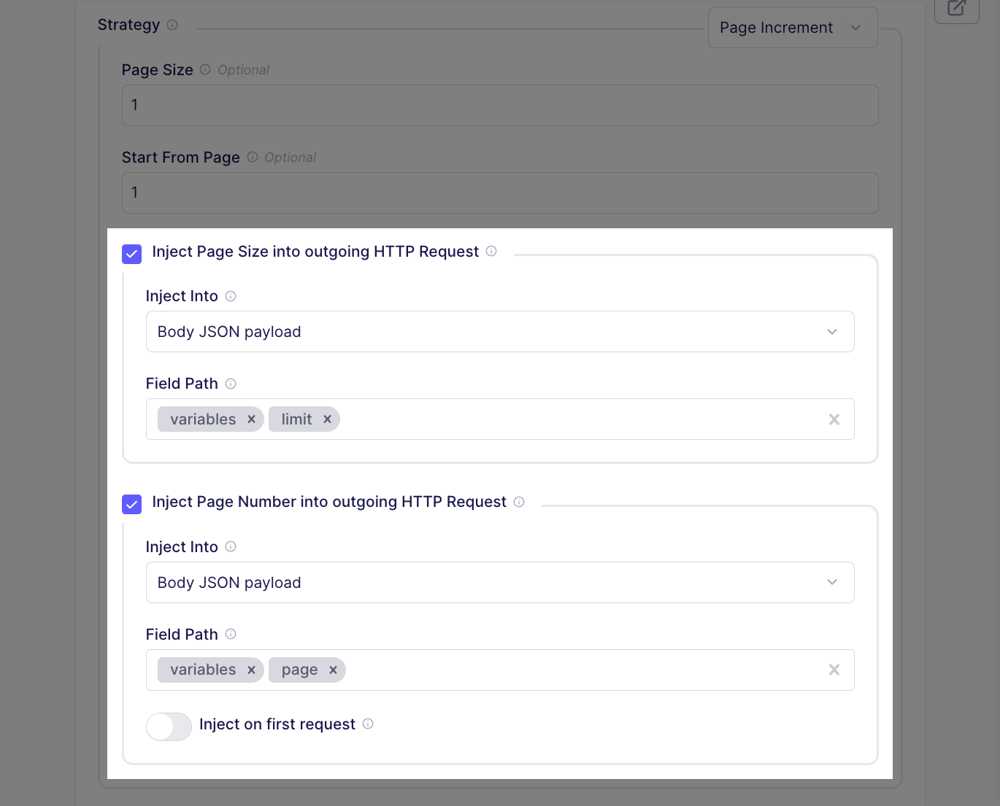

# Airbyte 1.6

The Easter Bunny reports a shortage of eggs this year and asked us to crack 🐣 open a new version of Airbyte, instead. Airbyte 1.6.0 was released on April 3, 2025. We're excited to share new improvements and changes to the Airbyte platform.

## 🚀 Platform changes

These changes improve Airbyte for all Self-Managed users.

### Connection page dashboard

Connection pages now include a dashboard that visualizes sync successes and failures. This high-level view gives you quick insight into the health of your syncs over hours, days, and weeks. With one click, you can get more information about each point in time, and fast access to any problematic sync in your workspace to diagnose what's wrong. [**Learn more >**](#)


### Schema configuration updates in the connection Timeline

When someone makes a change to a connection's schema, Airbyte now logs an event in the connection's Timeline page. This data can help you understand why sync behaviors or record volumes suddenly, diagnose issues, and identify intentional and unintentional changes. [**Learn more >**](#)


Logged events include:

- Enabling or disabling streams and fields
- Changing primary keys or cursors
- Changing the sync mode
- Adding or removing streams/fields after clicking Refresh source schema

### Copy JSON from connectors

All connectors now have a **Copy JSON** button in the Airbyte UI. This button generates a JSON string populated with your configurations in the UI. It's the easiest way to add a source or destination connector with Terraform by pasting the JSON string into the `airbyte_source_custom` and `airbyte_destination_custom` resources. Previously, though, you had to work out the JSON string on your own. [**Learn more >**](../terraform-documentation#weakly-typed-json-configurations)

```json title="Airbyte source connector example"
{
  "name": "Airbyte",
  "workspaceId": "c0e5b294-2c71-475b-ae9c-6d70b36ff4f4",
  "definitionId": "284f6466-3004-4d83-a9b2-e4b36cbbbd41",
  "configuration": {
    "client_id": "37a7a966-5fe1-47e4-b751-4e73294758g7",
    "start_date": "2024-01-01T00:00:00Z",
    "client_secret": "******"
  }
}
```

### Connector Builder improvements

Airbyte's Connector Builder has been substantively improved.

#### Asynchronous job streams

The Connector Builder UI now supports asynchronous streams, allowing you to handle scenarios where data extraction happens over multiple steps. Some APIs that handle large datasets or perform resource-intensive operations can't complete their work in a single request-response cycle. By setting up a stream as asynchronous, you can separate requesting a job, polling for a response, and downloading the response into distinct steps. [**Learn more >**](../connector-development/connector-builder-ui/async-streams)


#### Better GraphQL support

- **Nested field injection**: For streams using body JSON injection, you can add field paths representing the nested path to the field you want to inject. This is primarily used to communicate with GraphQL APIs that accept variables as a separate object in the request body. [**Learn more >**](../connector-development/config-based/understanding-the-yaml-file/request-options#request-option-component)

    

- **GraphQL Request Body**: You can write request bodies as free form GraphQL queries with built-in syntax validation.

  

#### Handle CSV, gzip, and ZIP response formats

Airbyte has two new ways to handle API responses in the Connector Builder.

- **CSV decoding**: Make requests to sources that respond in CSV format and set expected delimiter and encoding options.

- **Nested decoding**. Make requests to sources that respond with compressed `gzip` or `zip` files, then set a nested decoding option the handle the unzipped contents within.

[**Learn More >**](#)


#### Run custom Python code

You can, optionally, enable custom components in the Connection Builder and run your own Python implementations. This brings the power and flexibility of the Low-Code CDK into the Connector Builder for cases where Airbyte's built-in components don't meet your needs. [**Learn more >**](../connector-development/connector-builder-ui/custom-components)


## 🚀 Self-Managed Enterprise changes

These changes bring new capabilities to Airbyte's Self-Managed Enterprise customers.

### Multiple data planes

To follow.

<!-- Q1a 44, Q1b 76 -->

## Unique stream prefixes or namespaces are now mandatory

Airbyte now requires that stream identifiers be unique across Airbyte connections that share a destination. You can no longer set multiple connections to sync to the same destination stream.

A common scenario looks like this: you have multiple source accounts and want to sync all this data to a single table in your destination. Although convenient, doing this carried a risk of data loss as multiple connections clashed with each other while writing to the same table.

After careful consideration, Airbyte has stopped supporting this. You must use a unique prefix for each stream or use unique namespaces in each connection. Then, you can combine your tables downstream of Airbyte. [Learn more >](../using-airbyte/configuring-schema#stream-uniqueness)

## Full changelog

<details>
  <summary>Full changelog</summary>

This is the full list of changes this version. Some changes improve internal tools or are milestones toward future releases, so not every change results in a noticeable change to Airbyte.

<!-- This is an experimental, AI-driven summary of changes. We will need to regenerate this later and do some serious prompt engineering so Devin knows exactly what we want. -->

### New features

* [#15586](https://github.com/airbytehq/airbyte-platform-internal/pull/15586) - Added timeout configuration in Connector Builder for async data sources, allowing you to set custom timeouts in minutes or with expressions.
* [#15576](https://github.com/airbytehq/airbyte-platform-internal/pull/15576) - Enhanced OAuth configuration with organization-level settings, giving you more flexibility in managing authentication across your organization.
* [#15565](https://github.com/airbytehq/airbyte-platform-internal/pull/15565) - Added ability to customize secret prefixes for better integration with your existing secret management systems.
* [#15563](https://github.com/airbytehq/airbyte-platform-internal/pull/15563) - Improved sync failure webhooks with detailed error information, making it easier to diagnose and resolve connection issues.
* [#15556](https://github.com/airbytehq/airbyte-platform-internal/pull/15556) - Added email field to billing notifications to ensure you receive important billing alerts.
* [#15545](https://github.com/airbytehq/airbyte-platform-internal/pull/15545) - Added support for nested data transformations in Connector Builder, enabling more complex data processing capabilities.
* [#15532](https://github.com/airbytehq/airbyte-platform-internal/pull/15532) - Enhanced connections dashboard with real-time sync status indicators for better visibility into your data pipelines.
* [#15526](https://github.com/airbytehq/airbyte-platform-internal/pull/15526) - Introduced connector templates system to simplify and standardize connector configuration.
* [#15522](https://github.com/airbytehq/airbyte-platform-internal/pull/15522) - Added schema update filter to connection history page, making it easier to track schema changes over time.
* [#15518](https://github.com/airbytehq/airbyte-platform-internal/pull/15518) - Improved user experience for asynchronous data sources with better status tracking and error handling.
* [#15510](https://github.com/airbytehq/airbyte-platform-internal/pull/15510) - Started development of embedded Airbyte widget, allowing future integration of Airbyte components into your own applications.
* [#15491](https://github.com/airbytehq/airbyte-platform-internal/pull/15491) - Added environment-based configuration options for advanced deployment scenarios.
* [#15484](https://github.com/airbytehq/airbyte-platform-internal/pull/15484) - Added text formatting command for improved documentation readability.
* [#15471](https://github.com/airbytehq/airbyte-platform-internal/pull/15471) - Integrated Connector Chat Builder for automated connector setup, allowing quick configuration through URL parameters.
* [#15468](https://github.com/airbytehq/airbyte-platform-internal/pull/15468) - Improved sync performance with optimized data processing engine for faster and more reliable data transfers.
* [#15465](https://github.com/airbytehq/airbyte-platform-internal/pull/15465) - Enhanced authentication options for asynchronous data sources in Connector Builder.
* [#15461](https://github.com/airbytehq/airbyte-platform-internal/pull/15461) - Added granular control over data fetching for asynchronous sources in Connector Builder.

### Bug fixes

* [#15613](https://github.com/airbytehq/airbyte-platform-internal/pull/15613) - Fixed installation issues with the open-source version of Airbyte.
* [#15607](https://github.com/airbytehq/airbyte-platform-internal/pull/15607) - Fixed dropdown menu display issues in the user interface.
* [#15590](https://github.com/airbytehq/airbyte-platform-internal/pull/15590) - Improved performance of analytics tracking.
* [#15569](https://github.com/airbytehq/airbyte-platform-internal/pull/15569) - Fixed checkbox focus behavior for better accessibility.
* [#15553](https://github.com/airbytehq/airbyte-platform-internal/pull/15553) - Improved testing environment for more reliable application updates.
* [#15540](https://github.com/airbytehq/airbyte-platform-internal/pull/15540) - Fixed token expiration handling to prevent premature authentication timeouts.
* [#15535](https://github.com/airbytehq/airbyte-platform-internal/pull/15535) - Fixed scheduling system to ensure jobs run at the correct times.
* [#15529](https://github.com/airbytehq/airbyte-platform-internal/pull/15529) - Reduced false positive alerts in monitoring systems.
* [#15523](https://github.com/airbytehq/airbyte-platform-internal/pull/15523) - Improved documentation for connector developers regarding pagination implementation.
* [#15521](https://github.com/airbytehq/airbyte-platform-internal/pull/15521) - Fixed application startup issues for more reliable deployment.
* [#15509](https://github.com/airbytehq/airbyte-platform-internal/pull/15509) - Enhanced security for community authentication.
* [#15495](https://github.com/airbytehq/airbyte-platform-internal/pull/15495) - Fixed configuration copying functionality and improved code quality.
* [#15488](https://github.com/airbytehq/airbyte-platform-internal/pull/15488) - Added sorting capabilities to connections dashboard for better organization.
* [#15487](https://github.com/airbytehq/airbyte-platform-internal/pull/15487) - Fixed deployment configuration for more reliable system startup.
* [#15467](https://github.com/airbytehq/airbyte-platform-internal/pull/15467) - Fixed duplicate connector metadata issue in Connector Builder.
* [#15459](https://github.com/airbytehq/airbyte-platform-internal/pull/15459) - Made documentation URL optional when creating custom Docker connectors for simpler connector creation.

### Improvements

* [#15605](https://github.com/airbytehq/airbyte-platform-internal/pull/15605) - Streamlined connector management by removing redundant clone functionality.
* [#15598](https://github.com/airbytehq/airbyte-platform-internal/pull/15598) - Improved code organization for better maintainability and performance.
* [#15596](https://github.com/airbytehq/airbyte-platform-internal/pull/15596) - Added support for connector templates to simplify connector configuration.
* [#15594](https://github.com/airbytehq/airbyte-platform-internal/pull/15594) - Modernized codebase for improved reliability and performance.
* [#15585](https://github.com/airbytehq/airbyte-platform-internal/pull/15585) - Enhanced data plane management for better resource allocation and reliability.
* [#15580](https://github.com/airbytehq/airbyte-platform-internal/pull/15580) - Added support for deployments without database passwords for simplified setup in secure environments.
* [#15579](https://github.com/airbytehq/airbyte-platform-internal/pull/15579) - Improved deployment initialization for more reliable startup.
* [#15570](https://github.com/airbytehq/airbyte-platform-internal/pull/15570) - Optimized cloud data storage for better performance and reliability.
* [#15566](https://github.com/airbytehq/airbyte-platform-internal/pull/15566) - Enhanced security for data plane communication.
* [#15530](https://github.com/airbytehq/airbyte-platform-internal/pull/15530) - Improved connection management with better data plane assignment.
* [#15500](https://github.com/airbytehq/airbyte-platform-internal/pull/15500) - Removed unused code to improve system performance and maintainability.
* [#15496](https://github.com/airbytehq/airbyte-platform-internal/pull/15496) - Reorganized code structure for better maintainability.
* [#15492](https://github.com/airbytehq/airbyte-platform-internal/pull/15492) - Modernized scheduling system for improved reliability.
* [#15482](https://github.com/airbytehq/airbyte-platform-internal/pull/15482) - Simplified database interactions for better performance.
* [#15480](https://github.com/airbytehq/airbyte-platform-internal/pull/15480) - Optimized build process for faster deployment.
* [#15473](https://github.com/airbytehq/airbyte-platform-internal/pull/15473) - Improved workspace management with better resource allocation.
* [#15472](https://github.com/airbytehq/airbyte-platform-internal/pull/15472) - Enhanced data organization for improved system performance.
* [#15470](https://github.com/airbytehq/airbyte-platform-internal/pull/15470) - Upgraded build system for faster development and deployment.
* [#15463](https://github.com/airbytehq/airbyte-platform-internal/pull/15463) - Improved testing framework for better code quality.
* [#15460](https://github.com/airbytehq/airbyte-platform-internal/pull/15460) - Enhanced data plane reliability for more stable connections.
* [#15456](https://github.com/airbytehq/airbyte-platform-internal/pull/15456) - Improved form validation in Connector Builder for better user experience.

</details>
