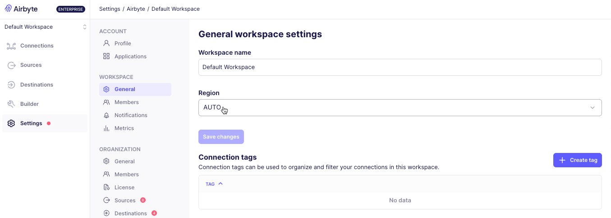
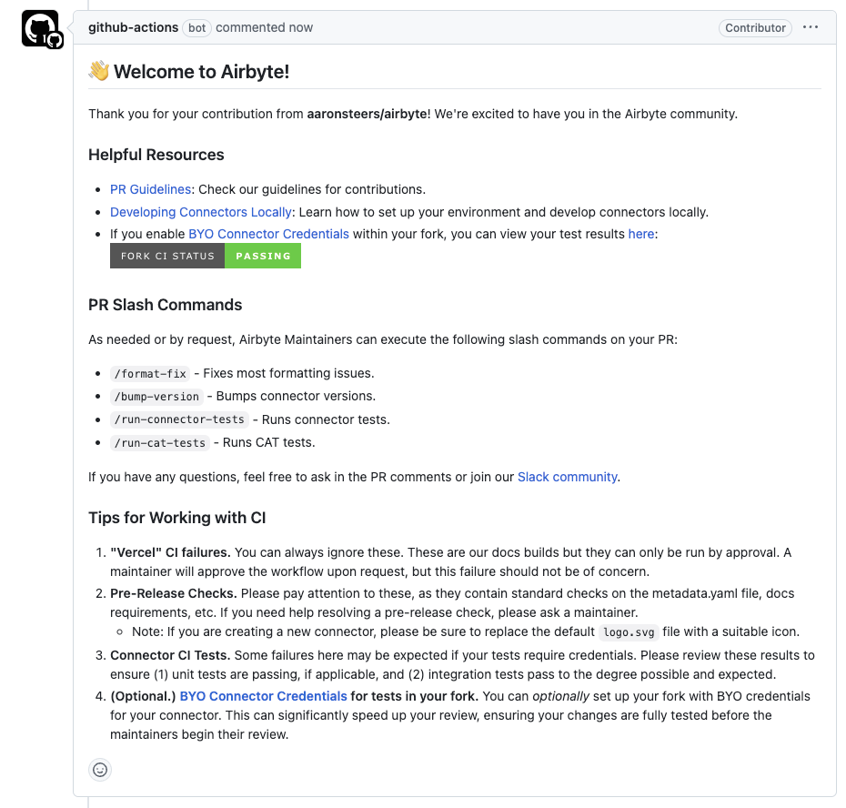

# Airbyte 1.7

People liked the last version of Airbyte so much that we decided to ship another one 🚢. Airbyte 1.7 was released on June 16, 2025. We're excited to share new improvements and changes to the Airbyte platform.

## Platform changes

These changes improve Airbyte for everyone.

### Move files and records together

Airbyte now supports moving files and records in the same connection. The combination of structured and unstructured data drives more robust knowledge systems that have more context, which is critical to successful AI systems.

<Arcade id="Nmr0UIYCXIhaZifOOwiO" title="Use the Connection Dashboard to diagnose unhealthy syncs" paddingBottom="calc(60% + 0px)" />

- In **connectors that move structured data** but also contain attachments, like ZenDesk Support, when you set up your connection, you can choose to move attachments as a separate stream in the same connection. Airbyte also generates metadata describing those files.

- In **file-based connectors**, like S3 or Google Drive, when you choose **Copy raw files** as your delivery method, Airbyte generates metadata describing those files.

- You choose the format and content of the metadata the same way you already manage your streams.

[**Learn more >**](/platform/next/using-airbyte/sync-files-and-records)

### Connector Builder and low-code improvements

Airbyte's Connector Builder and low-code CDK have new features to interact with a wider range of more complex APIs. These changes allow Airbyte to migrate more connectors to the low-code format. Low-code connectors are forkable, faster, and easier for everyone to contribute to.

#### Stream templates

Use stream templates to generate multiple similar streams from a single template configuration. Stream templates are ideal for APIs that have multiple regions or a large number of resources that have predictable endpoint structures. [**Learn more&nbsp;>**](/platform/next/connector-development/connector-builder-ui/stream-templates)

#### File syncing

The low-code CDK now supports syncing files up to 1.5-GB. You can implement this feature with `manifest.yaml` files in a manifest-only or hybrid connector when making requests from endpoints that return files. [**Learn more&nbsp;>**](/platform/next/connector-development/config-based/understanding-the-yaml-file/file-syncing)

#### Property chunking

Some APIs don't send a complete set of properties for a record in a single API request, so connectors have to make a series of requests, then merge those responses into a single record. Connector developers working with the low-code CDK can now chunk properties, specify the chunk size, and statically or dynamically define the list of properties to fetch. [**Learn more&nbsp;>**](/platform/next/connector-development/config-based/understanding-the-yaml-file/property-chunking)

#### Config normalization rules

The Spec component in the low-code CDK now supports `config_normalizaton_rules`. Use this to automatically modify, migrate, and validate user configurations before your connector uses them and without needing to write custom Python code. It consists of three arrays.

- `config_migrations`: Apply discrete, one-time transformations to migrate user configurations from old formats to new ones.

- `transformations`: Apply configuration modifications at the start of each sync, dynamically modifying configurations based on current values.

- `validations`: Apply validation checks after the connector completes transformations to ensure data integrity and proper formatting.

[**Learn more&nbsp;>**](https://github.com/airbytehq/airbyte-python-cdk/blob/e44362a81b4830848f38cf799a0c7c6929b5aa04/airbyte_cdk/sources/declarative/declarative_component_schema.yaml#L3821-L3850)

## Self-Managed Enterprise changes

These changes bring new capabilities to Airbyte's Self-Managed Enterprise customers.

:::danger Breaking Change
Before upgrading from version 1.5.1 or earlier, you must upgrade your service account permissions. If you don't, Airbyte doesn't permit you to begin the upgrade. [Learn more&nbsp;>](/platform/enterprise-setup/upgrade-service-account)
:::

### Audit logs

Self-Managed Enterprise now supports audit logging. Audit logging gives you visibility into data, environment, user, and permission changes. This data ensures you have records of any unauthorized changes and insider threats, making it easy to continue meeting your compliance obligations while using Airbyte.

Audit logging requires you to configure a blob storage solution (S3, GCS, Azure Blob Storage). This bucket must be accessible by Airbyte's pods using the same credentials it uses to access your log and state storage. Then, you configure Airbyte to read from and write to your bucket with Airbyte’s values.yaml file:

Once enabled, Airbyte writes audit logs to the `/audit-logging/` directory as JSON files named in this format: `<yyyyMMddHHmmss>_<hostname>_<random UUID>`.

```json title="Sample audit log"
{
  "id": "8478fcbd-d369-4bda-8d9b-b782cea5ad40",
  "timestamp": 1746724563299,
  "actor": {
    "actorId": "1c26c465-58h8-43e6-8jko-2252b7g8a9e2",
    "email": "user@airbyte.io",
    "ipAddress": "192.000.000.0",
    "userAgent": "Mozilla/5.0 (Macintosh; Intel Mac OS X 10_15_7) AppleWebKit/537.36 (KHTML, like Gecko) Chrome/136.0.0.0 Safari/537.36"
  },
  "operation": "deleteWorkspace",
  "request": "<request object>",
  "response": "<response object>",
  "success": true,
  "errorMessage": null
}
```

[**Learn more&nbsp;>**](/platform/next/enterprise-setup/audit-logging)

### Assign data planes from Airbyte's UI

If you're using multiple data planes, you can now assign a workspace to a region from Airbyte's workspace settings. Previously, you could only do this with the API. [**Learn more >**](/platform/enterprise-setup/multi-region)



## Contributors: `airbyte-ci` is deprecated

Everyone is welcome to contribute to Airbyte. In most cases, the best way to contribute to Marketplace connectors is with Airbyte's Connector Builder. Some connectors still require using one of Airbyte's connector development kits (CDKs), though.

To simplify and speed up connector development, Airbyte has deprecated the `airbyte-ci` tool.

- Most `airbyte-ci` commands have simpler equivalents in Poe the Poet.

- Airbyte's GitHub repository provides new, more helpful messages in your pull requests.

- Airbyte has removed 8 legacy GitHub workflows that were no longer necessary.

- The new Connector CI suite of checks is between 2 and 10 times faster for rapid iteration with less waiting.

- Maintainers can still manually run connector acceptance tests (CATs 🐈) if needed.

For help developing your own connectors, see [Developing connectors locally](/platform/connector-development/local-connector-development).



### Connector Builder off in low resource mode

In abctl [version 0.26.0](https://github.com/airbytehq/abctl/releases), if you deploy Airbyte in low resource mode, the Connector Builder is now turned off. To access the Connector Builder, allocate Airbyte's [suggested resources](/platform/next/using-airbyte/getting-started/oss-quickstart#suggested-resources) and re-deploy Airbyte without setting the `--low-resource-mode` flag.

## Full change log

### Major Platform Features
- **Move Files and Records Together** - Airbyte now supports moving files and records in the same connection, enabling structured and unstructured data combination for more robust AI and knowledge systems. Connectors with attachments like ZenDesk Support can move attachments as separate streams, while file-based connectors like S3 generate metadata describing files
- **Stream Templates** - Generate multiple similar streams from a single template configuration, ideal for APIs with multiple regions or predictable endpoint structures, allowing more efficient connector development
- **File Syncing in Low-Code CDK** - Low-code CDK now supports syncing files up to 1.5GB with manifest.yaml files in manifest-only or hybrid connectors when making requests from file-returning endpoints
- **Property Chunking** - Connector developers can now chunk properties, specify chunk sizes, and define property lists to fetch when APIs don't send complete record properties in single requests, enabling better handling of complex API responses
- **Config Normalization Rules** - Automatically modify, migrate, and validate user configurations with config_migrations, transformations, and validations without requiring custom Python code, improving connector reliability and user experience

### Enterprise Features
- **Audit Logging** - Self-Managed Enterprise now supports comprehensive audit logging for data, environment, user, and permission changes with configurable blob storage (S3, GCS, Azure), providing visibility for compliance and security monitoring
- **UI-Based Data Plane Assignment** - Assign workspaces to regions directly from Airbyte's workspace settings instead of requiring API calls, simplifying multi-region deployment management
- **Service Account Permissions Upgrade** - Breaking change requiring service account permission upgrades when upgrading from version 1.5.1 or earlier to ensure proper security and functionality

### Developer Experience Improvements
- **airbyte-ci Tool Deprecation** - Simplified connector development with Poe the Poet equivalents, new helpful PR messages, removed 8 legacy workflows, and 2-10x faster Connector CI suite for rapid iteration with less waiting
- **Enhanced GitHub Workflow** - Improved pull request feedback and faster development iteration through streamlined CI processes and better contributor guidance
- **Low Resource Mode Updates** - Connector Builder automatically disabled in low resource mode deployments (abctl v0.26.0+) for better resource management, requiring full resource allocation to access Connector Builder

### Backend Infrastructure Enhancements
- **Data Activation Validation** - Enhanced validation for data activation connections to ensure configured catalogs match destination operations, preventing configuration errors and improving data reliability ([#16667](https://github.com/airbytehq/airbyte-platform-internal/pull/16667))
- **Organization Management UI** - New organization-level landing pages and navigation structure for improved multi-workspace management and organization settings ([#16286](https://github.com/airbytehq/airbyte-platform-internal/pull/16286))
- **Service Accounts Foundation** - Database and API infrastructure for service accounts, laying groundwork for enhanced authentication and access management ([#16323](https://github.com/airbytehq/airbyte-platform-internal/pull/16323))
- **Enhanced Connector Configuration** - Added connector inter-process communication options in actor definitions for improved connector performance and reliability ([#16277](https://github.com/airbytehq/airbyte-platform-internal/pull/16277))
- **Connection Timeline Filtering** - Running jobs now properly respect filters on the connection timeline, providing more accurate status visibility ([#16314](https://github.com/airbytehq/airbyte-platform-internal/pull/16314))
- **Enhanced Check Commands** - Improved connection check workflow using new command API for better reliability and performance ([#16295](https://github.com/airbytehq/airbyte-platform-internal/pull/16295))
- **Catalog Discovery Enhancement** - Enhanced catalog discovery process using command API for more reliable source and destination catalog operations ([#16374](https://github.com/airbytehq/airbyte-platform-internal/pull/16374))

### Bug Fixes
- **UI Alignment Fixes** - Corrected "see more" button alignment and organization settings navigation titles for improved user experience ([#16412](https://github.com/airbytehq/airbyte-platform-internal/pull/16412), [#16391](https://github.com/airbytehq/airbyte-platform-internal/pull/16391))
- **Login Issue Resolution** - Fixed login bug for users without organization assignments ([#16396](https://github.com/airbytehq/airbyte-platform-internal/pull/16396))
- **API Host Configuration** - Resolved issue with AIRBYTE_API_HOST environment variable configuration ([#16369](https://github.com/airbytehq/airbyte-platform-internal/pull/16369))
- **Billing Status Display** - Fixed billing status banner to use correct ID in URL path ([#16417](https://github.com/airbytehq/airbyte-platform-internal/pull/16417))
