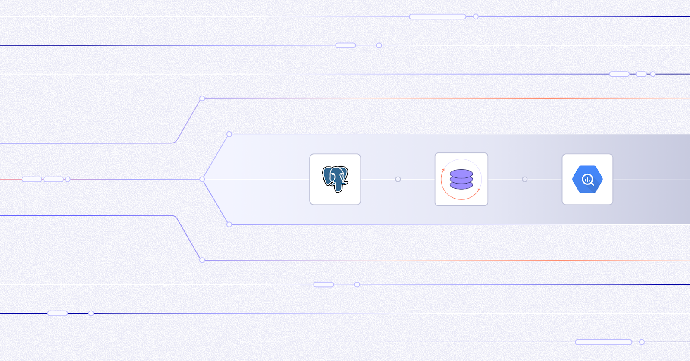
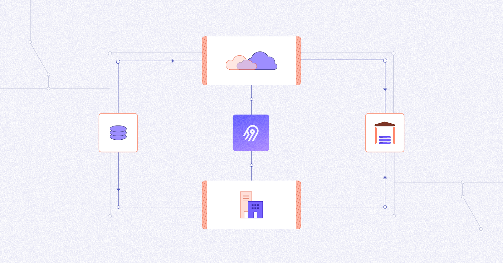

# Airbyte 2.0

We go fast so you don't get furious. Airbyte hasn't released a 2.0 artifact yet, but version 1.8 already supports version 2.0's faster sync speed and data activation capabilities. This marks a major achievement in Airbyte's platform architecture. We're excited to share new improvements and changes to the Airbyte platform.

## Platform changes

These changes improve Airbyte for everyone.

### Faster sync speed

Faster sync speed is now generally available. When using faster sync speed, Airbyte syncs data 4-6 times faster on average while consuming resources more economically. To use faster sync speed:

- A connection needs to use a source connector and destination connector for which Airbyte has turned on faster syncs.

- You need to upgrade to a version of those connectors that supports faster speed.

[**Learn more about faster speed >**](/integrations/speed-improvements)

### Data activation

Data activation is now generally available. It enables you to move data out of your data warehouse and into the operational tools where work happens, like CRMs, marketing platforms, and support systems. With this capability, you can deliver modeled data directly to points of action and systems people already use, helping your organization respond faster and more effectively.

Instead of limiting insights to dashboards and reports, data activation enables data to directly power workflows and decisions in real time in the places people need it.

[**Learn more about data activation >**](/platform/next/move-data/elt-data-activation)

### 2.0 arrives soon

We'll release a 2.0 artifact soon, which includes these and other improvements. For now, version 1.8 already supports these features. If you're running version 1.8.x of Airbyte, you can use faster sync speed and data activation.

## Airbyte Enterprise Flex

Airbyte Enterprise Flex is a hybrid solution that consists of a fully managed Cloud control plane that supports separate data planes that run in your own infrastructure. It's ideal for organizations with data sovereignty and compliance requirements who need to carefully manage data movement while also minimizing the time and effort needed to self-manage Airbyte.

Managing operational and compliance requirements with more infrastructure often means increased maintenance commitments, higher spend, and greater complexity. Airbyte built Enterprise Flex to ensure you don't have to choose between data sovereignty and ease of deployment.

If you're an Airbyte Cloud customer, any Cloud organization can upgrade to an Enterprise Flex organization. [Talk to Sales](https://airbyte.com/company/talk-to-sales) to get started. [**Learn more about Enterprise Flex >**](/platform/next/enterprise-flex/)

## A look back at version 1

Airbyte is an open source product. We win together, and we've come a long way together. In 2025, here are some of the main things we delivered:

**Sovereignty, privacy, and security**:

- Self-managed data planes in different regions and workspace region assignment from Airbyte's UI

- Custom image registries

- Mappings

- Audit logging

- A new helm chart with more options to customize deployments and better alignment with Helm's best practices for chart design

**Better connector and connection management**:

- The ability to configure schema refresh rates.

- A simplified OAuth flow for connectors.

- Connection tags

- Resource allocation in the UI

- A connection page dashboard

- Schema configuration updates in the connection timeline

- Pagination for better UI performance in large organizations

**More support for AI use cases**:

- The ability to [move files and records together](platform/using-airbyte/sync-files-and-records) in the same connection, combining structured and unstructured data for more robust knowledge system critical to AI.

**More power from the connector builder**:

- Declarative OAuth 2.0 support.

- Asyncronous streams

 - GraphQL support

- CSV, gzip, and ZIP support

- Stream templates

- File syncing

- Property chunking

- Configuration normalization

