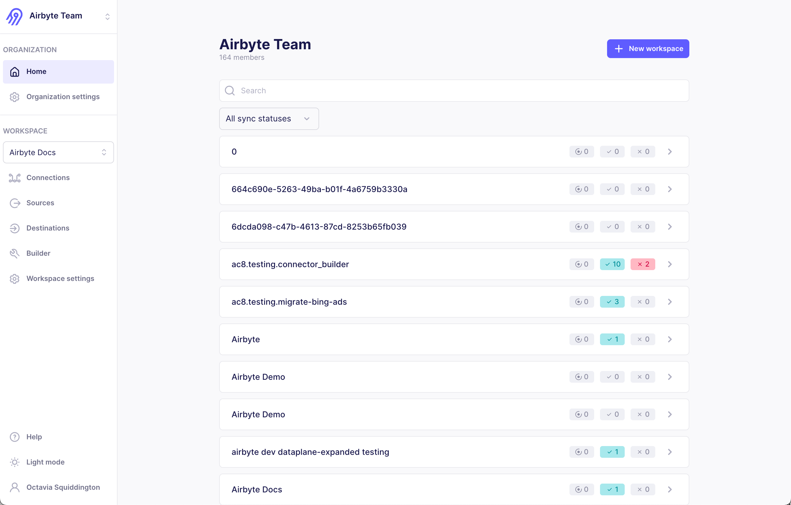

import YouTube from '@site/src/components/YouTube';

# Airbyte 2.0

<!-- vale off -->

We're back, fast, and furious. 🏎️ 🏁 Airbyte version 2.0 was released on October 14, 2025. This version marks a major achievement in Airbyte's platform architecture. We're excited to share new improvements and changes to the Airbyte platform.

<!-- vale on -->

## Faster sync speed

<YouTube id="wlVEDQPCDRE" />

Faster sync speed is now generally available. When using faster sync speed, Airbyte syncs data 4-6 times faster, on average, while consuming resources more economically. [**Learn more about faster sync speed >**](/integrations/speed-improvements)

## Data activation

<YouTube id="JJLpmh7ioxg" />

Data activation is now generally available. It enables you to move data out of your data warehouse and into the operational tools where work happens, like CRMs, marketing platforms, and support systems. With this capability, you can deliver modeled data directly to points of action and systems people already use, helping your organization respond faster and more effectively.

Instead of limiting insights to dashboards and reports, data activation powers workflows and decisions in real time and in the places people need data. [**Learn more about data activation >**](/platform/move-data/elt-data-activation)

## Airbyte Enterprise Flex

<YouTube id="Xw9dCQGK-W8" />

Airbyte Enterprise Flex is a hybrid solution that consists of a fully managed Cloud control plane that supports separate data planes that run in your own infrastructure. It's ideal for organizations with data sovereignty and compliance requirements who need to carefully manage data movement while also minimizing the time and effort needed to self-manage Airbyte.

Managing operational and compliance requirements with more infrastructure often means increased maintenance commitments, higher spend, and greater complexity. Airbyte built Enterprise Flex to ensure you don't have to choose between data sovereignty and ease of deployment.

If you're an Airbyte Cloud customer, any Cloud organization can upgrade to an Enterprise Flex organization. [Talk to Sales](https://airbyte.com/company/talk-to-sales) to get started. [**Learn more about Enterprise Flex >**](/platform/enterprise-flex/)

## Better Connector Builder interface

Airbyte has aligned the Connector Builder's user interface with the YAML specification it represents. You should find it more intuitive to switch between UI and YAML modes. These changes also ensure that virtually all the capabilities of YAML mode are available in the UI. Future new features can be available in the UI at release time, and you no longer need to write YAML to handle _most_ complex APIs.

**Your custom connectors still work normally and migrate seamlessly to the new user interface**. You don't need to take any action. If you need help with any of the fields, see [the documentation](/platform/connector-development/connector-builder-ui/overview).

<Arcade id="mlPEcBzurqOkIFpPXduY" title="" paddingBottom="calc(60% + 0px)" />

Here's what's changed.

### Global configuration

- The **API base URL** and **Authentication method** fields have been removed from this form. You now define URLs and authentication on each stream.

- Use the **Global Configuration** page to control which streams are included in check operations, set concurrency, and adjust request frequency with HTTP budgets.

### Streams

- **URL path** is removed. The new **API Endpoint URL** field replaces both the **URL path** and the **API base URL** from the Global Configuration. Each stream can now use a different base URL if needed.

- The **Authenticator** panel handles authentication for each stream. Each stream can use a different authentication method if needed. [OAuth 2.0](/platform/using-airbyte/oauth) flows are now fully supported in the Connector Builder, including in asynchronous streams.

- The **Parent Streams** and **Parameterized Requests** panels are now merged into the **Partition Router** panel.

- Added a new **Advanced** panel at the bottom of the page, introducing new capabilities, like file transfers, that were previously only available in YAML mode.

- Renamed or combined some fields to make their purpose more obvious.

## Better organizations and workspaces interface

Airbyte's UI for viewing and managing organizations and workspaces is reorganized.

- The navigation bar is now split into "Organization" and "Workspace" sections.

- The general settings page is now split into Organization settings and Workspace settings.

- Your user settings and applications/tokens are now under your name > User settings.

- Organizations now have a meaningful home page that shows all workspaces in that organization, plus any in-progress, successful, and failed syncs. This gives you a birds-eye view of all the activity across all workspaces you have access to.

[**Learn more about organizatons and workspaces >**](/platform/organizations-workspaces/)

## abctl 0.30.2 required

If you deploy Airbyte with abctl, [upgrade to abctl version 0.30.2](/platform/operator-guides/upgrading-airbyte#upgrade-abctl) before upgrading to Airbyte version 2.0.

## Final version with Helm chart V1 support

Version 2.0 is the final version of Airbyte that supports Helm chart V1. In versions 2.1 and later, Airbyte will only support Helm Chart V2.

- **New deployments** should use Helm chart V2 from the start to avoid a future upgrade. The [Deployment documentation](/platform/deploying-airbyte/) includes examples for this Helm chart.

- **Existing deployments** can migrate at the time of your choosing. Airbyte strongly encourages you to migrate as soon as practical to avoid blocking future upgrades. For help and to learn more, see the migration guides for [Core](/platform/deploying-airbyte/chart-v2-community) or [Self-Managed Enterprise](/platform/enterprise-setup/chart-v2-enterprise).

## Other improvements

Version 2.0 also contains these improvements.

- **Ingress**: Airbyte now ships ingress with the Helm chart. If you've already set up ingress, you can continue using your existing configuration. For new deployments, you might find it easier to enable ingress through values.yaml. [**Learn&nbsp;more&nbsp;>**](/platform/deploying-airbyte/integrations/ingress)

- **Data activation**: validation improvements to help prevent failed syncs due to improperly configuring connectors through the API.

- **Data activation**: the Mappings page now warns you if you attempt to navigate away with unsaved changes.

- **Data activation**: The Mappings page renders more swiftly when dealing with large-scale data sets with dozens and hundreds of mapped fields.

- **Workspaces members**: this version turns off email validation when adding new users to a workspace. If you're a Self-Managed Enterprise customer using SSO, you can now add users who have user IDs that aren't email addresses.

## Fixes

This version fixes the following issues that you reported, or which might have affected you.

- Fixed an issue in which Airbyte didn't show your client IDs and client secrets. This issue was first [reported](https://github.com/airbytehq/airbyte/issues/66675) with version 1.8.2. Airbyte fixed it for 1.8.3, but the issue [recurred](https://github.com/airbytehq/airbyte/issues/67581) in version 1.8.5.

- Fixed an issue that could make data activation connections fail to display rejected records.

- Fixed alignment issues for timestamps in the Connection Timeline.

- Fixed an issue where the on/off toggles didn't work on the Connections home page.

- Fixed a rare issue where turning a connection off and then on again could cause a reset.

- Fixed an issue where opening a drop down menu on the source and destination configuration page caused the form to shift to the left.

- Fixed an issue where an empty table flashed on the screen if you didn't have any Connections yet.

- Fixed an issue where workspace admins could see 403 errors if they only had access to some workspaces in the organization.

- Updated base images to address security vulnerabilities.

## A look back at version 1

<!-- vale off -->

Airbyte is an open source product. We win together. Here are some of the main enhancements that landed in 2025. Thank you for being on this journey with us. We're just getting started, and the best is yet to come.

<!-- vale on -->

**Sovereignty, privacy, and security**:

- [Self-managed data planes](/platform/enterprise-setup/multi-region)

- [Custom image registries](/platform/deploying-airbyte/integrations/custom-image-registries)

- [Mappings](/platform/using-airbyte/mappings)

- [Audit logging](/platform/enterprise-setup/audit-logging)

- [New helm chart](/platform/deploying-airbyte/chart-v2-community)

**Better connector and connection management**:

- [Simplified OAuth flows for connectors](/platform/using-airbyte/oauth)

- [Connection tags](/platform/using-airbyte/tagging)

- [Resource allocation in the UI](/platform/operator-guides/configuring-connector-resources)

- [A connection page dashboard](/platform/cloud/managing-airbyte-cloud/review-connection-status)

- [Schema configuration updates show in the connection timeline](/platform/cloud/managing-airbyte-cloud/review-connection-timeline)

- Pagination for better UI performance

**More support for AI use cases**:

- [Move files and records together](/platform/using-airbyte/sync-files-and-records)

**Connector Builder improvements**:

- [Declarative OAuth 2.0 support](/platform/connector-development/connector-builder-ui/authentication#oauth)

- [Asynchronous streams](/platform/connector-development/connector-builder-ui/async-streams)

- [GraphQL support](/platform/connector-development/config-based/understanding-the-yaml-file/request-options#graphql-request-injection)

- [CSV, gzip, and ZIP support](/platform/connector-development/connector-builder-ui/record-processing)

- [Stream templates](/platform/connector-development/connector-builder-ui/stream-templates)

- [File syncing](/platform/connector-development/config-based/understanding-the-yaml-file/file-syncing)

- [Property chunking](/platform/connector-development/config-based/understanding-the-yaml-file/property-chunking)

- Configuration normalization rules, including transformations and validations

## Patch releases

### Version 2.0.1

Airbyte 2.0.1 was released on October 22, 2025.

- Optimized heartbeat mechanism. Airbyte now makes fewer unnecessary database writes during job execution, improving performance and stability.
