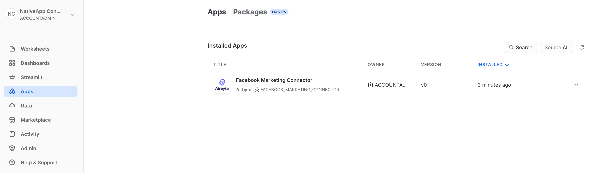
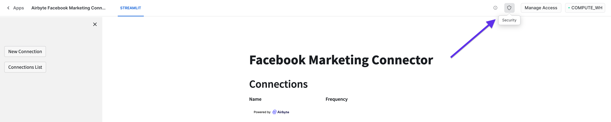
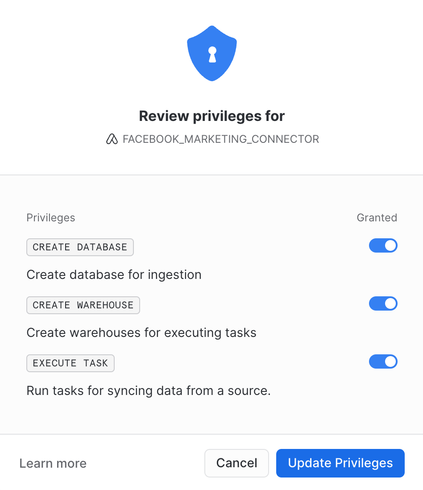

# Facebook Marketing Connector

The Facebook Marketing Connector by Airbyte is a Snowflake Native Application that allows you to extract data from your Facebook Marketing account and load records into a Snowflake database of your choice.

:::info
The Snowflake Native Apps platform is new and rapidly evolving. The Facebook Marketing Connector by Airbyte is in _public preview_ and is subject to further development that may affect setup and configuration of the application. Please note that, at this time, only a [full table refresh](/using-airbyte/core-concepts/sync-modes/full-refresh-overwrite.md) without deduplication is supported.  
:::

# Getting started

## Prerequisites

A Facebook Marketing account with permission to access data from accounts you want to sync.

## Installing the App

:::warning
Do not refresh the Apps page while the application is being installed. This may cause installation to fail.
:::

1. Log into your Snowflake account.
2. On the left sidebar, click `Marketplace`.
3. Search for `Facebook Marketing Connector` by Airbyte or navigate to https://app.snowflake.com/marketplace/listing/GZTYZ9BCRTG/airbyte-facebook-marketing-connector
4. Click `Get`. This will open a pop-up where you can specify install options. Expand `Options`.
   1. You can rename the application or leave the default. This is how you will reference the application from a worksheet.
   2. Specify the warehouse that the application will be installed to.
5. Wait for the application to install. Once complete, the pop-up window should automatically close.
6. On the left sidebar, click `Apps`.



7. Once your installation is complete, under the `Installed Apps` section, you should see the `Facebook Marketing Connector` by Airbyte.

## Facebook Marketing Account

In order for the Facebook Marketing Connector by Airbyte to query Facebook's APIs, you will need an account with the right permissions. Please follow the [Facebook Marketing authentication guide](https://docs.airbyte.com/integrations/sources/facebook-marketing#for-airbyte-open-source-generate-an-access-token-and-request-a-rate-limit-increase) for further information.

## Snowflake Native App Authorizations

:::note
By default the app will be installed using the name `FACEBOOK_MARKETING_CONNECTOR`, but if you renamed the app during installation, you will have to use that name as a reference.
:::

### Adding Credentials and Configuring External API Access

Before using the application, you will need to perform a few prerequisite steps to prepare the application to make outbound API requests and use your authentication credentials. From a SQL worksheet, you will need to run a series of commands.

1. Create the database where the app will access the authorization.

```
CREATE DATABASE AIRBYTE_FACEBOOK_MARKETING_DB;
USE AIRBYTE_FACEBOOK_MARKETING_DB;
```

2. You will need to allow outgoing network traffic based on the domain of the source. In the case of Facebook Marketing, simply run:

```
CREATE OR REPLACE NETWORK RULE FACEBOOK_MARKETING_APIS_NETWORK_RULE
  MODE = EGRESS
  TYPE = HOST_PORT
  VALUE_LIST = ('graph.facebook.com');
```

:::note  
As of 2023-09-13, the [Snowflake documentation](https://docs.snowflake.com/en/sql-reference/sql/create-external-access-integration) mentions that direct external access is a preview feature and that it is `available to all accounts on AWS` which might restrict the number of users able to use the connector.
:::

3. Once you have external access configured, you need define your authorization/authentication. Provide the credentials to the app as such:

```
CREATE OR REPLACE SECRET AIRBYTE_APP_SECRET
  TYPE = GENERIC_STRING
  SECRET_STRING = '{
    "access_token": "<access_token>"
  }';
```

... where `client_id`, `client_secret` and `refresh_token` are strings. For more information, see the [Facebook Marketing authentication guide](https://docs.airbyte.com/integrations/sources/facebook-marketing#for-airbyte-open-source-generate-an-access-token-and-request-a-rate-limit-increase).

4. Once the network rule and the secret are defined in Snowflake, you need to make them available to the app by using an external access integration.

```
CREATE OR REPLACE EXTERNAL ACCESS INTEGRATION AIRBYTE_APP_INTEGRATION
  ALLOWED_NETWORK_RULES = (facebook_marketing_apis_network_rule)
  ALLOWED_AUTHENTICATION_SECRETS = (AIRBYTE_APP_SECRET)
  ENABLED = true;
```

5. Grant permission for the app to access the integration.

```
GRANT USAGE ON INTEGRATION AIRBYTE_APP_INTEGRATION TO APPLICATION FACEBOOK_MARKETING_CONNECTOR;
```

6. Grant permissions for the app to access the database that houses the secret and read the secret.

```
GRANT USAGE ON DATABASE AIRBYTE_FACEBOOK_MARKETING_DB TO APPLICATION FACEBOOK_MARKETING_CONNECTOR;
GRANT USAGE ON SCHEMA PUBLIC TO APPLICATION FACEBOOK_MARKETING_CONNECTOR;
GRANT READ ON SECRET AIRBYTE_APP_SECRET TO APPLICATION FACEBOOK_MARKETING_CONNECTOR;
```

### Granting Account Privileges

Once you have completed the prerequisite SQL setup steps, you will need to grant privileges to allow the application to create databases, create warehouses, and execute tasks.
All of these privileges are required for the application to extract data into Snowflake database successfully.

1. Start by going in the `Apps` section and selecting `Facebook Marketing Connector`. You will have to accept the Anaconda terms in order to use Streamlit.
2. After the application has loaded click the shield icon in the top right corner to modify `Security` settings.



3. Under `Account level privileges`, click `Review` which will then present will open a pop-up of security privileges the application needs granted.
4. Enable each of the privileges and click `Update Privileges`.



5. Reload the application to ensure that the application privileges have been updated.

You are now ready to begin syncing your data.

## Configuring a Connection

Navigate back to the application by clicking `STREAMLIT` in the top left corner. Select `New Connection` and fill the following fields:

---

`account_id`

The Facebook Ad account ID to use when pulling data from the Facebook Marketing API. The Ad account ID number is in the account dropdown menu or in your browser's address bar of your [Meta Ads Manager](https://adsmanager.facebook.com/adsmanager/).

---

`start_date`

UTC date in the format YYYY-MM-DDTHH:mm:ssZ (e.g. 2021-09-29T12:13:14Z). Any data before this date will not be replicated.

---

`end_date`

UTC date in the format YYYY-MM-DDTHH:mm:ssZ (e.g. 2021-09-29T12:13:14Z). Any data after this date will not be replicated.

---

`include_deleted`

The Facebook Marketing API does not have a concept of deleting records, and it maintains a record of Campaigns, Ads, and Ad Sets. Enabling this setting allows you to extract data that includes these objects that were archived or deleted from the Facebook platform.

---

`fetch_thumbnail_images`

When extracting Ad Creatives, retrieve the thumbnail_url and store it as thumbnail_data_url in each record.

---

`custom_insights`

Custom insights allow you to define ad statistic entries representing the performance of your campaigns against specific metrics. For more information about how to configure custom insights, please refer to the [Facebook Marketing documentation](https://docs.airbyte.com/integrations/sources/facebook-marketing#set-up-facebook-marketing-as-a-source-in-airbyte).

---

`page_size`

The number of records per page for paginated responses. The default is 100, but most users should not need to set this field except for unique use cases that require tuning the settings.

---

`insights_lookback_window`

The window in days to revisit data during syncing to capture updated conversion data from the API. Facebook allows for attribution windows of up to 28 days, during which time a conversion can be attributed to an ad. If you have set a custom attribution window in your Facebook account, please set the same value here.

---

`Output Database`

The database where the records will be saved. Snowflake's database [naming convention](https://docs.snowflake.com/en/sql-reference/identifiers-syntax) applies here.

---

`Output Schema`

The table where the schema will be saved. Snowflake's table [naming convention](https://docs.snowflake.com/en/sql-reference/identifiers-syntax) applies here.

---

`Connection Name`

How the connection will be referred in the Streamlit app.

---

`Replication Frequency`

The sync schedule that determines how often your data will be synced to the target database.

---

## Enabling Logging and Event Sharing for an Application

Sharing the logging and telemetry data of your installed application helps us improve the application and can allow us to better triage problems that your run into. To configure your application for logging and telemetry data please refer to the documentation for [Enabling Logging and Event Sharing](event-sharing.md).

## Syncing Your Facebook Marketing Data

Once a connection is configured, go in `Connections List` to view all of your connections. From here for each connection you can
view the configuration settings, start a sync, and view the prior sync history.

### Scheduled Syncs

While creating a connection, you can specify a "Replication Frequency" which will dictate how often your data will be extracted from
Facebook Marketing and loaded into your Snowflake database. This process is started automatically according to your schedule and does not
require that you manually trigger syncs. For example, if you create a connection at 10:15 AM and set your replication frequency to
hourly, then a sync will be started immediately. The next sync will start at 11:15 AM onwards. Only one sync is active at the same
time. In the event that your sync runs longer than one hour, a new sync will start at the next available time.

### Manual Syncs

In addition to scheduled syncs, you can also configure a connection to only sync data on-demand by setting "Replication Frequency" to
`MANUAL`. After creating a connection, from the `Connections List` page, you can use the "Sync Now" button to trigger a sync of
your API data to your Snowflake database. You can also use this button to manually trigger connections that sync according to a
schedule. If there is already a sync in progress, this button will be disabled.

### Sync History

From the `Connections List` page, you can view information about past syncs for each connection to determine when your
data is done syncing and whether the operation was successful. Once the sync is completed successfully, you should be
able to validate that the records have been stored in `<your_database>.<your_schema>`.

## Supported Streams

As of now, all supported streams perform a full refresh. Incremental syncs are not yet supported. Here are the list of supported streams:

- Activities
- Ad Account
- Ad Creatives
- Ad Insights
- Ad Sets
- Ads
- Campaigns
- Custom Audiences
- Custom Conversions

# Contact Us

snowflake-native-apps@airbyte.io
