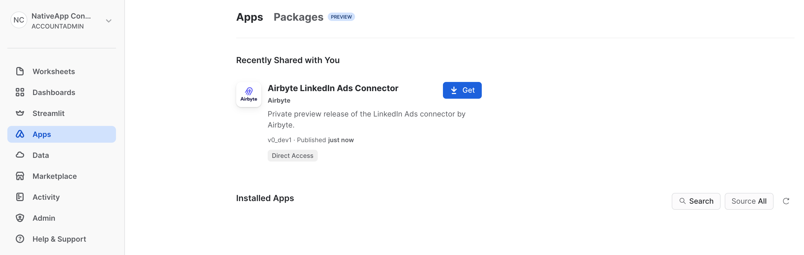

# LinkedIn Ads Connector

The LinkedIn Ads Connector by Airbyte is a Snowflake Native Application that allows you to extract data from your LinkedIn Ads account and load records into a Snowflake database of your choice.

:::info
The Snowflake Native Apps platform is new and rapidly evolving. The LinkedIn Ads Connector by Airbyte is in _private preview_ and is subject to further development that may affect setup and configuration of the application. Please note that, at this time, only a [full table refresh](../understanding-airbyte/connections/full-refresh-overwrite.md) without deduplication is supported.  
:::

# Getting started

## Prerequisites
A LinkedIn Ads account with permission to access data from accounts you want to sync.

## Installing the App

:::warning
Do not refresh the Apps page while the application is being installed. This may cause installation to fail.
:::

1. Log into your Snowflake account.
2. On the left sidebar, click `Marketplace`.
3. Search for `Linkedin Ads Connector` by Airbyte or navigate to https://app.snowflake.com/marketplace/listing/GZTYZ9BCRSJ/airbyte-linkedin-ads-connector-by-airbyte
4. Click `Request`. This will send a request that we will manually service as soon as we can.



5. On the left sidebar, click `Apps`.
6. Under the `Recently Shared with You` section, you should see the `Airbyte LinkedIn Ads Connector` by Airbyte. Click `Get`.
7. Expand `Options`.
    1. You can rename the application or leave the default. This is how you will reference the application from a worksheet.
    2. Specify the warehouse that the application will be installed to.
8. Click `Get`.
9. Wait for the application to install. Once complete, the pop-up window should automatically close.

You should now see the LinkedIn Ads Connector by Airbyte application under `Installed Apps`. You may need to refresh the page.

## LinkedIn Ads Account
In order for the LinkedIn Ads Connector by Airbyte to query LinkedIn, you will need an account with the right permissions. Please follow the [LinkedIn Ads authentication guide](https://docs.airbyte.com/integrations/sources/linkedin-ads/#set-up-linkedin-ads-authentication-airbyte-open-source) for further information.

## Snowflake Native App Authorizations

:::note
By default the app will be installed using the name `AIRBYTE_LINKEDIN_ADS_CONNECTOR`, but if you renamed the app during installation, you will have to use that name as a reference.
:::

1. Create the database where the app will access the authorization.
```
CREATE DATABASE AIRBYTE_LINKEDIN_ADS_DB;
USE AIRBYTE_LINKEDIN_ADS_DB;
```

2. The native app will validate the output database and create it if it does not exist. In order to do that, the app needs access to the database:
```
GRANT CREATE DATABASE ON ACCOUNT TO APPLICATION AIRBYTE_LINKEDIN_ADS_CONNECTOR;
```

3. You will need to allow outgoing network traffic based on the domain of the source. In the case of LinkedIn Ads, simply run:
```
CREATE OR REPLACE NETWORK RULE LINKEDIN_APIS_NETWORK_RULE
  MODE = EGRESS
  TYPE = HOST_PORT
  VALUE_LIST = ('api.linkedin.com', 'www.linkedin.com', 'linkedin.com');
```

:::note  
As of 2023-09-13, the [Snowflake documentation](https://docs.snowflake.com/en/sql-reference/sql/create-external-access-integration) mentions that direct external access is a preview feature and that it is `available to all accounts on AWS` which might restrict the number of users able to use the connector.
:::

4. Once you have external access configured, you need define your authorization/authentication. Provide the credentials to the app as such:
```
CREATE OR REPLACE SECRET AIRBYTE_APP_SECRET
  TYPE = GENERIC_STRING
  SECRET_STRING = '{
    "auth_method": "oAuth2.0",
    "client_id": <client_id>,
    "client_secret": <client_secret>,
    "refresh_token": <refresh_token>
  }';
```
... where `client_id`, `client_secret` and `refresh_token` are strings. For more information, see the [LinkedIn Ads authentication guide](https://docs.airbyte.com/integrations/sources/linkedin-ads/#set-up-linkedin-ads-authentication-airbyte-open-source).

5. Once the network rule and the secret are defined in Snowflake, you need to make them available to the app by using an external access integration.
```
CREATE OR REPLACE EXTERNAL ACCESS INTEGRATION AIRBYTE_APP_INTEGRATION
  ALLOWED_NETWORK_RULES = (LINKEDIN_APIS_NETWORK_RULE)
  ALLOWED_AUTHENTICATION_SECRETS = (AIRBYTE_APP_SECRET)
  ENABLED = true;
```

6. Grant permission for the app to access the integration.
```
GRANT USAGE ON INTEGRATION AIRBYTE_APP_INTEGRATION TO APPLICATION AIRBYTE_LINKEDIN_ADS_CONNECTOR;
```

7. Grant permissions for the app to access the database that houses the secret and read the secret.
```
GRANT USAGE ON DATABASE AIRBYTE_LINKEDIN_ADS_DB TO APPLICATION AIRBYTE_LINKEDIN_ADS_CONNECTOR;
GRANT USAGE ON SCHEMA PUBLIC TO APPLICATION AIRBYTE_LINKEDIN_ADS_CONNECTOR;
GRANT READ ON SECRET AIRBYTE_APP_SECRET TO APPLICATION AIRBYTE_LINKEDIN_ADS_CONNECTOR;
```

8. Grant permissions for the app to create a warehouse on which to execute sync tasks, and to execute tasks.
```
GRANT CREATE WAREHOUSE ON ACCOUNT TO APPLICATION AIRBYTE_LINKEDIN_ADS_CONNECTOR;
GRANT EXECUTE TASK ON ACCOUNT TO APPLICATION AIRBYTE_LINKEDIN_ADS_CONNECTOR;
```


## Configuring a Connection
Once this is all set up, you can now configure a connection. To do so, use the Streamlit app by going in the `Apps` section and selecting `AIRBYTE_LINKEDIN_ADS`. You will have to accept the Anaconda terms in order to use Streamlit.

Once you have access to the app, select `New Connection` and fill the following fields:

--- 

`start_date`

UTC date in the format YYYY-MM-DD (e.g. 2020-09-17). Any data before this date will not be replicated. 

---

`account_ids`

Leave empty, if you want to pull the data from all associated accounts. To specify individual account IDs to pull data from, separate them by a space. See the [LinkedIn Ads docs](https://www.linkedin.com/help/linkedin/answer/a424270/find-linkedin-ads-account-details) for more info.

---

`Output Database`

The database where the records will be saved. Snowflake's database [naming convention](https://docs.snowflake.com/en/sql-reference/identifiers-syntax) applies here.

---

`Output Schema`

The table where the schema will be saved. Snowflake's table [naming convention](https://docs.snowflake.com/en/sql-reference/identifiers-syntax) applies here. 

--- 

`Connection Name`

How the connection will be referred in the Streamlit app.

--- 

`Replication Frequency`

The sync schedule that determines how often your data will be synced to the target database.

---

## Enabling Logging and Event Sharing for an Application
Sharing the logging and telemetry data of your installed application helps us improve the application and can allow us to better triage problems that your run into. To configure your application for logging and telemetry data please refer to the documentation for [Enabling Logging and Event Sharing](event-sharing.md).

## Syncing Your LinkedIn Ads Data
Once a connection is configured, go in `Connections List` to view all of your connections. From here for each connection you can
view the configuration settings, start a sync, and view the prior sync history.

### Scheduled Syncs
While creating a connection, you can specify a "Replication Frequency" which will dictate how often your data will be extracted from
LinkedIn Ads and loaded into your Snowflake database. This process is started automatically according to your schedule and does not
require that you manually trigger syncs. For example, if you create a connection at 10:15 AM and set your replication frequency to
hourly, then a sync will be started immediately. The next sync will start at 11:15 AM onwards. Only one sync is active at the same
time. In the event that your sync runs longer than one hour, a new sync will start at the next available time.

### Manual Syncs
In addition to scheduled syncs, you can also configure a connection to only sync data on-demand by setting "Replication Frequency" to
`MANUAL`. After creating a connection, from the `Connections List` page, you can use the "Sync Now" button to trigger a sync of
your API data to your Snowflake database. You can also use this button to manually trigger connections that sync according to a
schedule. If there is already a sync in progress, this button will be disabled. 

### Sync History
From the `Connections List` page, you can view information about past syncs for each connection to determine when your
data is done syncing and whether the operation was successful. Once the sync is completed successfully, you should be
able to validate that the records have been stored in `<your_database>.<your_schema>`.

## Supported Streams
As of now, all supported streams perform a full refresh. Incremental syncs are not yet supported. Here are the list of supported streams:
* Accounts
* Account Users
* Ad Analytics by Campaign
* Ad Analytics by Creative
* Campaigns
* Campaign Groups
* Creatives

# Contact Us
snowflake-native-apps@airbyte.io
