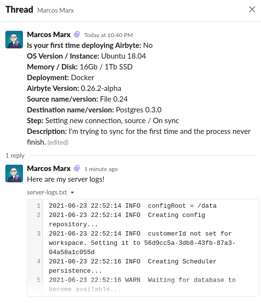

# Troubleshooting & FAQ

Our FAQ is now a section on our Discourse forum. Check it out [here](https://discuss.airbyte.io/c/faq/15)!
If you don't see your question answered, feel free to open up a new topic for it.

The troubleshooting section is aimed at collecting common issues users have to provide quick solutions. 
There are some sections you can find:
- [On Deploying](on-deploying.md): 
- [On Setting up a New Connection](new-connection.md)
- [On Running a Sync](running-sync.md)
- [On Upgrading](on-upgrading.md)

If you don't see your issue listed in those sections, you can send a message in our #issues Slack channel.
Using the template bellow will allow us to address your issue quickly and will give us full understanding of your situation.

## Slack Issue Template

**Is this your first time deploying Airbyte**: No / Yes  
**OS Version / Instance**: Ubuntu 18.04, Mac OS, Windows, GCP , EC2 micro.a4  
**Memory / Disk**: 16Gb / 1Tb SSD  
**Deployment**: Docker / Kubernetes  
**Airbyte Version**: 0.26.2-alpha  
**Source name/version**: File 0.24  
**Destination name/version**: Postgres 0.3.0  
**Step**: Setting new connection, source / On sync  
**Description**: I'm trying to sync for the first time and the process doesn't finish. I had enabled CDC and other cool features.  

Add the logs and other relevant information in the message thread.
Below is an example:

