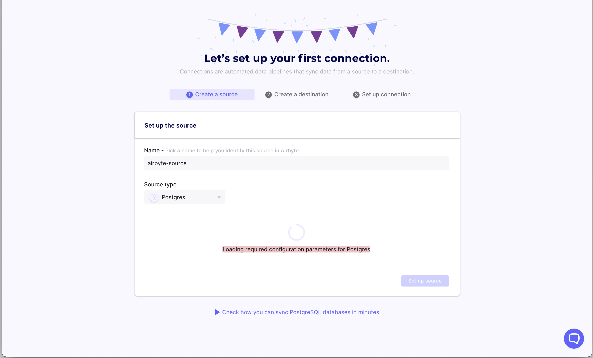

# On Setting up a New Connection

## Airbyte is stuck while loading required configuration parameters for my connector

Example of the issue:



To load configuration parameters, Airbyte must first `docker pull` the connector's image, which may be many hundreds of megabytes. Under poor connectivity conditions, the request to pull the image may take a very long time or time out. More context on this issue can be found [here](https://github.com/airbytehq/airbyte/issues/1462). If your Internet speed is less than 30Mbps down or are running bandwidth-consuming workloads concurrently with Airbyte, you may encounter this issue. Run a [speed test](https://fast.com/) to verify your internet speed.

One workaround is to manually pull the latest version of every connector you'll use then resetting Airbyte. Note that this will remove any configured connections, sources, or destinations you currently have in Airbyte. To do this:

1. Decide which connectors you'd like to use. For this example let's say you want the Postgres source and the Snowflake destination.
2. Find the Docker image name of those connectors. Look [here](https://github.com/airbytehq/airbyte/blob/master/airbyte-config/init/src/main/resources/seed/source_definitions.yaml) for sources and [here](https://github.com/airbytehq/airbyte/blob/master/airbyte-config/init/src/main/resources/seed/destination_definitions.yaml) for destinations. For each of the connectors you'd like to use, copy the value of the `dockerRepository` and `dockerImageTag` fields. For example, for the Postgres source this would be `airbyte/source-postgres` and e.g `0.1.6`.
3. For **each of the connectors** you'd like to use, from your shell run `docker pull <repository>:<tag>`, replacing `<repository>` and `<tag>` with the values copied from the step above e.g: `docker pull airbyte/source-postgres:0.1.6`.
4. Once you've finished downloading all the images, from the Airbyte repository root run `docker compose down -v` followed by `docker compose up`.
5. The issue should be resolved.

If the above workaround does not fix your problem, please report it [here](https://github.com/airbytehq/airbyte/issues/1462) or in our [Slack](https://slack.airbyte.io).

## Connection refused errors when connecting to a local db

Depending on your Docker network configuration, you may not be able to connect to `localhost` or `127.0.0.1` directly.

If you are running into connection refused errors when running Airbyte via Docker Compose on Mac, try using `host.docker.internal` as the host. On Linux, you may have to modify `docker-compose.yml` and add a host that maps to your local machine using [`extra_hosts`](https://docs.docker.com/compose/compose-file/compose-file-v3/#extra_hosts).

## I don’t see a form when selecting a connector

We’ve had that issue once. \(no spinner & 500 http error\). We don’t know why. Resolution: try to stop airbyte \(`docker compose down`\) & restart \(`docker compose up`\)

## Connection hangs when trying to run the discovery step

You receive the error below when you tried to sync a database with a lot of tables \(6000 or more\).

```bash
airbyte-server   | io.grpc.StatusRuntimeException: RESOURCE_EXHAUSTED: grpc: received message larger than max (<NUMBER> vs. 4194304)
```

There are two Github issues tracking this problem: [Issue \#3942](https://github.com/airbytehq/airbyte/issues/3942) and [Issue \#3943](https://github.com/airbytehq/airbyte/issues/3943)

The workaround for this is trying to transfer the tables you really want to use to another namespace. If you need all tables you should split them into separate namespaces and try to use two connections.

