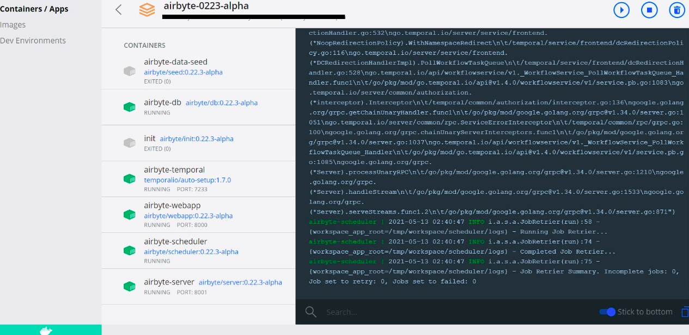

# On Deploying

## Stuck in onboarding, can’t skip or do anything

To fully reset Airbyte, you also need to delete the docker volumes associated with Airbyte. This is where data is stored. Assuming that you are running Airbyte by running `docker compose up`, then what you need to do is:

* Turn off Airbyte completely: `docker compose down -v`
* Turn Airbyte back on: `docker compose up`

that should handle you getting reset to the beginning. I would be curious if we can see the logs associated with the failure you are seeing. I would say if after you reset you run into it again we can debug that.

## Git says file names are too long.

If you are cloning the repo, you might run into a problem where git indicates that certain filenames are too long and it therefore can't create the local file. So if you received this error after cloning the repo, run the following commands in _git bash_:

```bash
cd airbyte
git config core.longpaths true
git reset --hard HEAD
```

However it's worth pointing out that the `core.longpaths` option is defaulted to false for a reason, so use with caution. This git configuration is only changed within the cloned Airbyte repo, so you won't need to worry about changing this setting for other repositories. Find more details about this issue in [this stack overflow question](https://stackoverflow.com/questions/22575662/filename-too-long-in-git-for-windows).

Instead of cloning the repo, you can alternatively download the latest Airbyte release [here](https://github.com/airbytehq/airbyte/releases). Unzip the downloaded file, access the unzipped file using PowerShell terminal, and run `docker compose up`. After this, you should see the Airbyte containers in the Docker application as in the image below.



## I have run `docker compose up` and can not access the interface

* If you see a blank screen and not a loading icon:

Check your web browser version; Some old versions of web browsers doesn't support our current Front-end stack.

* If you see a loading icon or the message `Cannot reach the server` persist:

Check if all Airbyte containers are running, executing: `docker ps`

```text
CONTAINER ID   IMAGE                            COMMAND                  CREATED        STATUS        PORTS                              NAMES
f02fc709b130   airbyte/server:1.11.1-alpha      "/bin/bash -c './wai…"   2 hours ago    Up 2 hours   8000/tcp, [...] :::8001->8001/tcp  airbyte-server
153b2b322870   airbyte/webapp:1.11.1-alpha      "/docker-entrypoint.…"   2 hours ago    Up 2 hours   :::8000->80/tcp                    airbyte-webapp
b88d94652268   airbyte/db:1.11.1-alpha          "docker-entrypoint.s…"   2 hours ago    Up 2 hours   5432/tcp                           airbyte-db
0573681a10e0   airbyte/temporal-auto-setup:1.13.0  "/entrypoint.sh /bin…"  2 hours ago  Up 2 hours   6933-6935/tcp, [...]               airbyte-temporal
```

You must see 4 containers running. If you are not seeing execute the following steps:

* `docker compose down -v`
* `docker compose up`

  Keep in mind the commands above will delete ALL containers, volumes and data created by Airbyte.

  We do not recommend this is you already deploy and have connection created.

First, let's check the server logs by running `docker logs airbyte-server | grep ERROR`.   
 If this command returns any output, please run `docker logs airbyte-server > airbyte-server.log`.   
 This command will create a file in the current directory. We advise you to send a message on our \#issues on Slack channel

If you don't have any server errors let's check the worker, `docker logs airbyte-worker | grep ERROR`.   
 If this command returns any output, please run `docker logs airbyte-worker > airbyte-worker.log`.   
 This command will create a file in the current directory. We advise you to send a message on our \#issues on Slack channel

If there is no error printed in both cases, we recommend running: `docker restart airbyte-server airbyte-worker`   
 Wait a few moments and try to access the interface again.

## `docker.errors.DockerException`: Error while fetching server API version

If you see the following error:

```text
docker.errors.DockerException: Error while fetching server API
version: ('Connection aborted.', FileNotFoundError(2, 'No such file or
directory'))
```

It usually means that Docker isn't running on your machine \(and a running Docker daemon is required to run Airbyte\). An easy way to verify this is to run `docker ps`, which will show `Cannot connect to the Docker daemon at unix:///var/run/docker.sock. Is the docker daemon running?` if the Docker daemon is not running on your machine.

This happens \(sometimes\) on Windows system when you first install `docker`. You need to restart your machine.

## Getting a weird error related to setting up the Airbyte server when running Docker Compose -- wondering if this is because I played around with Airbyte in a past version?

If you are okay with losing your previous Airbyte configurations, you can run `docker compose down -v` and that should fix things then `docker compose up`.

## `unauthorized: incorrect username or password` when running `docker compose up`

If you see the following error:

```bash
ERROR: Head "https://registry-1.docker.io/v2/airbyte/init/manifests/{XXX}": unauthorized: incorrect username or password
```

You are most likely logged into Docker with your email address instead of your Docker ID.
Log out of Docker by running `docker logout` and try running `docker compose up` again.

## Protocol Version errors from the bootloader when trying to upgrade

When starting up Airbyte, the bootloader may fail with the following error:
```
Aborting bootloader to avoid breaking existing connection after an upgrade. Please address airbyte protocol version support issues in the connectors before retrying.
```

We aborted the upgrade to avoid breaking existing connections due to a deprecation of protocol version.

Looking at the `airbyte-bootloader` logs, there should be a few messages describing the change of support range of the Airbyte Protocol:

```
2022-11-21 22:07:20 INFO i.a.b.ProtocolVersionChecker(validate):81 - Detected an AirbyteProtocolVersion range change from [0.0.0:2.0.0] to [1.0.0:2.0.0]
2022-11-21 22:07:20 WARN i.a.b.ProtocolVersionChecker(validate):98 - The following connectors need to be upgraded before being able to upgrade the platform
2022-11-21 22:07:20 WARN j.u.s.ReferencePipeline$3$1(accept):197 - Source: d53f9084-fa6b-4a5a-976c-5b8392f4ad8a: E2E Testing: protocol version: 0.2.1
```

From this example, this upgrade will drop the support for the major version 0 of the Airbyte Protocol. One connector here is problematic, we have the `E2E Testing` source connector that is blocking the upgrade because it is still using protocol version 0.2.1.

In order to resolve this situation, all the problematic connectors must be upgraded to a version that is using a newer version of the Airbyte Protocol. In this specific example, we should target version 1 or 2, our recommendation is to always target the most recent version.

For more details on how to upgrade a custom connector, you may want to refer to the [custom connector](../operator-guides/using-custom-connectors.md) documentation.
