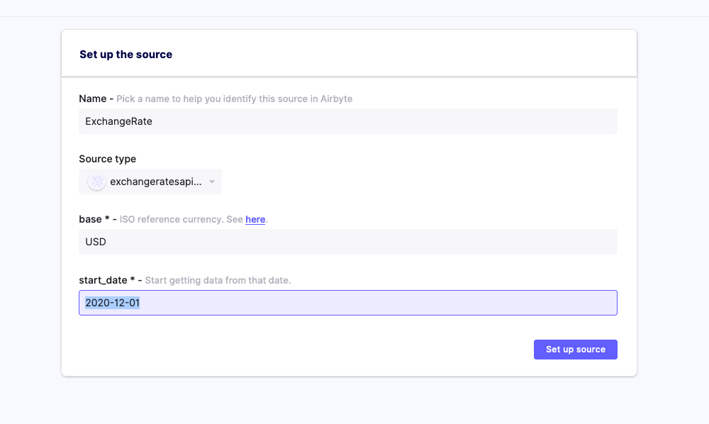
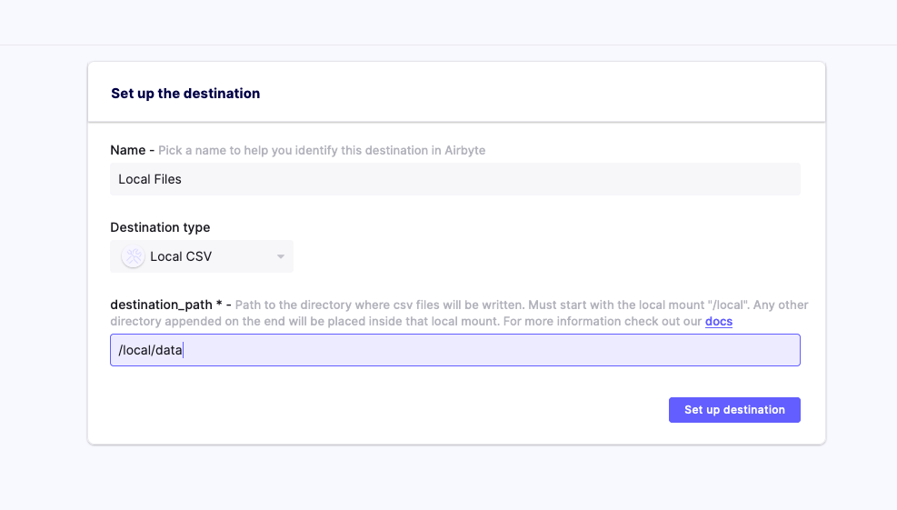
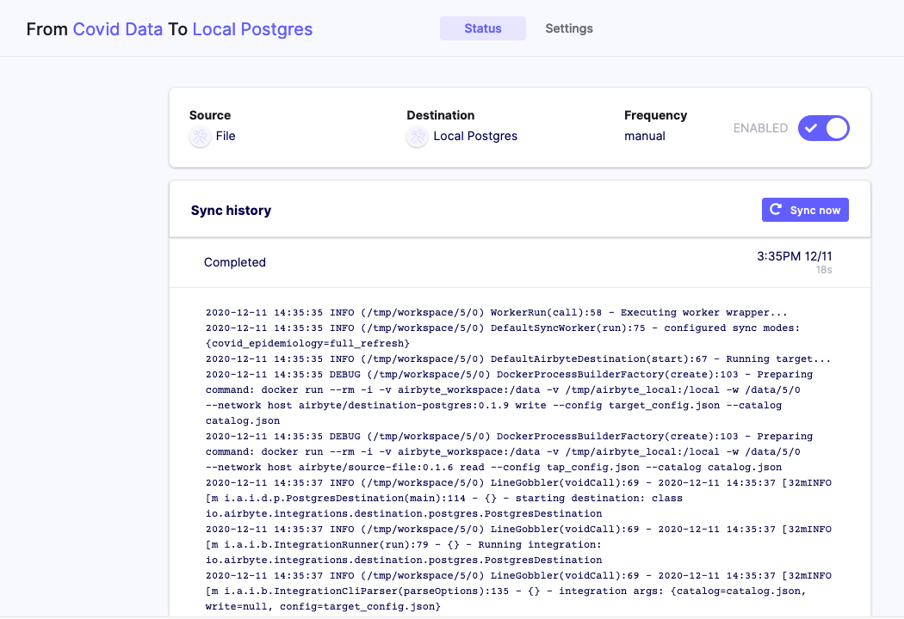

# Config & Persistence

Once you manage to spin up a local instance of Airbyte, following steps in the [Getting started Tutorial](../getting-started.md), you may want to gain a better understanding of what configuration files are available in Airbyte and how to work with it.

As we continue to improve the User experience around those aspects to make it simpler in the UI, this tutorial will go over how to manually import and export Airbyte configurations of connectors.

This may be useful if you need, for example, to version control, make a backup, share with your team, or if you just want to debug and learn more about Airbyte internals.

Here are the goals for this tutorial:

1. Access replication logs files
2. Export & Import Airbyte Configurations
3. Export normalization models to use in your own DBT project

## Setting up a local Postgres Destination

For this tutorial, we are going to use 2 types of destinations to run our demo where data will be written:

* Local File Destination
* Local Postgres Database

The local files will be written by default to the directory `/tmp/airbyte_local`.

The `postgres` database that we are going to spin up below will be running locally with the following configuration where data will be written:

* Host: localhost
* Port: 3000
* User: postgres
* Password: password
* DB Name: postgres

```bash
#!/usr/bin/env bash

echo "File Content in the local destination (may not exist yet):"
find /tmp/airbyte_local

echo ""

docker ps | grep -q local-airbyte-postgres-destination
if [ $? -eq 0 ]; then
    echo "Postgres Database local-airbyte-postgres-destination is already up"
else 
    echo "Start a Postgres container named local-airbyte-postgres-destination"
    docker run --rm --name local-airbyte-postgres-destination -e POSTGRES_PASSWORD=password -p 3000:5432 -d postgres
fi

echo ""

echo "Docker Containers currently running:"

docker ps
```

Example Output:

```text
File Content in the local destination (may not exist yet):
find: /tmp/airbyte_local: No such file or directory

Start a Postgres container named local-airbyte-postgres-destination
8e24a9682a1ec2e7539c7ada5d993120d3337cff07a54603fcdb8d44f4013aab

Docker Containers currently running:
CONTAINER ID   IMAGE      COMMAND                  CREATED        STATUS                  PORTS                    NAMES
8e24a9682a1e   postgres   "docker-entrypoint.s…"   1 second ago   Up Less than a second   0.0.0.0:3000->5432/tcp   local-airbyte-postgres-destination
```

## Starting Airbyte Server

As we've seen in the previous tutorial, we can spin up Airbyte instance after installing it:

```bash
#!/usr/bin/env bash

docker-compose up -d

echo -e "\n"

echo "Docker Containers currently running:"
docker ps
```

Example Output:

```text
WARNING: The API_URL variable is not set. Defaulting to a blank string.
Creating network "airbyte_default" with the default driver
Creating volume "airbyte_workspace" with default driver
Creating volume "airbyte_data" with default driver
Creating volume "airbyte_db" with default driver
Creating init ... 
Creating airbyte-data-seed ... 
Creating airbyte-db        ... 
Creating airbyte-server    ... mdone
Creating airbyte-scheduler ... 
Creating airbyte-webapp    ... mdone
ting airbyte-webapp    ... done

Docker Containers currently running:
CONTAINER ID   IMAGE                           COMMAND                  CREATED         STATUS                  PORTS                              NAMES
39cec3eb5953   airbyte/webapp:0.7.1-alpha      "/docker-entrypoint.…"   1 second ago    Up Less than a second   0.0.0.0:8000->80/tcp               airbyte-webapp
f0ff3f8f2b2b   airbyte/scheduler:0.7.1-alpha   "/bin/bash -c './wai…"   1 second ago    Up 1 second                                                airbyte-scheduler
50448db21673   airbyte/server:0.7.1-alpha      "/bin/bash -c './wai…"   1 second ago    Up Less than a second   8000/tcp, 0.0.0.0:8001->8001/tcp   airbyte-server
2aa496838b99   airbyte/db:0.7.1-alpha          "docker-entrypoint.s…"   2 seconds ago   Up 1 second             5432/tcp                           airbyte-db
8e24a9682a1e   postgres                        "docker-entrypoint.s…"   8 seconds ago   Up 7 seconds            0.0.0.0:3000->5432/tcp             local-airbyte-postgres-destination
```

Note that if you already went through the previous tutorial or already used Airbyte in the past, you may not need to complete the Onboarding process this time.

Otherwise, please complete the different steps until you reach the Airbyte Dashboard page.

After a few seconds, the UI should be ready to go at [http://localhost:8000/](http://localhost:8000/)

## Notes about running this tutorial on macOS vs Linux

Note that Docker for Mac is not a real Docker host, now it actually runs a virtual machine behind the scenes and hides it from you to make things simpler. Here's the simpler version, unless you want to dig deeper... just like our current use case where we want to inspect the content of internal Docker volumes...

Here are some related links as references on accessing Docker Volumes:

* on macOS [Using Docker containers in 2019](https://stackoverflow.com/a/55648186)
* official doc [Use Volume](https://docs.docker.com/storage/volumes/#backup-restore-or-migrate-data-volumes)

From these discussions, we will be using on macOS either:

1. any docker container/image to browse the virtual filesystem by mounting the volume in order to access them, for example with [busybox](https://hub.docker.com/_/busybox)
2. or extract files from the volume by copying them onto the host with [Docker cp](https://docs.docker.com/engine/reference/commandline/cp/)

However as a side remark on Linux, accessing to named Docker Volume can be easier since you simply need to:

```text
docker volume inspect <volume_name>
```

Then look at the `Mountpoint` value, this is where the volume is actually stored in the host filesystem and you can directly retrieve files directly from that folder.

Back to this tutorial, commands shown below should work for both macOS and Linux !

## Export Initial Setup

Now let's first make a backup of the configuration state of your Airbyte instance by running the following commands.

```bash
TUTORIAL_DIR=$(pwd)/build/persistence-tutorial
mkdir -p $TUTORIAL_DIR/my-setup

docker cp airbyte-server:/data $TUTORIAL_DIR/my-setup
```

## Configure Exchange Rate source and File destination

Head back to [http://localhost:8000/](http://localhost:8000/) and add more connectors. Here is an example of configuration from an API source:



and a local file destination:



## Run a Sync job

* once the source and destination are created
* the catalog and frequency can be configured
* then run the "Sync Now" button
* finally inspect logs in the UI


## Exploring Logs folders

We can read from the lines reported in the logs the working directory that is being used to run the synchronization process from.

As an example in the previous run, it is being ran in `/tmp/workspace/5/0` and we notice the different docker commands being used internally are starting with:

```text
docker run --rm -i -v airbyte_workspace:/data -v /tmp/airbyte_local:/local -w /data/5/0 --network host ...
```

From there, we can observe that Airbyte is using a docker named volume called `airbyte_workspace` that is mounted in the container at the location `/data`.

Following [Docker Volume documentation](https://docs.docker.com/storage/volumes/), we can inspect and manipulate persisted configuration data in these volumes. For example, we can run any docker container/image to browse the content of this named volume by mounting it in a similar way, let's use the [busybox](https://hub.docker.com/_/busybox) image.

```text
docker run -it --rm --volume airbyte_workspace:/data busybox
```

This will drop you into an `sh` shell to allow you to do what you want inside a BusyBox system from which we can browse the filesystem and accessing to logs files:

```text
ls /data/5/0/
```

Example Output:

```text
catalog.json                  normalize                     tap_config.json
logs.log                      singer_rendered_catalog.json  target_config.json
```

Or you can simply run:

```bash
docker run -it --rm --volume airbyte_workspace:/data busybox ls /data/4/0
```

Example Output:

```text
catalog.json                 singer_rendered_catalog.json
logs.log                     tap_config.json
normalize                    target_config.json
```

```bash
docker run -it --rm --volume airbyte_workspace:/data busybox cat /data/5/0/catalog.json
```

Example Output:

```text
{"streams":[{"stream":{"name":"exchange_rate","json_schema":{"type":"object","properties":{"CHF":{"type":"number"},"HRK":{"type":"number"},"date":{"type":"string"},"MXN":{"type":"number"},"ZAR":{"type":"number"},"INR":{"type":"number"},"CNY":{"type":"number"},"THB":{"type":"number"},"AUD":{"type":"number"},"ILS":{"type":"number"},"KRW":{"type":"number"},"JPY":{"type":"number"},"PLN":{"type":"number"},"GBP":{"type":"number"},"IDR":{"type":"number"},"HUF":{"type":"number"},"PHP":{"type":"number"},"TRY":{"type":"number"},"RUB":{"type":"number"},"HKD":{"type":"number"},"ISK":{"type":"number"},"EUR":{"type":"number"},"DKK":{"type":"number"},"CAD":{"type":"number"},"MYR":{"type":"number"},"USD":{"type":"number"},"BGN":{"type":"number"},"NOK":{"type":"number"},"RON":{"type":"number"},"SGD":{"type":"number"},"CZK":{"type":"number"},"SEK":{"type":"number"},"NZD":{"type":"number"},"BRL":{"type":"number"}}},"supported_sync_modes":["full_refresh"],"default_cursor_field":[]},"sync_mode":"full_refresh","cursor_field":[]}]}
```

## Check local data folder

Since the job completed successfully, a new file should be available in the special `/local/` directory in the container which is mounted from `/tmp/airbyte_local` on the host machine.

```bash
#!/usr/bin/env bash

echo "In the container:"

docker run -it --rm -v /tmp/airbyte_local:/local busybox find /local

echo ""
echo "On the host:"

find /tmp/airbyte_local
```

Example Output:

```text
In the container:
/local
/local/data
/local/data/exchange_rate_raw.csv

On the host:
/tmp/airbyte_local
/tmp/airbyte_local/data
/tmp/airbyte_local/data/exchange_rate_raw.csv
```

## Backup Exchange Rate Source and Destination configurations

In the following steps, we will play with persistence of configurations so let's make a backup of our newly added connectors for now:

```bash
mkdir -p $TUTORIAL_DIR/exchange-rate-setup

docker cp airbyte-server:data $TUTORIAL_DIR/exchange-rate-setup
```

## Shutting down Airbyte server and clear previous configurations

Whenever you want to stop the Airbyte server, you can run: `docker-compose down`

From [docker documentation](https://docs.docker.com/compose/reference/down/)

```text
This command stops containers and removes containers, networks, volumes, and images created by up.

By default, the only things removed are:

- Containers for services defined in the Compose file
- Networks defined in the networks section of the Compose file
- The default network, if one is used

Networks and volumes defined as external are never removed.

Anonymous volumes are not removed by default. However, as they don’t have a stable name, they will not be automatically mounted by a subsequent up. For data that needs to persist between updates, use host or named volumes.
```

So since Airbyte is using named volumes to store the configurations, if you run `docker-compose up` again, your connectors configurations from earlier steps will still be available.

Let's wipe our configurations on purpose and use the following option:

```text
-v, --volumes           Remove named volumes declared in the `volumes`
                            section of the Compose file and anonymous volumes
                            attached to containers.
```

Note that the `/tmp/airbyte_local:/local` that we saw earlier is a [bind mount](https://docs.docker.com/storage/bind-mounts/) so data that was replicated locally won't be affected by the next command.

However it will get rid of the named volume workspace so all logs and generated files by Airbyte will be lost.

We can then run:

```bash
docker-compose down -v
docker-compose up -d
```

Example Output:

```text
WARNING: The API_URL variable is not set. Defaulting to a blank string.
Stopping airbyte-webapp    ... 
Stopping airbyte-scheduler ... 
Stopping airbyte-server    ... 
Stopping airbyte-db        ... 
Removing airbyte-webapp    ... mdone
Removing airbyte-scheduler ... 
Removing airbyte-server    ... 
Removing airbyte-data-seed ... 
Removing airbyte-db        ... 
Removing init              ... 
Removing network airbyte_defaultdone
Removing volume airbyte_workspace
Removing volume airbyte_data
Removing volume airbyte_db
WARNING: The API_URL variable is not set. Defaulting to a blank string.
Creating network "airbyte_default" with the default driver
Creating volume "airbyte_workspace" with default driver
Creating volume "airbyte_data" with default driver
Creating volume "airbyte_db" with default driver
Creating init ... 
Creating airbyte-data-seed ... 
Creating airbyte-db        ... 
Creating airbyte-server    ... mdone
Creating airbyte-scheduler ... mdone
Creating airbyte-webapp    ... mdone
ting airbyte-webapp    ... done
```

Wait a moment for the webserver to start and go refresh the page [http://localhost:8000/](http://localhost:8000/).

We are prompted with the onboarding process again...

Let's ignore that step, close the page and go back to the notebook to import configurations from our initial setup instead.

## Restore our initial setup

We can play and restore files in the named docker volume `data` and thus retrieve files that were created from earlier:

```bash
docker cp $TUTORIAL_DIR/my-setup/data/config airbyte-server:data
```

Now refresh back the page [http://localhost:8000/](http://localhost:8000/) again, wait a little bit for the server to pick up the freshly imported configurations... Tada! We don't need to complete the onboarding process anymore! and we have the list of connectors that were created previously available again. Thus you can use this ability of export/import files from named volumes to share with others the configuration of your connectors.

Warning: and it will include credentials, so be careful too!

## Configure some Covid \(data\) source and Postgres destinations

Let's re-iterate the source and destination creation, this time, with a file accessible from a public API:

```text
Here are some examples of public API CSV:
https://storage.googleapis.com/covid19-open-data/v2/latest/epidemiology.csv
```


And a local Postgres Database:


After setting up the connectors, we can trigger the sync and study the logs:



Since we wiped the workspace volume and restarted the Airbyte Server, notice that the process ran in the `/tmp/workspace/5/0` as well but the logs for ExchangeRate are gone...

## Export and customize Normalization step with DBT

In the previous connector configuration, selected a Postgres Database destination and chose to enable the "Basic Normalization" option.

In Airbyte, data is written in destination in a JSON blob format in tables with suffix "\_raw" as it is taking care of the `E` and `L` in `ELT`.

The normalization option adds a last `T` transformation step that takes care of converting such JSON tables into flat tables. To do so, Airbyte is currently using [DBT](https://docs.getdbt.com/) to handle such tasks which can be manually triggered in the normalization container like this:

```bash
#!/usr/bin/env bash

# find latest workspace where normalization was run
NORMALIZE_WORKSPACE=`docker run --rm -i -v airbyte_workspace:/data  busybox find /data -path "*normalize/models*" | sed -E "s;/data/([0-9]+/[0-9]+/)normalize/.*;\1;g" | sort | 
uniq | tail -n 1`

docker run --rm -i -v airbyte_workspace:/data -w /data/$NORMALIZE_WORKSPACE/normalize --network host --entrypoint /usr/local/bin/dbt airbyte/normalization debug --profiles-dir=. --project-dir=.
docker run --rm -i -v airbyte_workspace:/data -w /data/$NORMALIZE_WORKSPACE/normalize --network host --entrypoint /usr/local/bin/dbt airbyte/normalization run --profiles-dir=. --project-dir=.
```

Example Output:

```text
Running with dbt=0.18.1
dbt version: 0.18.1
python version: 3.7.9
python path: /usr/local/bin/python
os info: Linux-4.19.121-linuxkit-x86_64-with-debian-10.6
Using profiles.yml file at ./profiles.yml
Using dbt_project.yml file at /data/5/0/normalize/dbt_project.yml

Configuration:
  profiles.yml file [OK found and valid]
  dbt_project.yml file [OK found and valid]

Required dependencies:
 - git [OK found]

Connection:
  host: localhost
  port: 3000
  user: postgres
  database: postgres
  schema: quarantine
  search_path: None
  keepalives_idle: 0
  sslmode: None
  Connection test: OK connection ok

Running with dbt=0.18.1
Found 1 model, 0 tests, 0 snapshots, 0 analyses, 302 macros, 0 operations, 0 seed files, 1 source

14:37:10 | Concurrency: 32 threads (target='prod')
14:37:10 | 
14:37:10 | 1 of 1 START table model quarantine.covid_epidemiology....................................................... [RUN]
14:37:11 | 1 of 1 OK created table model quarantine.covid_epidemiology.................................................. [SELECT 17911 in 0.33s]
14:37:11 | 
14:37:11 | Finished running 1 table model in 0.50s.

Completed successfully

Done. PASS=1 WARN=0 ERROR=0 SKIP=0 TOTAL=1
```

As seen earlier, it is possible to browse the workspace folders and examine further logs if an error occurs.

In particular, we can also take a look at the DBT models generated by Airbyte and export them to the local host filesystem:

```bash
#!/usr/bin/env bash

rm -rf $TUTORIAL_DIR/normalization-files
mkdir -p $TUTORIAL_DIR/normalization-files

docker cp airbyte-server:/tmp/workspace/$NORMALIZE_WORKSPACE/normalize/ $TUTORIAL_DIR/normalization-files

NORMALIZE_DIR=$TUTORIAL_DIR/normalization-files/normalize
cd $NORMALIZE_DIR
cat $NORMALIZE_DIR/models/generated/*.sql
```

Example Output:

```text
with 
covid_epidemiology_node as (
  select 
    emitted_at,
    {{ dbt_utils.current_timestamp_in_utc()  }} as normalized_at,
    cast({{ json_extract_scalar('data', ['date'])  }} as {{ dbt_utils.type_string()  }}) as date,
    cast({{ json_extract_scalar('data', ['new_recovered'])  }} as {{ dbt_utils.type_float()  }}) as new_recovered,
    cast({{ json_extract_scalar('data', ['new_tested'])  }} as {{ dbt_utils.type_float()  }}) as new_tested,
    cast({{ json_extract_scalar('data', ['total_deceased'])  }} as {{ dbt_utils.type_float()  }}) as total_deceased,
    cast({{ json_extract_scalar('data', ['new_deceased'])  }} as {{ dbt_utils.type_float()  }}) as new_deceased,
    cast({{ json_extract_scalar('data', ['new_confirmed'])  }} as {{ dbt_utils.type_float()  }}) as new_confirmed,
    cast({{ json_extract_scalar('data', ['total_confirmed'])  }} as {{ dbt_utils.type_float()  }}) as total_confirmed,
    cast({{ json_extract_scalar('data', ['total_tested'])  }} as {{ dbt_utils.type_float()  }}) as total_tested,
    cast({{ json_extract_scalar('data', ['total_recovered'])  }} as {{ dbt_utils.type_float()  }}) as total_recovered,
    cast({{ json_extract_scalar('data', ['key'])  }} as {{ dbt_utils.type_string()  }}) as key
  from {{ source('quarantine', 'covid_epidemiology_raw')  }}
),
covid_epidemiology_with_id as (
  select
    *,
    {{ dbt_utils.surrogate_key([
        'date',
        'new_recovered',
        'new_tested',
        'total_deceased',
        'new_deceased',
        'new_confirmed',
        'total_confirmed',
        'total_tested',
        'total_recovered',
        'key'
    ])  }} as _covid_epidemiology_hashid
    from covid_epidemiology_node
)
select * from covid_epidemiology_with_id
```

If you have [dbt cli](https://docs.getdbt.com/dbt-cli/cli-overview/) installed on your machine, you can then view, edit, customize and run the dbt models in your project if you want to bypass the normalization steps generated by Airbyte!

```bash
#!/usr/bin/env bash 

dbt deps --profiles-dir=$NORMALIZE_DIR --project-dir=$NORMALIZE_DIR
dbt run --profiles-dir=$NORMALIZE_DIR --project-dir=$NORMALIZE_DIR --full-refresh
```

Example Output:

```text
Running with dbt=0.18.1
Installing https://github.com/fishtown-analytics/dbt-utils.git@0.6.2
  Installed from revision 0.6.2

Running with dbt=0.18.1
Found 1 model, 0 tests, 0 snapshots, 0 analyses, 302 macros, 0 operations, 0 seed files, 1 source

15:37:54 | Concurrency: 32 threads (target='prod')
15:37:54 | 
15:37:55 | 1 of 1 START table model quarantine.covid_epidemiology....................................................... [RUN]
15:37:55 | 1 of 1 OK created table model quarantine.covid_epidemiology.................................................. [SELECT 17911 in 0.30s]
15:37:55 | 
15:37:55 | Finished running 1 table model in 0.51s.

Completed successfully

Done. PASS=1 WARN=0 ERROR=0 SKIP=0 TOTAL=1
```

