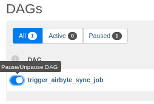
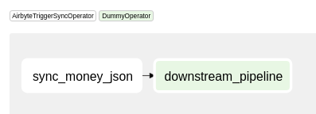
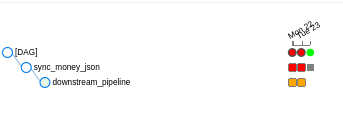

# Airflow Integration

During this tutorial we are going to replicate currencies closing price into a JSON file sync connection in Airbyte and use Airflow to trigger this job.

## 1. Set up the tools

First of all, make sure you have Docker and Docker Compose installed. 

### **Start Airbyte**
Then run the following commands:
```text
git clone https://github.com/airbytehq/airbyte.git
cd airbyte
docker-compose up
```

Once you see an Airbyte banner, the UI is ready to go at [http://localhost:8000/](http://localhost:8000/).

### **Start Airflow**
- [ ] Create walkthrough to setup Airflow

[Quick start Airflow](https://airflow.apache.org/docs/apache-airflow/stable/start/docker.html)


## 2. Create the sync connection in Airbyte

### **Set up your preferences**

You should see an onboarding page. Enter your email if you want updates about Airbyte and continue.


### **Set up your first connection**

#### **Create a source**

The source we are creating will pull data from an external API. It will replicate the closing price of currencies compared to USD since the specified start date.

To set it up, just follow the instructions on the screenshot below.


You might have to wait ~30 seconds before the fields show up because it is the first time you're using Airbyte.



#### **Create a destination**

The destination we are creating is a simple JSON line file, meaning that it will contain one JSON object per line. Each objects will represent data extracted from the source.

The resulting files will be located in `/tmp/airbyte_local/json_data`

To set it up, just follow the instructions on the screenshot below.


You might have to wait ~30 seconds before the fields show up because it is the first time you're using Airbyte.



#### **Create connection**

When we create the connection, we can select which data stream we want to replicate. We can also select if we want an incremental replication. The replication will run at the specified sync frequency.

To set it up, just follow the instructions on the screenshot below.
Configure the sync frequency to **manual**


## 3. Create a DAG in Airflow to trigger your Airbyte sync

The Airflow UI is ready to go at [http://localhost:8080/](http://localhost:8080/).

### Create Airbyte connection in Airflow
After Airflow starts, access the connections page to create our connection with Airbyte.


Insert data about our connection. We are going to use the Airbyte API to execute our actions. For this reason we will create an HTTP connection.


After inserting the information click on Save.

### Create a simple DAG in Airflow to run a sync job
Create a file inside the `/dags` directory called `dag_airbyte_example.py`
```python
from airflow import DAG
from airflow.utils.dates import days_ago
from airflow.operators.dummy import DummyOperator
from airflow.providers.airbyte.operator import AirbyteTriggerSyncOperator

with DAG(dag_id='dag_airbyte_example',
         schedule_interval='* 15 * * *',
         start_date=days_ago(7)) as dag:

    money_json = AirbyteTriggerSyncOperator(
        task_id='sync_money_json',
        airbyte_conn_id='airbyte_conn_example',
        source_name='Money',
        dest_name='JSON destination'
    )

    another_task = DummyOperator(
        task_id='downstream pipeline'
    )

    money_json >> another_task
```
After creating the file our DAG will show up in Airflow UI. Click on the button shown below to actived our DAG. Soon our DAG will be trigger.



You can navigate inside the DAG and check the graph created.



You can check the job status in Airflow UI.



### Check if the Airflow DAG trigger our sync
(check in Airbyte if the job was called)


## That's it!

This is just the beginning of using Airbyte. We support a large collection of sources and destination. You can even contribute your own.

If you have any questions at all, please reach out to us on [Slack](https://slack.airbyte.io/). We’re still in alpha, so if you see any rough edges or want to request a connector you need, please create an issue on our [Github](https://github.com/airbytehq/airbyte) or leave a thumbs up on an existing issue.
