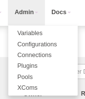
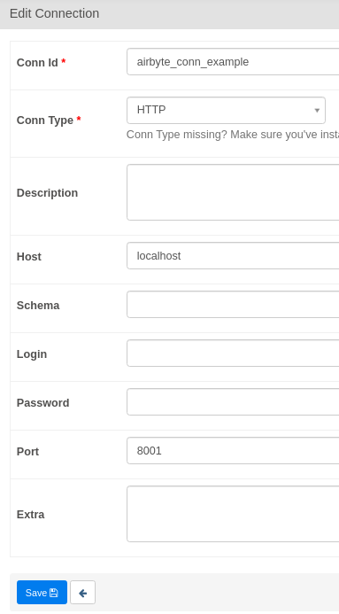

# Airflow Integration 
Airbyte allows you to trigger synchronization jobs using Airflow Operators. This tutorial explains how to configure your Airflow DAG to do so. 

## 1. Set up the tools

First, make sure you have Docker installed. (We'll be using the `docker-compose` command, so your install should contain `docker-compose`.)

### **Start Airbyte**
If this is your first time using Airbyte, we suggest first going through our [basic tutorial](../getting-started.md). This tutorial will use the connection set up in the basic tutorial.

The recommendation is to set up the **sync frequency** of your Connection to **manual** because Airflow will be responsible for triggering the job.

### **Start Airflow**

If you don't have an Airflow instance, we recommend following this [Quick start Airflow tutorial](https://airflow.apache.org/docs/apache-airflow/stable/start/docker.html) to set one up.

## 2. Create a DAG in Airflow to trigger your Airbyte job

### Create an Airbyte connection in Airflow
Once Airflow starts, navigate to Airflow's `Connections` page. The Airflow UI can be accessed at [http://localhost:8080/](http://localhost:8080/).



Airflow will use the Airbyte API to execute our actions. For this reason, we will create a HTTP connection. The typical Airbyte set up is hosted at `localhost:8001`. Configure Airflow's HTTP connection accordingly - we've provided a screenshot example.



After inserting the information, don't forget to click save!

### Retrieving the Airbyte Connection ID
We'll need the Airbyte connection id so our Airflow DAG knows which Airbyte connection to trigger.

This id can be seen in the URL on the connection page in the Airbyte UI.  The Airbyte UI can be accessed at `localhost:8000`

### Creating a simple Airflow DAG to run an Airbyte Sync Job
Place the following file inside the `/dags` directory. Name this file `dag_airbyte_example.py`.
```python
from airflow import DAG
from airflow.utils.dates import days_ago
from airflow.providers.airbyte.operator import AirbyteTriggerSyncOperator

with DAG(dag_id='trigger_airbyte_job_example',
         default_args={'owner': 'airflow'},
         schedule_interval='@daily',
         start_date=days_ago(1)
    ) as dag:

    money_to_json = AirbyteTriggerSyncOperator(
        task_id='airbyte_money_json_example',
        airbyte_conn_id='airbyte_conn_example',
        connection_id='1e3b5a72-7bfd-4808-a13c-204505490110',
        asynchronous=False,
        timeout=360,
        wait_seconds=5
    )
```
The Airbyte Airflow Operator accepts the following parameters:
- `airbyte_conn_id`: Name of the Airflow HTTP Connection pointing at the Airbyte API. Tells Airflow where the Airbyte API is located.
- `connection_id`: The ID of the Airbyte Connection to be triggered by Airflow.
- `asynchronous`: Determines how the Airbyte Operator runs. When true, Airflow will monitor the Airbyte Job using a **AirbyteJobSensor**. Since sensors do not occupy an Airflow worker slot, this is helps reduce Airflow load. Default is `false`.
- `timeout`: Maximum time Airflow will wait for the Airbyte job to complete. Only valid when `asynchronous=False`.
- `wait_seconds`: The amount of time to wait between checks. Only valid when `asynchronous=False`.

Our DAG will show up in Airflow UI shortly after we place our DAG file and can be activated by clicking the button shown below. Airflow will trigger the DAG shortly after.


Check to see if the job started syncing in the Airbyte UI's Sync History tab!


Simple like that! 

For more experienced users, the example below can be valuable:

### Using the `asynchronous` parameter
If your Airflow instance has limited resources and/or is under load, setting the `asynchronous=True` can help.

```python
from airflow import DAG
from airflow.utils.dates import days_ago
from airflow.providers.airbyte.operator import AirbyteTriggerSyncOperator

with DAG(dag_id='airbyte_trigger_job_example_async',
         default_args={'owner': 'airflow'},
         schedule_interval='@daily',
         start_date=days_ago(1)
    ) as dag:

    async_money_to_json = AirbyteTriggerSyncOperator(
        task_id='airbyte_async_money_json_example',
        airbyte_conn_id='airbyte_conn_example',
        connection_id='1e3b5a72-7bfd-4808-a13c-204505490110',
        asynchronous=True,
    )

    airbyte_sensor = AirbyteJobSensor(
        task_id='airbyte_sensor_money_json_example',
        airbyte_conn_id='airbyte_conn_example',
        airbyte_job_id=async_money_to_json.output
    )

    async_money_to_json >> airbyte_sensor
```

## That's it!

This is just the beginning of using Airbyte. We support a large collection of sources and destinations. You can even contribute your own.

If you have any questions at all, please reach out to us on [Slack](https://slack.airbyte.io/). We're still in alpha, so if you see any rough edges or want to request a connector you need, please create an issue on our [Github](https://github.com/airbytehq/airbyte) or leave a thumbs up on an existing issue.
