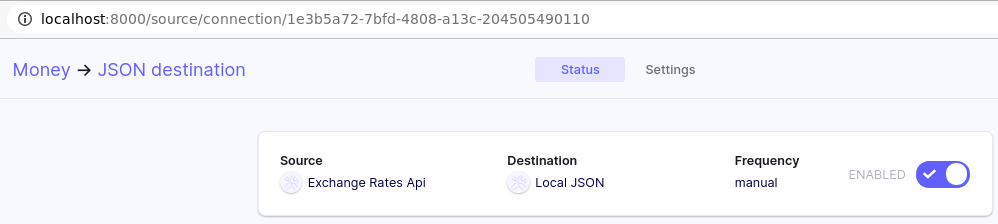

# Airflow Integration 
Airbyte allows to trigger the syncronization job using Operators in Airflow. This tutorials explain how to configure your DAG in Airflow to do this. 

## 1. Set up the tools

First of all, make sure you have Docker and Docker Compose installed. 

### **Start Airbyte**
For this tutorial you need have a connection created. If you are starting with Airbyte and want to test the integration, we suggest to you follow the [Getting Started tutorial](../getting-started.md) and use that connection.

The recommendation is to set up the **sync frequency** of your Connection to **manual** because Airflow will become responsible to trigger this process.


### **Start Airflow**

To setup Airflow we recommend you to follow this [Quick start Airflow](https://airflow.apache.org/docs/apache-airflow/stable/start/docker.html) if you don't have any instances yet.


## 2. Create a DAG in Airflow to trigger your Airbyte job

You can access Airflow at [http://localhost:8080/](http://localhost:8080/).

### Create Airbyte connection in Airflow
After Airflow starts, access the connections page to create our connection with Airbyte.


Insert data about our connection. We are going to use the Airbyte API to execute our actions. For this reason we will create an HTTP connection.


After inserting the information click on Save.

### Getting information about your Airbyte connection job
You can access Airbyte at `localhost:8000`. 

That code in the url is the `connectionId` used by Airflow to trigger the job. In our example: `1e3b5a72-7bfd-4808-a13c-204505490110`

### Create a simple DAG in Airflow to run a sync job
Create a file inside the `/dags` directory called `dag_airbyte_example.py`
```python
from airflow import DAG
from airflow.utils.dates import days_ago
from airflow.providers.airbyte.operator import AirbyteTriggerSyncOperator

with DAG(dag_id='trigger_airbyte_job_example',
         default_args={'owner': 'airflow'},
         schedule_interval='@daily',
         start_date=days_ago(1)
    ) as dag:

    money_to_json = AirbyteTriggerSyncOperator(
        task_id='airbyte_money_json_example',
        airbyte_conn_id='airbyte_conn_example',
        connection_id='1e3b5a72-7bfd-4808-a13c-204505490110',
        asynchronous=False,
        timeout=360,
        wait_seconds=5
    )
```
About the parameters used in the Operator:
- `airbyte_conn_id`: the HTTP connection configured above.
- `connection_id`: The uuid code for the connection job. You can get this in the url path from Airbyte UI.
- `asynchronous`: this is specific to Airflow DAG execution. Default is `false`. This is useful for submitting long running jobs and         waiting on them asynchronously using the **AirbyteJobSensor**. If you have a very busy Airflow instance this could be handful because after submiting the job you use the sensor to check, and a sensor doesn't occupy a worker slot in Airflow. Later we show how to configure a DAG using this configuration.
- `timeout`: maximum time to wait to finish the job to complete. This argument is only used when `asynchronous=False`.
- `wait_seconds`: The amount of time to wait between checks. This argument is only used when `asynchronous=False`.


After creating the file our DAG will show up in Airflow UI. Click on the button shown below to actived our DAG. Soon our DAG will be trigger.


You can check the job got start sync in Airbyte UI.


### How to create your DAG using the async parameter
As commented before, if your Airflow instance is limited or already had alot of DAGs running you can you this option to trigger a more performatic DAG.

```python
from airflow import DAG
from airflow.utils.dates import days_ago
from airflow.providers.airbyte.operator import AirbyteTriggerSyncOperator

with DAG(dag_id='airbyte_trigger_job_example_async',
         default_args={'owner': 'airflow'},
         schedule_interval='@daily',
         start_date=days_ago(1)
    ) as dag:

    async_money_to_json = AirbyteTriggerSyncOperator(
        task_id='airbyte_async_money_json_example',
        airbyte_conn_id='airbyte_conn_example',
        connection_id='1e3b5a72-7bfd-4808-a13c-204505490110',
        asynchronous=True,
    )

    airbyte_sensor = AirbyteJobSensor(
        task_id='airbyte_sensor_money_json_example',
        airbyte_conn_id='airbyte_conn_example',
        airbyte_job_id=async_money_to_json.output
    )

    async_money_to_json >> airbyte_sensor
```

## That's it!

This is just the beginning of using Airbyte. We support a large collection of sources and destination. You can even contribute your own.

If you have any questions at all, please reach out to us on [Slack](https://slack.airbyte.io/). We’re still in alpha, so if you see any rough edges or want to request a connector you need, please create an issue on our [Github](https://github.com/airbytehq/airbyte) or leave a thumbs up on an existing issue.