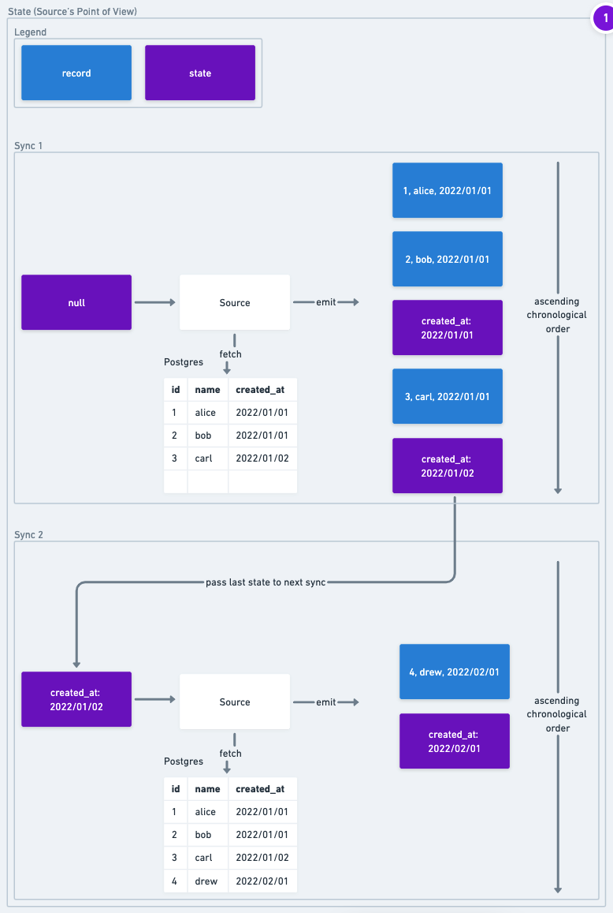
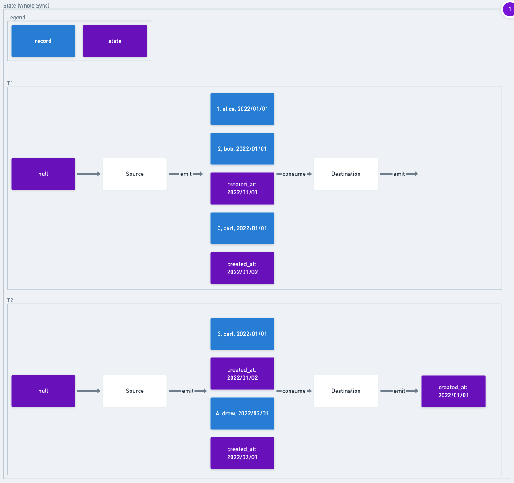

# Airbyte Protocol

## Goals
The Airbyte Protocol describes a series of standard components and all the interactions between them in order to declare an ELT pipeline. All message passing across components is done via serialized JSON messages for inter-process communication.

This document describes the protocol as it exists in its CURRENT form. Stay tuned for an RFC on how the protocol will evolve.

This document is intended to contain ALL the rules of the Airbyte Protocol in one place. Anything not contained in this document is NOT part of the Protocol. At the time of writing, there is one known exception, which is the [Supported Data Types](supported-data-types.md), which contains rules on data types that are part of the Protocol. That said, there are additional articles, e.g. [A Beginner's Guide to the Airbyte Catalog](beginners-guide-to-catalog.md) that repackage the information in this document for different audiences.

## Key Concepts
There are 2 major components in the Airbyte Protocol: Source and Destination. These components are referred to as Actors. A source is an application that is described by a series of standard interfaces. This application extracts data from an underlying data store. A data store in this context refers to the tool where the data is actually stored. A data store includes: databases, APIs, anything that produces data, etc. For example, the Postgres Source is a Source that pulls from Postgres (which is a data store). A Destination is an application that is described by a series of standard interfaces that loads data into a data store.

The key primitives that the Protocol uses to describe data are Catalog, Configured Catalog, Stream, Configured Stream, and Field:
* Stream - A Stream describes the schema of a resource and various metadata about how a user can interact with that resource. A resource in this context might refer to a database table, a resource in a REST API, or a data stream.
* Field - A Field refers to a "column" in a Stream. In a database this would be a column; in a JSON object it is a field.
* Catalog - A Catalog is a list of Streams that describes the data in the data store that a Source represents.

An Actor can advertise information about itself with an [Actor Specification](#actor-specification). One of the main pieces of information the specification shares is what information is needed to configure an Actor.

Each of these concepts is described in greater depth in their respective section.

## Actor Interface
This section describes important details about the interface over actors. It reviews parts of the interface that are the same across all actors. It also describes some invariants for all methods in actor interfaces.

### Common Interface Methods
The following part of the interface is identical across all actors:
```
spec() -> ConnectorSpecification
check(Config) -> AirbyteConnectionStatus
```

These methods are described in their respective sections ([spec](#spec), [check](#check)).

### Interface Invariants

The output of each method in actor interface is wrapped in an `AirbyteMessage`. This struct is an envelope for the return value of any message in the described interface. See the section the [AirbyteMessage](#airbytemessage) section below for more details. For the sake of brevity, interface diagrams will elide these `AirbyteMessage`s.

Additionally, all methods described in the protocol can emit `AirbyteLogMessage`s and `AirbyteTraceMessage`s (for more details see [Logging](#airbytelogmessage)). These messages allow an actor to emit logs and other informational metadata. All subsequent method signatures will assume that any number of messages of these types (wrapped in the `AirbyteMessage`) may be emitted.

Each method in the protocol has 3 parts:
1. **Input**: these are the arguments passed to the method.
2. **Data Channel Egress (Output)**: all outputs from a method are via STDOUT. While some method signatures declare a single return value, in practice, any number of `AirbyteLogMessage`s and `AirbyteTraceMessage`s may be emitted. An actor is responsible for closing STDOUT to declare that it is done.
3. **Data Channel Ingress**: after a method begins running, data can be passed to it via STDIN. For example, records are passed to a Destination on STDIN so that it can load them into a data warehouse.

Sources are a special case and do not have a Data Channel Ingress.

Additional Invariants
* All arguments passed to an Actor and all messages emitted from an Actor are serialized JSON.
* All messages emitted from Actors must be wrapped in an `AirbyteMessage`([ref](#airbytemessage)) envelope.
* Messages not wrapped in the `AirbyteMessage` must be dropped (e.g. not be passed from Source to Destination).  However certain implementations of the Airbyte Protocol may choose to store and log unknown messages for debugging purposes.
* Each message must be on its own line. Multiple messages _cannot_ be sent on the same line. The JSON objects cannot be serialized across multiple lines.
* STDERR should only be used for log messages (for errors). All other Data Channel Data moves on STDIN and STDOUT.

## Common Interface
### Spec
```
spec() -> ConnectorSpecification
```
The `spec` command allows an actor to broadcast information about itself and how it can be configured.
#### Input:
1. none.

#### Output:
1. `spec` - a [ConnectorSpecification](#actor-specification) wrapped in an `AirbyteMessage` of type `spec`. See the [Actor Specification](#actor-specification) for more details on the information in the spec.

### Check
```
check(Config) -> AirbyteConnectionStatus
```
The `check` command validates that, given a configuration, that the Actor is able to connect and access all resources that it needs in order to operate. e.g. Given some Postgres credentials, it determines whether it can connect to the Postgres database. If it can, it will return a success response. If it fails (perhaps the password is incorrect), it will return a failed response and (when possible) a helpful error message.  If an actor's `check` command succeeds, it is expected that all subsequent methods in the sync will also succeed. 

#### Input:
1. `config` - A configuration JSON object that has been validated using `ConnectorSpecification#connectionSpecification` (see [ActorSpecification](#actor-specification) for information on `connectionSpecification`).

#### Output:
1. `connectionStatus` - an [AirbyteConnectionStatus Message](#airbyteconnectionstatus-message) wrapped in an `AirbyteMessage` of type `connection_status`.

## Source

A Source is an application that extracts data from an underlying data store. A Source implements the following interface:

```
spec() -> ConnectorSpecification
check(Config) -> AirbyteConnectionStatus
discover(Config) -> AirbyteCatalog
read(Config, ConfiguredAirbyteCatalog, State) -> Stream<AirbyteRecordMessage | AirbyteStateMessage>
```

`spec` and `check` are the same as the commands described in the [Common Commands](#common-interface) section.

### Discover
The `discover` method detects and describes the _structure_ of the data in the data store and which Airbyte configurations can be applied to that data.  For example, given a Postges source and valid Config, `discover` would return a list of available tables as streams. 

#### Input:
1. `config` - A configuration JSON object that has been validated using `ConnectorSpecification#connectionSpecification` (see [ActorSpecification](#actor-specification) for information on `connectionSpecification`).

#### Output:
1. `catalog` - an [AirbyteCatalog](#catalog) wrapped in an `AirbyteMessage` of type `catalog`. See the [Catalog Section](#catalog) for details.

### Read
`read` extracts data from the underlying data store and emits it as `AirbyteRecordMessage`s. It also emits `AirbyteStateMessage`s to allow checkpointing replication.

#### Input:
1. `config` - A configuration JSON object that has been validated using `ConnectorSpecification#connectionSpecification` (see [ActorSpecification](#actor-specification) for information on `connectionSpecification`).
2. `configured catalog` - A `ConfiguredAirbyteCatalog` is built on top of the `catalog` returned by `discover`. The `ConfiguredAirbyteCatalog` specifies HOW the data in the catalog should be replicated. The catalog is documented in the [Catalog Section](#catalog).
3. `state` - An JSON object that represents a checkpoint in the replication. This object is only ever written or read by the source, so it is a JSON blob with whatever information is necessary to keep track of how much of the data source has already been read (learn more in the [State & Checkpointing](#state--checkpointing) Section).

#### Output:
1. `message stream` - An iterator of `AirbyteRecordMessage`s and `AirbyteStateMessage`s piped to the Data Channel Egress i.e: stdout.
   * A source outputs `AirbyteStateMessages` in order to allow checkpointing data replication. State is described in more detail below in the [State & Checkpointing](#state--checkpointing) section.
   * Only `AirbyteRecordMessage`s that contain streams that are in the catalog will be processed. Those that do not will be ignored. See [Schema Mismatches](#schema-mismatches) for more details.
   * AirbyteRecordMessages from multiple streams can be multiplexed/mixed together, and do not need to be emitted serially as a group.

## Destination
A destination receives data on the Data Channel Ingress and loads it into an underlying data store (e.g. data warehouse or database).

It implements the following interface.
```text
spec() -> ConnectorSpecification
check(Config) -> AirbyteConnectionStatus
write(Config, AirbyteCatalog, Stream<AirbyteMessage>(stdin)) -> Stream<AirbyteStateMessage>
```

For the sake of brevity, we will not re-describe `spec` and `check`. They are exactly the same as those commands described for the Source.

#### Write

#### Input:
1. `config` - A configuration JSON object that has been validated using the `ConnectorSpecification`.
2. `catalog` - An `AirbyteCatalog`. This `catalog` should be a subset of the `catalog` returned by the `discover` command. Any `AirbyteRecordMessages`s that the destination receives that do _not_ match the structure described in the `catalog` will fail.
3. `message stream` - \(this stream is consumed on stdin--it is not passed as an arg\). It will receive a stream of JSON-serialized `AirbyteMesssage`.

#### Output:
1. `message stream` - A stream of `AirbyteStateMessage`s piped to stdout. The destination connector should only output state messages if they were previously received as input on stdin. Outputting a state message indicates that all records which came before it have been successfully written to the destination. Implementations of this spec will likely want to move messages filtering and validation upstream of the destination itself

* The destination should read in the `AirbyteMessages` and write any that are of type `AirbyteRecordMessage` to the underlying data store.
* The destination should ignore fields or streams that are out of sync with the `catalog`. The destination should always make its best effort to load what data is there that does match that catalog. e.g. if the User Stream has the fields first_name and last_name in the catalog, but the record has first_name and eye_color, the destination should persist first_name, even though last_name is missing. It should ignore eye_color as extraneous.

This concludes the overview of the Actor Interface. The remaining content will dive deeper into each concept covered so far.

# Actor Specification
The specification allows the Actor to share information about itself.

The `connectionSpecification` is [JSONSchema](https://json-schema.org) that describes what information needs to the actor for it operate. e.g. If using a Postgres Source, the `ConnectorSpecification` would specify that a `hostname`, `port`, and `password` are required in order for the connector to function. This JSONSchema can be used to validate that the provided inputs are valid. e.g. If `port` is one of the fields and the JsonSchema in the `connectionSpecification` specifies that this field should be a number, if a user inputs "airbyte", they will receive an error. For connection specification, Airbyte adheres to JsonSchema validation rules. The Airbyte implementation of the Protocol is able to render this JSONSchema to produce a form for users to fill in the information for an Actor.

The specification also contains information about what features the Actor supports.
* `supported_destination_sync_modes` - describes which sync modes a destination is able to support. See [Sync Modes](#source-sync-modes).

`documentationUrl` and `changelogUrl` are optional fields that link to additional information about the connector.

The following are fields that still exist in the specification but are slated to be removed as they leak choices about how Airbyte implements the protocol as opposed to being strictly necessary part of the protocol.
* `supportsIncremental` is deprecated and can be ignored. It is vestigial from when full refresh / incremental was specified at the Actor level.
* `supportsNormalization` determines whether the Destination supports Basic Normalization
* `supportsDBT` - determines whether the Destination supports Basic Normalization
* `authSpecification` and `advanced_auth` will be removed from the protocol and as such are not documented. Information on their use can be found here.

```yaml
  ConnectorSpecification:
    description: Specification of a connector (source/destination)
    type: object
    required:
      - connectionSpecification
    additionalProperties: true
    properties:
      # General Properties (Common to all connectors)
      protocol_version:
        description: "the Airbyte Protocol version supported by the connector. Protocol versioning uses SemVer."
        type: string
      documentationUrl:
        type: string
        format: uri
      changelogUrl:
        type: string
        format: uri
      connectionSpecification:
        description: ConnectorDefinition specific blob. Must be a valid JSON string.
        type: object
        existingJavaType: com.fasterxml.jackson.databind.JsonNode
      # Connector Type Properties (Common to all connectors from same type)
      # Source Connectors Properties
      supportsIncremental:
        description: (deprecated) If the connector supports incremental mode or not.
        type: boolean
      # Destination Connectors Properties
      # Normalization is currently implemented using dbt, so it requires `supportsDBT` to be true for this to be true.
      supportsNormalization:
        description: If the connector supports normalization or not.
        type: boolean
        default: false
      supportsDBT:
        description: If the connector supports DBT or not.
        type: boolean
        default: false
      supported_destination_sync_modes:
        description: List of destination sync modes supported by the connector
        type: array
        items:
          "$ref": "#/definitions/DestinationSyncMode"
```

# Catalog
## Overview
An `AirbyteCatalog` is a struct that is produced by the `discover` action of a source. It is a list of `AirbyteStream`s. Each `AirbyteStream` describes the data available to be synced from the source. After a source produces an `AirbyteCatalog` or `AirbyteStream`, they should be treated as read only. A `ConfiguredAirbyteCatalog` is a list of `ConfiguredAirbyteStream`s. Each `ConfiguredAirbyteStream` describes how to sync an `AirbyteStream`.

Each `AirbyteStream` of these contain a `name` and `json_schema` field. The `json_schema` field accepts any valid JsonSchema and describes the structure of a stream. This data model is intentionally flexible. That can make it a little hard at first to mentally map onto your own data, so we provide some examples below:
    * If we are using a data source that is a traditional relational database, each table in that database would map to an `AirbyteStream`. Each column in the table would be a key in the `properties` field of the `json_schema` field.
        * e.g. If we have a table called `users` which had the columns `name` and `age` (the age column is optional) the `AirbyteCatalog` would look like this:

```json
{
  "streams": [
    {
      "name": "users",
      "json_schema": {
        "type": "object",
        "required": ["name"],
        "properties": {
          "name": {
            "type": "string"
          },
          "age": {
            "type": "number"
          }
        }
      }
    }
  ]
}
```
If we are using a data source that wraps an API with multiple different resources (e.g. `api/customers` and `api/products`) each route would correspond to a stream. The JSON object returned by each route would be described in the `json_schema` field.

e.g. In the case where the API has two endpoints `api/customers` and `api/products` and each returns a list of JSON objects, the `AirbyteCatalog` might look like this. (Note: using the JSON schema standard for defining a stream allows us to describe nested objects. We are not constrained to a classic "table/columns" structure)

```json
{
  "streams": [
    {
      "name": "customers",
      "json_schema": {
        "type": "object",
        "required": ["name"],
        "properties": {
          "name": {
            "type": "string"
          }
        }
      }
    },
    {
      "name": "products",
      "json_schema": {
        "type": "object",
        "required": ["name", "features"],
        "properties": {
          "name": {
            "type": "string"
          },
          "features": {
            "type": "array",
            "items": {
              "type": "object",
              "required": ["name", "productId"],
              "properties": {
                "name": { "type": "string" },
                "productId": { "type": "number" }
              }
            }
          }
        }
      }
    }
  ]
}
```

**Note:** Stream and field names can be any UTF8 string. Destinations are responsible for cleaning these names to make them valid table and column names in their respective data stores.

## Namespace
Technical systems often group their underlying data into namespaces with each namespace's data isolated from another namespace. This isolation allows for better organisation and flexibility, leading to better usability.

An example of a namespace is the RDBMS's `schema` concept. An API namespace might be used for multiple accounts (e.g. `company_a` vs `company_b`, each having a "users" and "purchases" stream).  Some common use cases for schemas are enforcing permissions, segregating test and production data and general data organization.

The `AirbyteStream` represents this concept through an optional field called `namespace`. Additional documentation on Namespaces can be found [here](namespaces.md).


## Cursor

* The cursor is how sources track which records are new or updated since the last sync.
* A "cursor field" is the field that is used as a comparable for making this determination.
    * If a configuration requires a cursor field, it requires an array of strings that serves as a path to the desired field. e.g. if the structure of a stream is `{ value: 2, metadata: { updated_at: 2020-11-01 } }` the `default_cursor_field` might be `["metadata", "updated_at"]`.

## AirbyteStream

This section will document the meaning of each field in an `AirbyteStream`

* `json_schema` - This field contains a [JsonSchema](https://json-schema.org/understanding-json-schema) representation of the schema of the stream.
* `supported_sync_modes` - The sync modes that the stream supports. By default, all sources support `FULL_REFRESH`. Even if this array is empty, it can be assumed that a source supports `FULL_REFRESH`. The allowed sync modes are `FULL_REFRESH` and `INCREMENTAL`.
* `source_defined_cursor` - If a source supports the `INCREMENTAL` sync mode, and it sets this field to true, it is responsible for determining internally how it tracks which records in a source are new or updated since the last sync. When set to `true`, `default_cursor_field` should also be set.
* `default_cursor_field` - If a source supports the `INCREMENTAL` sync mode, it may, optionally, set this field. If this field is set, and the user does not override it with the `cursor_field` attribute in the `ConfiguredAirbyteStream` \(described below\), this field will be used as the cursor. It is an array of keys to a field in the schema.

### Data Types

Airbyte maintains a set of types that intersects with those of JSONSchema but also includes its own. More information on supported data types can be found in [Supported Data Types](supported-data-types.md).

## ConfiguredAirbyteStream

This section will document the meaning of each field in an `ConfiguredAirbyteStream`

```yaml
  ConfiguredAirbyteStream:
    type: object
    additionalProperties: true
    required:
      - stream
      - sync_mode
      - destination_sync_mode
    properties:
      stream:
        "$ref": "#/definitions/AirbyteStream"
      sync_mode:
        "$ref": "#/definitions/SyncMode"
        default: full_refresh
      cursor_field:
        description: Path to the field that will be used to determine if a record is new or modified since the last sync. This field is REQUIRED if `sync_mode` is `incremental`. Otherwise it is ignored.
        type: array
        items:
          type: string
      destination_sync_mode:
        "$ref": "#/definitions/DestinationSyncMode"
        default: append
      primary_key:
        description: Paths to the fields that will be used as primary key. This field is REQUIRED if `destination_sync_mode` is `*_dedup`. Otherwise it is ignored.
        type: array
        items:
          type: array
          items:
            type: string
  SyncMode:
    type: string
    enum:
      - full_refresh
      - incremental
  DestinationSyncMode:
    type: string
    enum:
      - append
      - overwrite
      - append_dedup # SCD Type 1 & 2
```

* `stream` - This field contains the `AirbyteStream` that it is configured.
* `sync_mode` - The sync mode that will be used to by the source to sync that stream. The value in this field MUST be present in the `supported_sync_modes` array for the discovered `AirbyteStream` of this stream.
* `cursor_field` - This field is an array of keys to a field in the schema that in the `INCREMENTAL` sync mode will be used to determine if a record is new or updated since the last sync.
    * If an `AirbyteStream` has `source_defined_cursor` set to `true`, then the `cursor_field` attribute in `ConfiguredAirbyteStream` will be ignored.
    * If an `AirbyteStream` defines a `default_cursor_field`, then the `cursor_field` attribute in `ConfiguredAirbyteStream` is not required, but if it is set, it will override the default value.
    * If an `AirbyteStream` does not define a `cursor_field` or a `default_cursor_field`, then `ConfiguredAirbyteStream` must define a `cursor_field`.
* `destination_sync_mode` - The sync mode that will be used the destination to sync that stream. The value in this field MUST be present in the `supported_destination_sync_modes` array in the specification for the Destination.

### Source Sync Modes
* `incremental` - send all the data for the Stream since the last sync (e.g. the state message passed to the Source). This is the most common sync mode. It only sends new data.
* `full_refresh` - resend all data for the Stream on every sync. Ignores State. Should only be used in cases where data is very small, there is no way to keep a cursor into the data, or it is necessary to capture a snapshot in time of the whole dataset. Be careful using this, because misuse can lead to sending much more data than expected.

### Destination Sync Modes
* `append` - add new data from the sync to the end of whatever already data already exists.
* `append_dedup` - add new data from the sync to the end of whatever already data already exists and deduplicate it on primary key. This is the most **common** sync mode. It does require that a primary exists in the data. This is also known as SCD Type 1 & 2.
* `overwrite` - replace whatever data exists in the destination data store with the data that arrives in this sync.

## Logic for resolving the Cursor Field

This section lays out how a cursor field is determined in the case of a Stream that is doing an `incremental` sync.

* If `source_defined_cursor` in `AirbyteStream` is true, then the source determines the cursor field internally. It cannot be overridden. If it is false, continue...
* If `cursor_field` in `ConfiguredAirbyteStream` is set, then the source uses that field as the cursor. If it is not set, continue...
* If `default_cursor_field` in `AirbyteStream` is set, then the sources use that field as the cursor. If it is not set, continue...
* Illegal - If `source_defined_cursor`, `cursor_field`, and `default_cursor_field` are all false-y, this is an invalid configuration.

## Schema Mismatches

Over time, it is possible for the catalog to become out of sync with the underlying data store it represents. The Protocol is design to be resilient to this. In should never fail due to a mismatch.

|Scenario|Outcome|
|---|---|
|Stream exists in catalog but not in data store|When the source runs, it will not find the data for that stream. All other streams sync as usual.|
|Stream exists in data store but not in catalog|When the source runs, it never looks for the data in the store related to that stream and thus does not emit it.
|Field exists in catalog but not in data store|If the column for a table is remove in the underlying data store the Source will not find it and will not replicate it. It should not cause a failure. The data simply will not be there.|
|Field exists in data store but not in catalog|When the source runs, it never looks for the field in the store. It should not emit that field. If it does, it should be ignored downstream. The existence of an unknown field should not cause a failure.|

In short, if the catalog is ever out of sync with the schema of the underlying data store, it should never block replication for data that is present.

# State & Checkpointing
Sources are able to emit state in order to allow checkpointing data replication. The goal is that given wherever a sync stops (whether this is due to all data available at the time being replicated or due to a failure), the next time the Source attempts to extract data it can pick up where it left off and not have to go back to the beginning.

This concept enables incremental syncs--syncs that only replicate data that is new since the previous sync.

State also enables Partial Success. In the case where during a sync there is a failure before all data has been extracted and committed, if all records up to a certain state are committed, then the next time the sync happens, it can start from that state as opposed to going back to the beginning. Partial Success is powerful, because especially in the case of high data volumes and long syncs, being able to pick up from wherever the failure occurred can costly re-syncing of data that has already been replicated.

## State & Source
This section will step through how state is used to allow a Source to pick up where it left off. A Source takes state as an input. A Source should be able to take that input and use it to determine where it left off the last time. The contents of the Source is a black box to the Protocol. The Protocol provides an envelope for the Source to put its state in and then passes the state back in that envelope. The Protocol never needs to know anything about the contents of the state. Thus, the Source can track state however makes most sense to it.

Here is an example of the lifecycle of state in reference to the Source.


-- [link](https://whimsical.com/state-ESb6dLBnBYKLSJR2a7iMxi) to source image

In Sync 1, the Postgres Source receives null state as an input. Thus, when it queries data from the database, it starts at the beginning and returns all the records it finds. In addition, it emits state records that show track the high watermark of what records it has replicated. The Source has broad latitude to decide how frequently it will emit state records. In this implementation it emits a state message for each new day of the created_at it processes.

In Sync 2, the last state that was emitted from Sync 1 is passed into the Source. When the Source queries the data, it knows that it has already replicated records from 2022/01/02 and before, so it does not resend them. It just emits records after that date.

While this example, demonstrates a success case, we can see how this process helps in failure cases as well. Let's say that in Sync 1 after emitting the first state message and before emitting the record for Carl, the Source lost connectivity with Postgres due to a network blip and the Source Actor crashed. When Sync 2 runs, it will get the state record with 2022/01/01 instead, so it will replicate Carl and Drew, but it skips Alice and Bob. While in this toy example this procedure only saves replicating one record, in a production use case, being able to checkpoint regularly can save having to resend huge amounts of data due to transient issues.

## State & the Whole Sync
The previous section, for the sake of clarity, looked exclusively at the life cycle of state relative to the Source. In reality knowing that a record was emitted from the Source is NOT enough guarantee to know that we can skip sending the record in future syncs. For example, imagine the Source successfully emits the record, but the Destination fails. If we skip that record in the next sync, it means it never truly made it to its destination. This insight means, that a State should only ever be passed to a Source in the next run if it was both emitted from the Source and the Destination.



This image looks at two time points during an example sync. At T1 the Source has emitted 3 records and 2 state messages. If the Sync were to fail now, the next sync should start at the beginning because no records have been saved to the destination.

At T2, the Destination has received all records before the first state message and has emitted that that state message. By emitting that state message, the destination is confirming that all records in that state message have been committed. The diagram only shows the state being emitted because the destination does not emit record messages, only state messages. In addition, the Source has also emitted more records, including the record for Drew and another state message. If the sync were to fail at T2, then the next sync could start replicating records after Bob. Because the state records for Carl and Drew did not make it through to the destination, despite being emitted by the source, they have to be resent.

The normal success case (T3, not depicted) would be that all the records would move through the destination and the last state message that the Source emitted is then emitted by the Destination. The Source and Destination would both close `STDOUT` and `exit 0` signal that they have emitted all records without failure.

-- [link](https://whimsical.com/state-TYX5bSCVtVF4BU1JbUwfpZ) to source image

## V1
The state for an actor is emitted as a complete black box. When emitted it is wrapped in the [AirbyteStateMessage](#airbytestatemessage-v1). The contents of the `data` field is what is passed to the Source on start up. This gives the Source lead to decide how to track the state of each stream. That being said, a common pattern is a `Map<StreamDescriptor, StreamStateBlob>`. Nothing outside the source can make any inference about the state of the object EXCEPT, if it is null, it can be concluded that there is no state and the Source will start at the beginning.

## V2 (coming soon!)
In addition to allowing a Source to checkpoint data replication, the state object is structure to allow for the ability to configure and reset streams in isolation from each other. For example, if adding or removing a stream, it is possible to do so without affecting the state of any other stream in the Source.

There are 3 types of state: Stream, Global, and Legacy.
* **Stream** represents Sources where there is complete isolation between stream states. In these cases, the state for each stream will be emitted in its own state message. In other words, if there are 3 streams replicated during a sync, the Source would emit at least 3 state message (1 per stream). The state of the Source is the sum of all the stream states.
* **Global** represents Sources where this shared state across streams. In these cases each state message contains the whole state for the connection. The `shared_state` field is where any information that is shared across streams must go. The `stream_states` field contains a list of objects that contain a Stream Descriptor and the state information for that stream that is stream-specific. There are drawbacks to this state type, so it should only be used in cases where a shared state between streams is unavoidable.
* **Legacy** exists for backwards compatibility. In this state type, the state object is totally a black box. The only inference tha can be drawn from the state object is that if it is null, then there is no state for the entire Source. All current legacy cases can be ported to stream or global. Once they are, it will be removed.

This table breaks down attributes of these state types.

| |Stream|Global|Legacy|
|---|---|---|---|
|Stream-Level Configuration / Reset|X|X| |
|Stream-Level Replication Isolation|X| | |
|Single state message describes full state for Source| |X|X|

* **Protocol Version** simply connotes which versions of the Protocol have support for these State types. The new state message is backwards compatible with the V1 message. This allows old versions of connectors and platforms to interact with the new message.
* **Stream-Level Configuration / Reset** was mentioned above. The drawback of the old state struct was that it was not possible to configure or reset the state for a single stream without doing it for all of them. Thus, new state types support this, but the legacy one cannot.
* **Stream-Level Replication Isolation** means that a Source could be run in parallel by splitting up its streams across running instances. This is only possible for Stream state types, because they are the only state type that can update its current state completely on a per-stream basis. This is one of the main drawbacks of Sources that use Global state; it is not possible to increase their throughput through parallelization.
* **Single state message describes full state for Source** means that any state message contains the full state information for a Source. Stream does not meet this condition because each state message is scoped by stream. This means that in order to build a full picture of the state for the Source, the state messages for each configured stream must be gathered.

# Messages
## Common
For forwards compatibility all messages should allow for unknown properties (in JSONSchema parlance that is `additionalProperties: true`).

Messages are structs emitted by actors.

### StreamDescriptor
A stream descriptor contains all information required to identify a Stream:

* The `name` of the stream (required).  It may not be `null`.
* The `namespace` of the stream (optional).  It may be `null` if the stream does not have an associated namespace, otherwise must be populated.
* Any UTF-8 string value is valid for both `name` and `namespace`, including the empty string (`""`) value.

This is the new pattern for referring to a stream. As structs are updated, they are moved ot use this pattern. Structs that have not been updated still refer to streams by having top-level fields called `stream_name` and `namespace`.

```yaml
  StreamDescriptor:
    type: object
    additionalProperties: true
    required:
      - name
    properties:
      name:
        type: string
      namespace:
        type: string
```

## AirbyteMessage
The output of each method in the actor interface is wrapped in an `AirbyteMessage`. This struct is an envelope for the return value of any message in the described interface.

The envelope has a required `type` which described the type of the wrapped message. Based on the type only the field of that type will be populated. All other fields will be null.

```yaml
AirbyteMessage:
  type: object
  additionalProperties: true
  required:
    - type
  properties:
    type:
      description: "Message type"
      type: string
      enum:
        - RECORD
        - STATE
        - LOG
        - SPEC
        - CONNECTION_STATUS
        - CATALOG
        - TRACE
    log:
      description: "log message: any kind of logging you want the platform to know about."
      "$ref": "#/definitions/AirbyteLogMessage"
    spec:
      "$ref": "#/definitions/ConnectorSpecification"
    connectionStatus:
      "$ref": "#/definitions/AirbyteConnectionStatus"
    catalog:
      description: "catalog message: the catalog"
      "$ref": "#/definitions/AirbyteCatalog"
    record:
      description: "record message: the record"
      "$ref": "#/definitions/AirbyteRecordMessage"
    state:
      description: "schema message: the state. Must be the last message produced. The platform uses this information"
      "$ref": "#/definitions/AirbyteStateMessage"
    trace:
      description: "trace message: a message to communicate information about the status and performance of a connector"
      "$ref": "#/definitions/AirbyteTraceMessage"
```

## AirbyteRecordMessage
The record message contains the actual data that is being replicated.

The `namespace` and `stream` fields are used to identify which stream the data is associated with. `namespace` can be null if the stream does not have an associated namespace. If it does, it must be populated.

The `data` contains the record data and must always be populated. It is a JSON blob.

The `emitted_at` field contains when the source extracted the record. It is a required field.

```yaml
  AirbyteRecordMessage:
    type: object
    additionalProperties: true
    required:
      - stream
      - data
      - emitted_at
    properties:
      namespace:
        description: "namespace the data is associated with"
        type: string
      stream:
        description: "stream the data is associated with"
        type: string
      data:
        description: "record data"
        type: object
        existingJavaType: com.fasterxml.jackson.databind.JsonNode
      emitted_at:
        description: "when the data was emitted from the source. epoch in millisecond."
        type: integer
```

## AirbyteStateMessage (V1)
The state message enables the Source to emit checkpoints while replicating data. These checkpoints mean that if replication fails before completion, the next sync is able to start from the last checkpoint instead of returning to the beginning of the previous sync. The details of this process are described in [State & Checkpointing](#state--checkpointing).

The state message is a wrapper around the state that a Source emits. The state that the Source emits is treated as a black box by the protocol--it is modeled as a JSON blob.

```yaml
  AirbyteStateMessage:
    type: object
    additionalProperties: true
    required:
      - data
    properties:
      data:
        description: "the state data"
        type: object
        existingJavaType: com.fasterxml.jackson.databind.JsonNode
```

## AirbyteStateMessage (V2 -- coming soon!)
The state message enables the Source to emit checkpoints while replicating data. These checkpoints mean that if replication fails before completion, the next sync is able to start from the last checkpoint instead of returning to the beginning of the previous sync. The details of this process are described in [State & Checkpointing](#state--checkpointing).

In the previous version of the protocol, the state object that the Source emitted was treated entirely as a black box. In the current version of protocol, Sources split up state by Stream. Within each Stream, the state is treated like a black box. The current version of the protocol is backwards compatible to the previous state message. The previous version is referred to as type `LEGACY` (if type is not set, it is assumed that the state message is `LEGACY`).

`state_type` is a required field. Only the field associated with that type we be populated. All others will be null. If the type is `LEGACY` and `data` is null, that means the state should be reset.

`STREAM` is the common way of constructing states and should be preferred wherever possible. In the `STREAM` case, the state for each stream is emitted in a separate message. This is described by the `AirbyteStreamState` struct. The `stream_descriptor` field is required to determine which stream a state is associated with. `stream_state` contains the black box state for a stream. If it is null, it means that the state for that stream should be reset.

In the `GLOBAL` case, the state for the whole Source is encapsulated in the message (see: `AirbyteGlobalState`). Within that message the state for individual streams is split. The `GLOBAL` case allows the author of a Source to share state across streams (`shared_state`). The contract is that if the state of the stream is set to null in `stream_states` then the next time the Source runs, it should treat that state as reset. This message should only be used in cases where there is a shared state across streams (e.g. CDC where the WAL log number is a global cursor), otherwise prefer `STREAM`.

```yaml
  AirbyteStateMessage:
    type: object
    additionalProperties: true
    properties:
      state_type:
        "$ref": "#/definitions/AirbyteStateType"
      stream:
        "$ref": "#/definitions/AirbyteStreamState"
      global:
        "$ref": "#/definitions/AirbyteGlobalState"
      data:
        description: "(Deprecated) the state data"
        type: object
        existingJavaType: com.fasterxml.jackson.databind.JsonNode
  AirbyteStateType:
    type: string
    description: >
      The type of state the other fields represent.
      Is set to LEGACY, the state data should be read from the `data` field for backwards compatibility.
      If not set, assume the state object is type LEGACY.
      GLOBAL means that the state should be read from `global` and means that it represents the state for all the streams. It contains one shared
      state and individual stream states.
      PER_STREAM means that the state should be read from `stream`. The state present in this field correspond to the isolated state of the
      associated stream description.
    enum:
      - GLOBAL
      - STREAM
      - LEGACY
  AirbyteStreamState:
    type: object
    additionalProperties: true
    required:
      - stream_descriptor
    properties:
      stream_descriptor:
        "$ref": "#/definitions/StreamDescriptor"
      stream_state:
        "$ref": "#/definitions/AirbyteStateBlob"
  AirbyteGlobalState:
    type: object
    additionalProperties: true
    required:
      - stream_states
    properties:
      shared_state:
        "$ref": "#/definitions/AirbyteStateBlob"
      stream_states:
        type: array
        items:
          "$ref": "#/definitions/AirbyteStreamState"
```

## AirbyteConnectionStatus Message
This message reports whether an Actor was able to connect to its underlying data store with all the permissions it needs to succeed. The goal is that if a successful stat is returned, that the user should be confident that using that Actor will succeed. The depth of the verification is not specified in the protocol. More robust verification is preferred but going to deep can create undesired performance tradeoffs

```yaml
  AirbyteConnectionStatus:
    description: Airbyte connection status
    type: object
    additionalProperties: true
    required:
      - status
    properties:
      status:
        type: string
        enum:
          - SUCCEEDED
          - FAILED
      message:
        type: string
```

## ConnectorSpecification Message
This message returns the `ConnectorSpecification` struct which is described in detail in [Actor Specification](#actor-specification)

## AirbyteCatalog Message
This message returns the `AirbyteCatalog` struct which is described in detail in [Catalog](#catalog)

## AirbyteLogMessage
Logs are helping for debugging an Actor. In order for a log emitted from an Actor be properly parsed it should be emitted as an `AirbyteLogMessage` wrapped in an `AirbyteMessage`.

The Airbyte implementation of the protocol does attempt to parse any data emitted from an Actor as a log, even if it is not properly wrapped in an `AirbyteLogMessage`. It attempts to treat any returned line that is not JSON or that is JSON but is not an `AirbyteMessage` as a log. This an implementation choice outside the boundaries of the strict protocol. The downside of this approach is that metadata about the log that would be captured in the `AirbyteLogMessage` is lost.

```yaml
  AirbyteLogMessage:
    type: object
    additionalProperties: true
    required:
      - level
      - message
    properties:
      level:
        description: "log level"
        type: string
        enum:
          - FATAL
          - ERROR
          - WARN
          - INFO
          - DEBUG
          - TRACE
      message:
        description: "log message"
        type: string
```

## AirbyteTraceMessage
The trace message allows an Actor to emit metadata about the runtime of the Actor. As currently implemented, it allows an Actor to surface information about errors. This message is designed to grow to handle other use cases, including progress and performance metrics.

```yaml
  AirbyteTraceMessage:
    type: object
    additionalProperties: true
    required:
      - type
      - emitted_at
    properties:
      type:
        title: "trace type" # this title is required to avoid python codegen conflicts with the "type" parameter in AirbyteMessage. See https://github.com/airbytehq/airbyte/pull/12581
        description: "the type of trace message"
        type: string
        enum:
          - ERROR
      emitted_at:
        description: "the time in ms that the message was emitted"
        type: number
      error:
        description: "error trace message: the error object"
        "$ref": "#/definitions/AirbyteErrorTraceMessage"
  AirbyteErrorTraceMessage:
    type: object
    additionalProperties: true
    required:
      - message
    properties:
      message:
        description: A user-friendly message that indicates the cause of the error
        type: string
      internal_message:
        description: The internal error that caused the failure
        type: string
      stack_trace:
        description: The full stack trace of the error
        type: string
      failure_type:
        description: The type of error
        type: string
        enum:
          - system_error
          - config_error
```

# Acknowledgements

We'd like to note that we were initially inspired by Singer.io's [specification](https://github.com/singer-io/getting-started/blob/master/docs/SPEC.md#singer-specification) and would like to acknowledge that some of their design choices helped us bootstrap our project. We've since made a lot of modernizations to our protocol and specification, but don't want to forget the tools that helped us get started.
