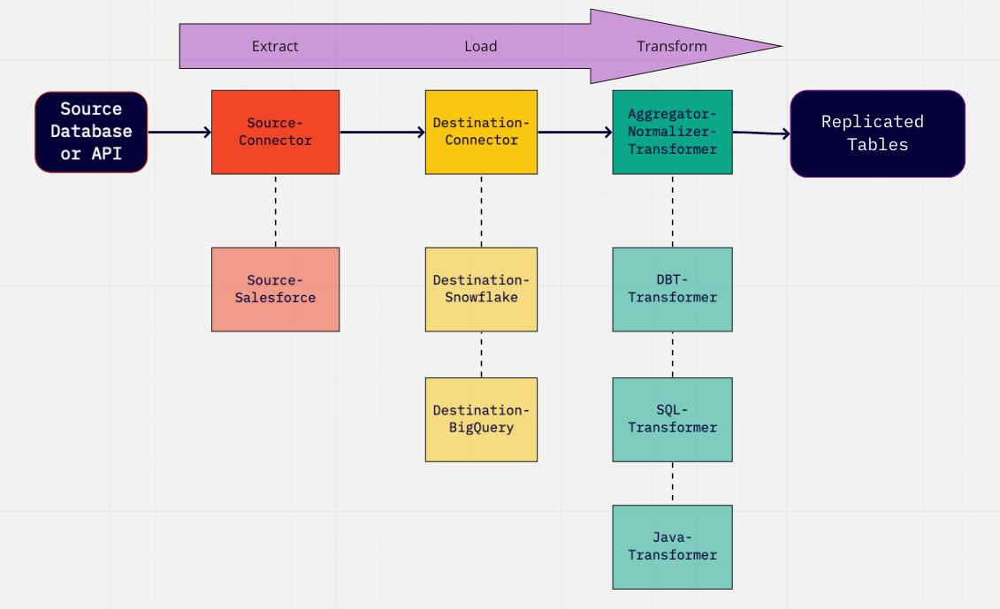
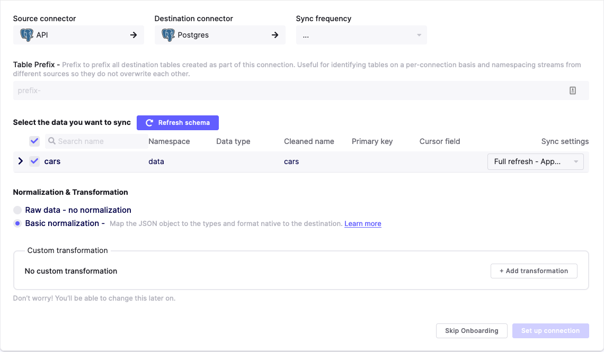

# Basic Normalization

## High-Level Overview

:::info

The high-level overview contains all the information you need to use Basic Normalization when pulling from APIs. Information past that can be read for advanced or educational purposes.

:::

When you run your first Airbyte sync without the basic normalization, you'll notice that your data gets written to your destination as one data column with a JSON blob that contains all of your data. This is the `_airbyte_raw_` table that you may have seen before. Why do we create this table? A core tenet of ELT philosophy is that data should be untouched as it moves through the E and L stages so that the raw data is always accessible. If an unmodified version of the data exists in the destination, it can be retransformed without needing to sync data again.

If you have Basic Normalization enabled, Airbyte automatically uses this JSON blob to create a schema and tables with your data in mind, converting it to the format of your destination. This runs after your sync and may take a long time if you have a large amount of data synced. If you don't enable Basic Normalization, you'll have to transform the JSON data from that column yourself.

## Example

Basic Normalization uses a fixed set of rules to map a json object from a source to the types and format that are native to the destination. For example if a source emits data that looks like this:

```javascript
{
  "make": "alfa romeo",
  "model": "4C coupe",
  "horsepower": "247"
}
```

The destination connectors produce the following raw table in the destination database:
```sql
CREATE TABLE "_airbyte_raw_cars" (
    -- metadata added by airbyte
    "_airbyte_ab_id" VARCHAR, -- uuid value assigned by connectors to each row of the data written in the destination.
    "_airbyte_emitted_at" TIMESTAMP_WITH_TIMEZONE, -- time at which the record was emitted.
    "_airbyte_data" JSONB -- data stored as a Json Blob.
);
```

Then, basic normalization would create the following table:

```sql
CREATE TABLE "cars" (
    "_airbyte_ab_id" VARCHAR,
    "_airbyte_emitted_at" TIMESTAMP_WITH_TIMEZONE,
    "_airbyte_cars_hashid" VARCHAR,
    "_airbyte_normalized_at" TIMESTAMP_WITH_TIMEZONE,

    -- data from source
    "make" VARCHAR,
    "model" VARCHAR,
    "horsepower" INTEGER
);
```

## Normalization metadata columns

You'll notice that some metadata are added to keep track of important information about each record.
- Some are introduced at the destination connector level: These are propagated by the normalization process from the raw table to the final table
  - `_airbyte_ab_id`: uuid value assigned by connectors to each row of the data written in the destination.
  - `_airbyte_emitted_at`: time at which the record was emitted and recorded by destination connector.
- While other metadata columns are created at the normalization step.
  - `_airbyte_<table_name>_hashid`: hash value assigned by airbyte normalization derived from a hash function of the record data.
  - `_airbyte_normalized_at`: time at which the record was last normalized (useful to track when incremental transformations are performed)

Additional metadata columns can be added on some tables depending on the usage:
- On the Slowly Changing Dimension (SCD) tables:
  - `_airbyte_start_at`: equivalent to the cursor column defined on the table, denotes when the row was first seen
  - `_airbyte_end_at`: denotes until when the row was seen with these particular values. If this column is not NULL, then the record has been updated and is no longer the most up to date one. If NULL, then the row is the latest version for the record.
  - `_airbyte_active_row`: denotes if the row for the record is the latest version or not.
  - `_airbyte_unique_key_scd`: hash of primary keys + cursors used to de-duplicate the scd table.
  - On de-duplicated (and SCD) tables:
  - `_airbyte_unique_key`: hash of primary keys used to de-duplicate the final table.

The [normalization rules](basic-normalization.md#Rules) are _not_ configurable. They are designed to pick a reasonable set of defaults to hit the 80/20 rule of data normalization. We respect that normalization is a detail-oriented problem and that with a fixed set of rules, we cannot normalize your data in such a way that covers all use cases. If this feature does not meet your normalization needs, we always put the full json blob in destination as well, so that you can parse that object however best meets your use case. We will be adding more advanced normalization functionality shortly. Airbyte is focused on the EL of ELT. If you need a really featureful tool for the transformations then, we suggest trying out dbt.

Airbyte places the json blob version of your data in a table called `_airbyte_raw_<stream name>`. If basic normalization is turned on, it will place a separate copy of the data in a table called `<stream name>`. Under the hood, Airbyte is using dbt, which means that the data only ingresses into the data store one time. The normalization happens as a query within the datastore. This implementation avoids extra network time and costs.

## Why does Airbyte have Basic Normalization?

At its core, Airbyte is geared to handle the EL \(Extract Load\) steps of an ELT process. These steps can also be referred in Airbyte's dialect as "Source" and "Destination".

However, this is actually producing a table in the destination with a JSON blob column... For the typical analytics use case, you probably want this json blob normalized so that each field is its own column.

So, after EL, comes the T \(transformation\) and the first T step that Airbyte actually applies on top of the extracted data is called "Normalization".

Airbyte runs this step before handing the final data over to other tools that will manage further transformation down the line.

To summarize, we can represent the ELT process in the diagram below. These are steps that happens between your "Source Database or API" and the final "Replicated Tables" with examples of implementation underneath:



In Airbyte, the current normalization option is implemented using a dbt Transformer composed of:

* Airbyte base-normalization python package to generate dbt SQL models files
* dbt to compile and executes the models on top of the data in the destinations that supports it.

## Destinations that Support Basic Normalization

* [BigQuery](../integrations/destinations/bigquery.md)
* [MS Server SQL](../integrations/destinations/mssql.md)
* [MySQL](../integrations/destinations/mysql.md)
  * The server must support the `WITH` keyword.
  * Require MySQL &gt;= 8.0, or MariaDB &gt;= 10.2.1.
* [Postgres](../integrations/destinations/postgres.md)
* [Redshift](../integrations/destinations/redshift.md)
* [Snowflake](../integrations/destinations/snowflake.md)

Basic Normalization can be configured when you're creating the connection between your Connection Setup and after in the Transformation Tab.
Select the option: **Normalized tabular data**.

## Rules

### Typing

Airbyte tracks types using JsonSchema's primitive types. Here is how these types will map onto standard SQL types. Note: The names of the types may differ slightly across different destinations.

Airbyte uses the types described in the catalog to determine the correct type for each column. It does not try to use the values themselves to infer the type.

| JsonSchema Type | Resulting Type | Notes |
| :--- | :--- | :--- |
| `number` | float |  |
| `integer` | integer |  |
| `string` | string |  |
| `bit` | boolean |  |
| `boolean` | boolean |  |
| `string` with format label `date-time`| timestamp with timezone |  |
| `array` | new table | see [nesting](basic-normalization.md#Nesting) |
| `object` | new table | see [nesting](basic-normalization.md#Nesting) |

### Nesting

Basic Normalization attempts to expand any nested arrays or objects it receives into separate tables in order to allow more ergonomic querying of your data.

#### Arrays

Basic Normalization expands arrays into separate tables. For example if the source provides the following data:

```javascript
{
  "make": "alfa romeo",
  "model": "4C coupe",
  "limited_editions": [
    { "name": "4C spider", "release_year": 2013 },
    { "name" : "4C spider italia" , "release_year":  2018 }
  ]
}
```

The resulting normalized schema would be:

```sql
CREATE TABLE "cars" (
    "_airbyte_cars_hashid" VARCHAR,
    "_airbyte_emitted_at" TIMESTAMP_WITH_TIMEZONE,
    "_airbyte_normalized_at" TIMESTAMP_WITH_TIMEZONE,

    "make" VARCHAR,
    "model" VARCHAR
);

CREATE TABLE "limited_editions" (
    "_airbyte_limited_editions_hashid" VARCHAR,
    "_airbyte_cars_foreign_hashid" VARCHAR,
    "_airbyte_emitted_at" TIMESTAMP_WITH_TIMEZONE,
    "_airbyte_normalized_at" TIMESTAMP_WITH_TIMEZONE,

    "name" VARCHAR,
    "release_year" VARCHAR
);
```

If the nested items in the array are not objects then they are expanded into a string field of comma separated values e.g.:

```javascript
{
  "make": "alfa romeo",
  "model": "4C coupe",
  "limited_editions": [ "4C spider", "4C spider italia"]
}
```

The resulting normalized schema would be:

```sql
CREATE TABLE "cars" (
    "_airbyte_cars_hashid" VARCHAR,
    "_airbyte_emitted_at" TIMESTAMP_WITH_TIMEZONE,
    "_airbyte_normalized_at" TIMESTAMP_WITH_TIMEZONE,

    "make" VARCHAR,
    "model" VARCHAR
);

CREATE TABLE "limited_editions" (
    "_airbyte_limited_editions_hashid" VARCHAR,
    "_airbyte_cars_foreign_hashid" VARCHAR,
    "_airbyte_emitted_at" TIMESTAMP_WITH_TIMEZONE,
    "_airbyte_normalized_at" TIMESTAMP_WITH_TIMEZONE,

    "data" VARCHAR
);
```

#### Objects

In the case of a nested object e.g.:

```javascript
{
  "make": "alfa romeo",
  "model": "4C coupe",
  "powertrain_specs": { "horsepower": 247, "transmission": "6-speed" }
}
```

The normalized schema would be:

```sql
CREATE TABLE "cars" (
    "_airbyte_cars_hashid" VARCHAR,
    "_airbyte_emitted_at" TIMESTAMP_WITH_TIMEZONE,
    "_airbyte_normalized_at" TIMESTAMP_WITH_TIMEZONE,

    "make" VARCHAR,
    "model" VARCHAR
);

CREATE TABLE "powertrain_specs" (
    "_airbyte_powertrain_hashid" VARCHAR,
    "_airbyte_cars_foreign_hashid" VARCHAR,
    "_airbyte_emitted_at" TIMESTAMP_WITH_TIMEZONE,
    "_airbyte_normalized_at" TIMESTAMP_WITH_TIMEZONE,

    "horsepower" INTEGER,
    "transmission" VARCHAR
);
```

### Naming Collisions for un-nested objects

When extracting nested objects or arrays, the Basic Normalization process needs to figure out new names for the expanded tables.

For example, if we had a `cars` table with a nested column `cars` containing an object whose schema is identical to the parent table.

```javascript
{
  "make": "alfa romeo",
  "model": "4C coupe",
  "cars": [
    { "make": "audi", "model": "A7" },
    { "make" : "lotus" , "model":  "elise" }
    { "make" : "chevrolet" , "model":  "mustang" }
  ]
}
```

The expanded table would have a conflict in terms of naming since both are named `cars`. To avoid name collisions and ensure a more consistent naming scheme, Basic Normalization chooses the expanded name as follows:

* `cars` for the original parent table
* `cars_da3_cars` for the expanded nested columns following this naming scheme in 3 parts: `<Json path>_<Hash>_<nested column name>`
* Json path: The entire json path string with '\_' characters used as delimiters to reach the table that contains the nested column name.
* Hash: Hash of the entire json path to reach the nested column reduced to 3 characters. This is to make sure we have a unique name \(in case part of the name gets truncated, see below\)
* Nested column name: name of the column being expanded into its own table.

By following this strategy, nested columns should "never" collide with other table names. If it does, an exception will probably be thrown either by the normalization process or by dbt that runs afterward.

```sql
CREATE TABLE "cars" (
    "_airbyte_cars_hashid" VARCHAR,
    "_airbyte_emitted_at" TIMESTAMP_WITH_TIMEZONE,
    "_airbyte_normalized_at" TIMESTAMP_WITH_TIMEZONE,

    "make" VARCHAR,
    "model" VARCHAR
);

CREATE TABLE "cars_da3_cars" (
    "_airbyte_cars_hashid" VARCHAR,
    "_airbyte_cars_foreign_hashid" VARCHAR,
    "_airbyte_emitted_at" TIMESTAMP_WITH_TIMEZONE,
    "_airbyte_normalized_at" TIMESTAMP_WITH_TIMEZONE,

    "make" VARCHAR,
    "model" VARCHAR
);
```

### Naming limitations & truncation

Note that different destinations have various naming limitations, most commonly on how long names can be. For instance, the Postgres documentation states:

> The system uses no more than NAMEDATALEN-1 bytes of an identifier; longer names can be written in commands, but they will be truncated. By default, NAMEDATALEN is 64 so the maximum identifier length is 63 bytes

Most modern data warehouses have name lengths limits on the longer side, so this should not affect us that often. Basic Normalization will fallback to the following rules:

1. No Truncate if under destination's character limits

However, in the rare cases where these limits are reached:

1. Truncate only the `Json path` to fit into destination's character limits
2. Truncate the `Json path` to at least the 10 first characters, then truncate the nested column name starting in the middle to preserve prefix/suffix substrings intact \(whenever a truncate in the middle is made, two '\_\_' characters are also inserted to denote where it happened\) to fit into destination's character limits

As an example from the hubspot source, we could have the following tables with nested columns:

| Description | Example 1 | Example 2 |
| :--- | :--- | :--- |
| Original Stream Name | companies | deals |
| Json path to the nested column | `companies/property_engagements_last_meeting_booked_campaign` | `deals/properties/engagements_last_meeting_booked_medium` |
| Final table name of expanded nested column on BigQuery | companies\_2e8\_property\_engag**ements\_last\_meeting\_bo**oked\_campaign | deals\_prop**erties**\_6e6\_engagements\_l**ast\_meeting\_**booked\_medium |
| Final table name of expanded nested column on Postgres | companies\_2e8\_property\_engag**\_\_**oked\_campaign | deals\_prop\_6e6\_engagements\_l**\_\_**booked\_medium |

As mentioned in the overview:

* Airbyte places the json blob version of your data in a table called `_airbyte_raw_<stream name>`.
* If basic normalization is turned on, it will place a separate copy of the data in a table called `<stream name>`.
* In certain pathological cases, basic normalization is required to generate large models with many columns and multiple intermediate transformation steps for a stream. This may break down the "ephemeral" materialization strategy and require the use of additional intermediate views or tables instead. As a result, you may notice additional temporary tables being generated in the destination to handle these checkpoints.

## UI Configurations

To enable basic normalization \(which is optional\), you can toggle it on or disable it in the "Normalization and Transformation" section when setting up your connection:



## Incremental runs

When the source is configured with sync modes compatible with incremental transformations (using append on destination) such as ( [full_refresh_append](connections/full-refresh-append.md), [incremental append](connections/incremental-append.md) or  [incremental deduped history](connections/incremental-deduped-history.md)), only rows that have changed in the source are transferred over the network and written by the destination connector.
Normalization will then try to build the normalized tables incrementally as the rows in the raw tables that have been created or updated since the last time dbt ran. As such, on each dbt run, the models get built incrementally. This limits the amount of data that needs to be transformed, vastly reducing the runtime of the transformations. This improves warehouse performance and reduces compute costs.
Because normalization can be either run incrementally and, or, in full refresh, a technical column `_airbyte_normalized_at` can serve to track when was the last time a record has been transformed and written by normalization.
This may greatly diverge from the `_airbyte_emitted_at` value as the normalized tables could be totally re-built at a latter time from the data stored in the `_airbyte_raw` tables.

## Partitioning, clustering, sorting, indexing

Normalization produces tables that are partitioned, clustered, sorted or indexed depending on the destination engine and on the type of tables being built. The goal of these are to make read more performant, especially when running incremental updates.

In general, normalization needs to do lookup on the last emitted_at column to know if a record is freshly produced and need to be
incrementally processed or not. But in certain models, such as SCD tables for example, we also need to retrieve older data to update their type 2 SCD end_date and active_row flags, thus a different partitioning scheme is used to optimize that use case.

On Postgres destination, an additional table suffixed with `_stg` for every stream replicated in  [incremental deduped history](connections/incremental-deduped-history.md) needs to be persisted (in a different staging schema) for incremental transformations to work because of a [limitation](https://github.com/dbt-labs/docs.getdbt.com/issues/335#issuecomment-694199569).

## Extending Basic Normalization

Note that all the choices made by Normalization as described in this documentation page in terms of naming (and more) could be overridden by your own custom choices. To do so, you can follow the following tutorials:

* to build a [custom SQL view](../operator-guides/transformation-and-normalization/transformations-with-sql.md) with your own naming conventions
* to export, edit and run [custom dbt normalization](../operator-guides/transformation-and-normalization/transformations-with-dbt.md) yourself
* or further, you can configure the use of a custom dbt project within Airbyte by following [this guide](../operator-guides/transformation-and-normalization/transformations-with-airbyte.md).

## CHANGELOG

### airbyte-integration/bases/base-normalization

Note that Basic Normalization is packaged in a docker image `airbyte/normalization`. This image is tied to and released along with a specific Airbyte version. It is not configurable independently like it is possible to do with connectors \(source & destinations\)

Therefore, in order to "upgrade" to the desired normalization version, you need to use the corresponding Airbyte version that it's being released in:

| Airbyte Version | Normalization Version      | Date       | Pull Request                                                                                                                         | Subject                                                                                                              |
|:----------------|:---------------------------|:-----------|:-------------------------------------------------------------------------------------------------------------------------------------|:---------------------------------------------------------------------------------------------------------------------|
|                 | 0.4.1                      | 2023-04-26 | [\#25591](https://github.com/airbytehq/airbyte/pull/25591)                                                                           | Pin MarkupSafe library for Oracle normalization to fix build.                                                       |
|                 | 0.4.0                      | 2023-03-23 | [\#22381](https://github.com/airbytehq/airbyte/pull/22381)                                                                           | Prevent normalization from creating unnecessary duplicates in nested tables.                                         |
|                 | 0.2.27                     | 2023-03-15 | [\#24077](https://github.com/airbytehq/airbyte/pull/24077)                                                                           | Add more bigquery reserved words                                                                                     |
|                 | 0.2.26                     | 2023-02-15 | [\#19573](https://github.com/airbytehq/airbyte/pull/19573)                                                                           | Update Clickhouse dbt version to 1.4.0                                                                               |
|                 | 0.3.2 (broken, do not use) | 2023-01-31 | [\#22165](https://github.com/airbytehq/airbyte/pull/22165)                                                                           | Fix support for non-object top-level schemas                                                                         |
|                 | 0.3.1 (broken, do not use) | 2023-01-31 | [\#22161](https://github.com/airbytehq/airbyte/pull/22161)                                                                           | Fix handling for combined primitive types                                                                            |
|                 | 0.3.0 (broken, do not use) | 2023-01-30 | [\#19721](https://github.com/airbytehq/airbyte/pull/19721)                                                                           | Update normalization to airbyte-protocol v1.0.0                                                                      |
|                 | 0.2.25                     | 2022-12-05 | [\#19573](https://github.com/airbytehq/airbyte/pull/19573)                                                                           | Update Clickhouse dbt version                                                                                        |
|                 | 0.2.24                     | 2022-11-01 | [\#18015](https://github.com/airbytehq/airbyte/pull/18015)                                                                           | Add a drop table hook that drops *_scd tables after overwrite/reset                                                  |
|                 | 0.2.23                     | 2022-10-12 | [\#17483](https://github.com/airbytehq/airbyte/pull/17483) (published in [\#17896](https://github.com/airbytehq/airbyte/pull/17896)) | Remove unnecessary `Native Port` config option                                                                       |
|                 | 0.2.22                     | 2022-09-05 | [\#16339](https://github.com/airbytehq/airbyte/pull/16339)                                                                           | Update Clickhouse DBT to 1.1.8                                                                                       |
|                 | 0.2.21                     | 2022-09-09 | [\#15833](https://github.com/airbytehq/airbyte/pull/15833/)                                                                          | SSH Tunnel: allow using OPENSSH key format (published in [\#16545](https://github.com/airbytehq/airbyte/pull/16545)) |
|                 | 0.2.20                     | 2022-08-30 | [\#15592](https://github.com/airbytehq/airbyte/pull/15592)                                                                           | Add TiDB support                                                                                                     |
|                 | 0.2.19                     | 2022-08-21 | [\#14897](https://github.com/airbytehq/airbyte/pull/14897)                                                                           | Update Clickhouse DBT to 1.1.7                                                                                       |
|                 | 0.2.16                     | 2022-08-04 | [\#14295](https://github.com/airbytehq/airbyte/pull/14295)                                                                           | Fixed SSH tunnel port usage                                                                                          |
|                 | 0.2.14                     | 2022-08-01 | [\#14790](https://github.com/airbytehq/airbyte/pull/14790)                                                                           | Add and persist job failures for Normalization                                                                       |
|                 | 0.2.13                     | 2022-07-27 | [\#14683](https://github.com/airbytehq/airbyte/pull/14683)                                                                           | Quote schema name to allow reserved keywords                                                                         |
|                 | 0.2.12                     | 2022-07-26 | [\#14362](https://github.com/airbytehq/airbyte/pull/14362)                                                                           | Handle timezone in date-time format. Parse date correct in clickhouse.                                               |
|                 | 0.2.11                     | 2022-07-26 | [\#13591](https://github.com/airbytehq/airbyte/pull/13591)                                                                           | Updated support for integer columns.                                                                                 |
|                 | 0.2.10                     | 2022-07-18 | [\#14792](https://github.com/airbytehq/airbyte/pull/14792)                                                                           | Add support for key pair auth for snowflake                                                                          |
|                 | 0.2.9                      | 2022-07-06 | [\#14485](https://github.com/airbytehq/airbyte/pull/14485)                                                                           | BigQuery partition pruning otimization                                                                               |
|                 | 0.2.8                      | 2022-07-13 | [\#14522](https://github.com/airbytehq/airbyte/pull/14522)                                                                           | BigQuery replaces `NULL` array entries with the string value `"NULL"`                                                |
|                 | 0.2.7                      | 2022-07-05 | [\#11694](https://github.com/airbytehq/airbyte/pull/11694)                                                                           | Do not return NULL for MySQL column values > 512 chars                                                               |
|                 | 0.2.6                      | 2022-06-16 | [\#13894](https://github.com/airbytehq/airbyte/pull/13894)                                                                           | Fix incorrect jinja2 macro `json_extract_array` call                                                                 |
|                 | 0.2.5                      | 2022-06-15 | [\#11470](https://github.com/airbytehq/airbyte/pull/11470)                                                                           | Upgrade MySQL to dbt 1.0.0                                                                                           |
|                 | 0.2.4                      | 2022-06-14 | [\#12846](https://github.com/airbytehq/airbyte/pull/12846)                                                                           | CDC correctly deletes propagates deletions to final tables                                                           |
|                 | 0.2.3                      | 2022-06-10 | [\#11204](https://github.com/airbytehq/airbyte/pull/11204)                                                                           | MySQL: add support for SSh tunneling                                                                                 |
|                 | 0.2.2                      | 2022-06-02 | [\#13289](https://github.com/airbytehq/airbyte/pull/13289)                                                                           | BigQuery use `json_extract_string_array` for array of simple type elements                                           |
|                 | 0.2.1                      | 2022-05-17 | [\#12924](https://github.com/airbytehq/airbyte/pull/12924)                                                                           | Fixed checking --event-buffer-size on old dbt crashed entrypoint.sh                                                  |
|                 | 0.2.0                      | 2022-05-15 | [\#12745](https://github.com/airbytehq/airbyte/pull/12745)                                                                           | Snowflake: add datetime without timezone                                                                             |
|                 | 0.1.78                     | 2022-05-06 | [\#12305](https://github.com/airbytehq/airbyte/pull/12305)                                                                           | Mssql: use NVARCHAR and datetime2 by default                                                                         |
| 0.36.2-alpha    | 0.1.77                     | 2022-04-19 | [\#12064](https://github.com/airbytehq/airbyte/pull/12064)                                                                           | Add support redshift SUPER type                                                                                      |
| 0.35.65-alpha   | 0.1.75                     | 2022-04-09 | [\#11511](https://github.com/airbytehq/airbyte/pull/11511)                                                                           | Move DBT modules from `/tmp/dbt_modules` to `/dbt`                                                                   |
| 0.35.61-alpha   | 0.1.74                     | 2022-03-24 | [\#10905](https://github.com/airbytehq/airbyte/pull/10905)                                                                           | Update clickhouse dbt version                                                                                        |
| 0.35.60-alpha   | 0.1.73                     | 2022-03-25 | [\#11267](https://github.com/airbytehq/airbyte/pull/11267)                                                                           | Set `--event-buffer-size` to reduce memory usage                                                                     |
| 0.35.59-alpha   | 0.1.72                     | 2022-03-24 | [\#11093](https://github.com/airbytehq/airbyte/pull/11093)                                                                           | Added Snowflake OAuth2.0 support                                                                                     |
| 0.35.53-alpha   | 0.1.71                     | 2022-03-14 | [\#11077](https://github.com/airbytehq/airbyte/pull/11077)                                                                           | Enable BigQuery to handle project ID embedded inside dataset ID                                                      |
| 0.35.49-alpha   | 0.1.70                     | 2022-03-11 | [\#11051](https://github.com/airbytehq/airbyte/pull/11051)                                                                           | Upgrade dbt to 1.0.0 (except for MySQL and Oracle)                                                                   |
| 0.35.45-alpha   | 0.1.69                     | 2022-03-04 | [\#10754](https://github.com/airbytehq/airbyte/pull/10754)                                                                           | Enable Clickhouse normalization over SSL                                                                             |
| 0.35.32-alpha   | 0.1.68                     | 2022-02-20 | [\#10485](https://github.com/airbytehq/airbyte/pull/10485)                                                                           | Fix row size too large for table with numerous `string` fields                                                       |
|                 | 0.1.66                     | 2022-02-04 | [\#9341](https://github.com/airbytehq/airbyte/pull/9341)                                                                             | Fix normalization for bigquery datasetId and tables                                                                  |
| 0.35.13-alpha   | 0.1.65                     | 2021-01-28 | [\#9846](https://github.com/airbytehq/airbyte/pull/9846)                                                                             | Tweak dbt multi-thread parameter down                                                                                |
| 0.35.12-alpha   | 0.1.64                     | 2021-01-28 | [\#9793](https://github.com/airbytehq/airbyte/pull/9793)                                                                             | Support PEM format for ssh-tunnel keys                                                                               |
| 0.35.4-alpha    | 0.1.63                     | 2021-01-07 | [\#9301](https://github.com/airbytehq/airbyte/pull/9301)                                                                             | Fix Snowflake prefix tables starting with numbers                                                                    |
|                 | 0.1.62                     | 2021-01-07 | [\#9340](https://github.com/airbytehq/airbyte/pull/9340)                                                                             | Use TCP-port support for clickhouse                                                                                  |
|                 | 0.1.62                     | 2021-01-07 | [\#9063](https://github.com/airbytehq/airbyte/pull/9063)                                                                             | Change Snowflake-specific materialization settings                                                                   |
|                 | 0.1.62                     | 2021-01-07 | [\#9317](https://github.com/airbytehq/airbyte/pull/9317)                                                                             | Fix issue with quoted & case sensitive columns                                                                       |
|                 | 0.1.62                     | 2021-01-07 | [\#9281](https://github.com/airbytehq/airbyte/pull/9281)                                                                             | Fix SCD partition by float columns in BigQuery                                                                       |
| 0.32.11-alpha   | 0.1.61                     | 2021-12-02 | [\#8394](https://github.com/airbytehq/airbyte/pull/8394)                                                                             | Fix incremental queries not updating empty tables                                                                    |
|                 | 0.1.61                     | 2021-12-01 | [\#8378](https://github.com/airbytehq/airbyte/pull/8378)                                                                             | Fix un-nesting queries and add proper ref hints                                                                      |
| 0.32.5-alpha    | 0.1.60                     | 2021-11-22 | [\#8088](https://github.com/airbytehq/airbyte/pull/8088)                                                                             | Speed-up incremental queries for SCD table on Snowflake                                                              |
| 0.30.32-alpha   | 0.1.59                     | 2021-11-08 | [\#7669](https://github.com/airbytehq/airbyte/pull/7169)                                                                             | Fix nested incremental dbt                                                                                           |
| 0.30.24-alpha   | 0.1.57                     | 2021-10-26 | [\#7162](https://github.com/airbytehq/airbyte/pull/7162)                                                                             | Implement incremental dbt updates                                                                                    |
| 0.30.16-alpha   | 0.1.52                     | 2021-10-07 | [\#6379](https://github.com/airbytehq/airbyte/pull/6379)                                                                             | Handle empty string for date and date-time format                                                                    |
|                 | 0.1.51                     | 2021-10-08 | [\#6799](https://github.com/airbytehq/airbyte/pull/6799)                                                                             | Added support for ad\_cdc\_log\_pos while normalization                                                              |
|                 | 0.1.50                     | 2021-10-07 | [\#6079](https://github.com/airbytehq/airbyte/pull/6079)                                                                             | Added support for MS SQL Server normalization                                                                        |
|                 | 0.1.49                     | 2021-10-06 | [\#6709](https://github.com/airbytehq/airbyte/pull/6709)                                                                             | Forward destination dataset location to dbt profiles                                                                 |
| 0.29.17-alpha   | 0.1.47                     | 2021-09-20 | [\#6317](https://github.com/airbytehq/airbyte/pull/6317)                                                                             | MySQL: updated MySQL normalization with using SSH tunnel                                                             |
|                 | 0.1.45                     | 2021-09-18 | [\#6052](https://github.com/airbytehq/airbyte/pull/6052)                                                                             | Snowflake: accept any date-time format                                                                               |
| 0.29.8-alpha    | 0.1.40                     | 2021-08-18 | [\#5433](https://github.com/airbytehq/airbyte/pull/5433)                                                                             | Allow optional credentials\_json for BigQuery                                                                        |
| 0.29.5-alpha    | 0.1.39                     | 2021-08-11 | [\#4557](https://github.com/airbytehq/airbyte/pull/4557)                                                                             | Handle date times and solve conflict name btw stream/field                                                           |
| 0.28.2-alpha    | 0.1.38                     | 2021-07-28 | [\#5027](https://github.com/airbytehq/airbyte/pull/5027)                                                                             | Handle quotes in column names when parsing JSON blob                                                                 |
| 0.27.5-alpha    | 0.1.37                     | 2021-07-22 | [\#3947](https://github.com/airbytehq/airbyte/pull/4881/)                                                                            | Handle `NULL` cursor field values when deduping                                                                      |
| 0.27.2-alpha    | 0.1.36                     | 2021-07-09 | [\#3947](https://github.com/airbytehq/airbyte/pull/4163/)                                                                            | Enable normalization for MySQL destination                                                                           |
