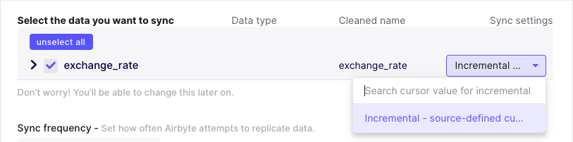
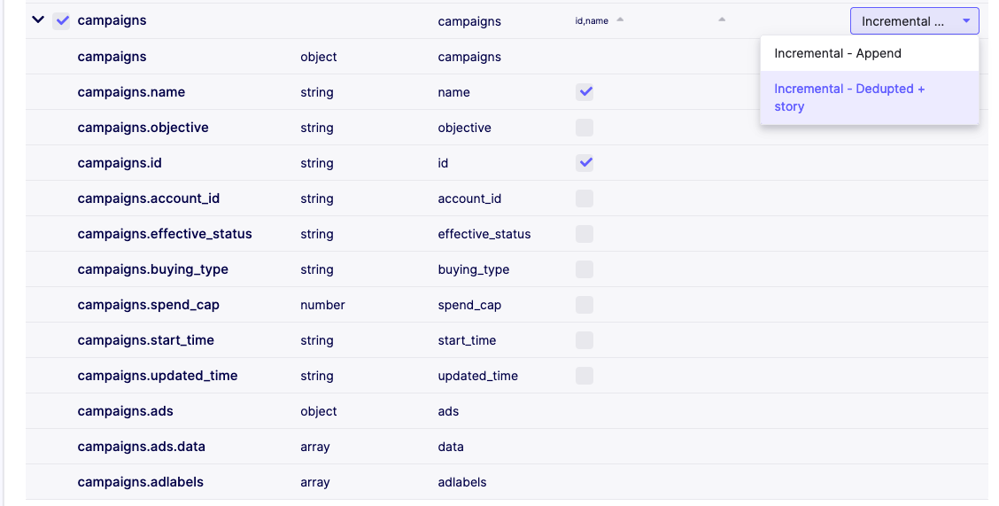

# Incremental Sync - Deduped History

## High-Level Context

This connector syncs data **incrementally**, which means that only new or modified data will be synced. In contrast with the [Incremental Append mode](./incremental-append.md), this mode updates rows that have been modified instead of adding a new version of the row with the updated data. Simply put, if you've synced a row before and it has since been updated, this mode will combine the two rows
in the destination and use the updated data. On the other hand, the [Incremental Append mode](./incremental-append.md) would just add a new row with the updated data.

## Overview

Airbyte supports syncing data in **Incremental Deduped History** mode i.e:

1. **Incremental** means syncing only replicate _new_ or _modified_ data. This prevents re-fetching data that you have already replicated from a source. If the sync is running for the first time, it is equivalent to a [Full Refresh](full-refresh-append.md) since all data will be considered as _new_.
2. **Deduped** means that data in the final table will be unique per primary key \(unlike [Append modes](incremental-append.md)\). This is determined by sorting the data using the cursor field and keeping only the latest de-duplicated data row. In dimensional data warehouse jargon defined by Ralph Kimball, this is referred as a Slowly Changing Dimension \(SCD\) table of type 1.
3. **History** means that an additional intermediate table is created in which data is being continuously appended to \(with duplicates exactly like [Append modes](incremental-append.md)\). With the use of primary key fields, it is identifying effective `start` and `end` dates of each row of a record. In dimensional data warehouse jargon, this is referred as a Slowly Changing Dimension \(SCD\) table of type 2.

In this flavor of incremental, records in the warehouse destination will never be deleted in the history tables \(named with a `_scd` suffix\), but might not exist in the final table. A copy of each new or updated record is _appended_ to the history data in the warehouse. Only the `end` date column is mutated when a new version of the same record is inserted to denote effective date ranges of a row. This means you can find multiple copies of the same record in the destination warehouse. We provide an "at least once" guarantee of replicating each record that is present when the sync runs.

On the other hand, records in the final destination can potentially be deleted as they are de-duplicated. You should not find multiple copies of the same primary key as these should be unique in that table.

## Definitions

A `cursor` is the value used to track whether a record should be replicated in an incremental sync. A common example of a `cursor` would be a timestamp from an `updated_at` column in a database table.

A `cursor field` is the _field_ or _column_ in the data where that cursor can be found. Extending the above example, the `updated_at` column in the database would be the `cursor field`, while the `cursor` is the actual timestamp _value_ used to determine if a record should be replicated.

We will refer to the set of records that the source identifies as being new or updated as a `delta`.

A `primary key` is one or multiple \(called `composite primary keys`\) _fields_ or _columns_ that is used to identify the unique entities of a table. Only one row per primary key value is permitted in a database table. In the data warehouse, just like in [incremental - Append](incremental-append.md), multiple rows for the same primary key can be found in the history table. The unique records per primary key behavior is mirrored in the final table with **incremental deduped** sync mode. The primary key is then used to refer to the entity which values should be updated.

## Rules

As mentioned above, the delta from a sync will be _appended_ to the existing history data in the data warehouse. In addition, it will update the associated record in the final table. Let's walk through a few examples.

### Newly Created Record

Assume that `updated_at` is our `cursor_field` and `name` is the `primary_key`. Let's say the following data already exists into our data warehouse.

| name             | deceased | updated_at |
| :--------------- | :------- | :--------- |
| Louis XVI        | false    | 1754       |
| Marie Antoinette | false    | 1755       |

In the next sync, the delta contains the following record:

| name       | deceased | updated_at |
| :--------- | :------- | :--------- |
| Louis XVII | false    | 1785       |

At the end of this incremental sync, the data warehouse would now contain:

| name             | deceased | updated_at |
| :--------------- | :------- | :--------- |
| Louis XVI        | false    | 1754       |
| Marie Antoinette | false    | 1755       |
| Louis XVII       | false    | 1785       |

### Updating a Record

Let's assume that our warehouse contains all the data that it did at the end of the previous section. Now, unfortunately the king and queen lose their heads. Let's see that delta:

| name             | deceased | updated_at |
| :--------------- | :------- | :--------- |
| Louis XVI        | true     | 1793       |
| Marie Antoinette | true     | 1793       |

The output we expect to see in the warehouse is as follows:

In the history table:

| name             | deceased | updated_at | start_at | end_at |
| :--------------- | :------- | :--------- | :------- | :----- |
| Louis XVI        | false    | 1754       | 1754     | 1793   |
| Louis XVI        | true     | 1793       | 1793     | NULL   |
| Louis XVII       | false    | 1785       | 1785     | NULL   |
| Marie Antoinette | false    | 1755       | 1755     | 1793   |
| Marie Antoinette | true     | 1793       | 1793     | NULL   |

In the final de-duplicated table:

| name             | deceased | updated_at |
| :--------------- | :------- | :--------- |
| Louis XVI        | true     | 1793       |
| Louis XVII       | false    | 1785       |
| Marie Antoinette | true     | 1793       |

## Source-Defined Cursor

Some sources are able to determine the cursor that they use without any user input. For example, in the [exchange rates source](../../integrations/sources/exchange-rates.md), the source knows that the date field should be used to determine the last record that was synced. In these cases, simply select the incremental option in the UI.



\(You can find a more technical details about the configuration data model [here](../airbyte-protocol.md#catalog)\).

## User-Defined Cursor

Some sources cannot define the cursor without user input. For example, in the [postgres source](../../integrations/sources/postgres.md), the user needs to choose which column in a database table they want to use as the `cursor field`. In these cases, select the column in the sync settings dropdown that should be used as the `cursor field`.


\(You can find a more technical details about the configuration data model [here](../airbyte-protocol.md#catalog)\).

## Source-Defined Primary key

Some sources are able to determine the primary key that they use without any user input. For example, in the \(JDBC\) Database sources, primary key can be defined in the table's metadata.

## User-Defined Primary key

Some sources cannot define the cursor without user input or the user may want to specify their own primary key on the destination that is different from the source definitions. In these cases, select the column in the sync settings dropdown that should be used as the `primary key` or `composite primary keys`.



In this example, we selected both the `campaigns.id` and `campaigns.name` as the composite primary key of our `campaigns` table.

Note that in **Incremental Deduped History**, the size of the data in your warehouse increases monotonically since an updated record in the source is appended to the destination history table rather than updated in-place as it is done with the final table. If you only care about having the latest snapshot of your data, you may want to periodically run cleanup jobs which retain only the latest instance of each record in the history tables.

## Inclusive Cursors

When replicating data incrementally, Airbyte provides an at-least-once delivery guarantee. This means that it is acceptable for sources to re-send some data when ran incrementally. One case where this is particularly relevant is when a source's cursor is not very granular. For example, if a cursor field has the granularity of a day \(but not hours, seconds, etc\), then if that source is run twice in the same day, there is no way for the source to know which records that are that date were already replicated earlier that day. By convention, sources should prefer resending data if the cursor field is ambiguous.

## Known Limitations

Due to the use of a cursor column, if modifications to the underlying records are made without properly updating the cursor field, then the updated records won't be picked up by the **Incremental** sync as expected since the source connectors extract delta rows using a SQL query looking like:

```sql
select * from table where cursor_field > 'last_sync_max_cursor_field_value'
```

Let's say the following data already exists into our data warehouse.

| name             | deceased | updated_at |
| :--------------- | :------- | :--------- |
| Louis XVI        | false    | 1754       |
| Marie Antoinette | false    | 1755       |

At the start of the next sync, the source data contains the following new record:

| name      | deceased | updated_at |
| :-------- | :------- | :--------- |
| Louis XVI | true     | 1754       |

At the end of the second incremental sync, the data warehouse would still contain data from the first sync because the delta record did not provide a valid value for the cursor field \(the cursor field is not greater than last sync's max value, `1754 < 1755`\), so it is not emitted by the source as a new or modified record.

| name             | deceased | updated_at |
| :--------------- | :------- | :--------- |
| Louis XVI        | false    | 1754       |
| Marie Antoinette | false    | 1755       |

Similarly, if multiple modifications are made during the same day to the same records. If the frequency of the sync is not granular enough \(for example, set for every 24h\), then intermediate modifications to the data are not going to be detected and emitted. Only the state of data at the time the sync runs will be reflected in the destination.

Those concerns could be solved by using a different incremental approach based on binary logs, Write-Ahead-Logs \(WAL\), or also called [Change Data Capture \(CDC\)](../cdc.md).

The current behavior of **Incremental** is not able to handle source schema changes yet, for example, when a column is added, renamed or deleted from an existing table etc. It is recommended to trigger a [Full refresh - Overwrite](full-refresh-overwrite.md) to correctly replicate the data to the destination with the new schema changes.

Additionally, this sync mode is only supported for destinations where dbt/normalization is possible for the moment. The de-duplicating logic is indeed implemented as dbt models as part of a sequence of transformations applied after the Extract and Load activities \(thus, an ELT approach\). Nevertheless, it is theoretically possible that destinations can handle directly this logic \(maybe in the future\) before actually writing records to the destination \(as in traditional ETL manner\), but that's not the way it is implemented at this time.

If you are not satisfied with how transformations are applied on top of the appended data, you can find more relevant SQL transformations you might need to do on your data in the [Connecting EL with T using SQL \(part 1/2\)](../../operator-guides/transformation-and-normalization/transformations-with-sql.md)

## Related information

- [An overview of Airbyte’s replication modes](https://airbyte.com/blog/understanding-data-replication-modes).
- [Explore Airbyte’s incremental data synchronization](https://airbyte.com/tutorials/incremental-data-synchronization).
