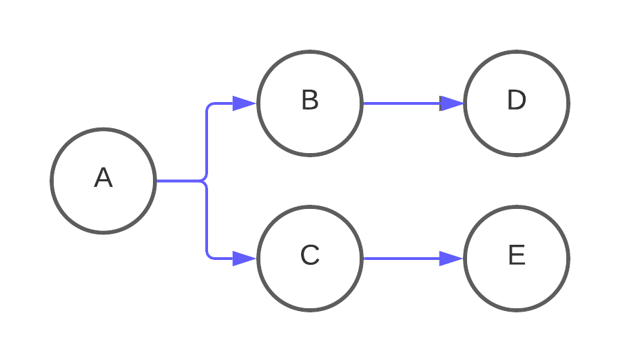

# Glossary of Terms

### Airbyte CDK

The Airbyte CDK (Connector Development Kit) allows you to create connectors for Sources or Destinations. 
If your source or destination doesn't exist, you can use the CDK to make the building process a lot easier. 
It generates all the tests and files you need and all you need to do is write the connector-specific code 
for your source or destination. We created one in Python which you can check out [here](../connector-development/cdk-python/) 
and the Faros AI team created a Javascript/Typescript one that you can check out [here](../connector-development/cdk-faros-js.md).

### DAG

DAG stands for **Directed Acyclic Graph**. It's a term originally coined by math graph theorists that 
describes a tree-like process that cannot contain loops. For example, in the following diagram, you start 
at A and can choose B or C, which then proceed to D and E, respectively. This kind of structure is great 
for representing workflows and is what tools like [Airflow](https://airflow.apache.org) use to orchestrate
the execution of software based on different cases or states.

&#x20;

### ETL/ELT

Stands for **E**xtract, **T**ransform, and **L**oad and **E**xtract, **L**oad, and **T**ransform, respectively.

**Extract**: Retrieve data from a [source](../integrations/README.md#Sources), which can be an application, database, anything really.

**Load**: Move data to your [destination](../integrations/README.md#Destinations).

**Transform**: Clean up the data. This is referred to as [normalization](basic-normalization.md) 
in Airbyte and involves [deduplication](connections/incremental-deduped-history.md), changing data types, formats, and more.

### Full Refresh Sync

A **Full Refresh Sync** will attempt to retrieve all data from the source every time a sync is run. 
Then there are two choices, **Overwrite** and **Append**. **Overwrite** deletes the data in the destination before running the 
sync and **Append** doesn't.

### Incremental Sync

An **Incremental Sync** will only retrieve new data from the source when a sync occurs. 
The first sync will always attempt to retrieve all the data. 
If the [destination supports it](https://discuss.airbyte.io/t/what-destinations-support-the-incremental-deduped-sync-mode/89), 
you can have your data deduplicated. Simply put, this just means that if you sync an updated 
version of a record you've already synced, it will remove the old record.

### Partial Success

A **Partial Success** indicates that some records were successfully committed to the destination during a sync, 
even when the overall sync status was reported as a failure. 

### Raw Tables

Airbyte spits out tables with the prefix `_airbyte_raw_`. This is your replicated data, but the prefix 
indicates that it's not normalized. If you select basic normalization, Airbyte will create renamed versions without the prefix.

## Advanced Terms

### AirbyteCatalog

:::info

This is only relevant for individuals who want to create a connector.

:::

This refers to how you define the data that you can retrieve from a Source. For example, 
if you want to retrieve information from an API, the data that you can receive needs to be 
defined clearly so that Airbyte can have a clear expectation of what endpoints are supported 
and what the objects that the streams return look like. This is represented as a sort of schema 
that Airbyte can interpret. Learn more [here](beginners-guide-to-catalog.md).

### Airbyte Specification

:::info

This is only relevant for individuals who want to create a connector.

:::

This refers to the functions that a Source or Destination must implement to successfully 
retrieve data and load it, respectively. Implementing these functions using the Airbyte 
Specification makes a Source or Destination work correctly. Learn more [here](airbyte-protocol.md).

### Temporal

:::info

This is only relevant for individuals who want to learn about or contribute to our underlying platform.

:::

[Temporal](https://temporal.io) is a development kit that lets you create workflows, 
parallelize them, and handle failures/retries gracefully. We use it to reliably schedule each step 
of the ELT process, and a Temporal service is always deployed with each Airbyte installation.
