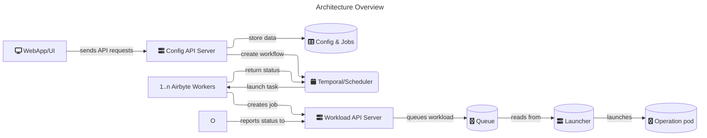

# Architecture overview

Airbyte is conceptually composed of two parts: platform and connectors.

The platform provides all the horizontal services required to configure and run data movement operations e.g: the UI, configuration API, job scheduling, logging, alerting, etc. and is structured as a set of microservices.

Connectors are independent modules which push/pull data to/from sources and destinations. Connectors are built in accordance with the [Airbyte Specification](./airbyte-protocol.md), which describes the interface with which data can be moved between a source and a destination using Airbyte. Connectors are packaged as Docker images, which allows total flexibility over the technologies used to implement them.

A more concrete diagram can be seen below:

- **Web App/UI** [`airbyte-webapp`]: An easy-to-use graphical interface for interacting with the Airbyte Server.
- **Config API Server** [`airbyte-server`, `airbyte-server-api`]: Airbyte's main controller. All operations in Airbyte such as creating sources, destinations, connections, managing configurations, etc.. are configured and invoked from the API.
- **Database Config & Jobs** [`airbyte-db`]: Stores all the configuration \(credentials, frequency...\) and job history.
- **Temporal Service** [`airbyte-temporal`]: Manages the scheduling and sequencing task queues and workflows.
- **Worker** [`airbyte-worker`]: Reads from the task queues and executes the connection scheduling and sequencing logic, making calls to the workload API.
- **Workload API** [`airbyte-workload-api-server`]: The HTTP interface for enqueuing workloads — the discrete pods that run the connector operations.
- **Launcher** [`airbyte-workload-launcher`]: Consumes events from the workload API and interfaces with k8s to launch workloads.

The diagram shows the steady-state operation of Airbyte, there are components not described you'll see in your deployment:

- **Cron** [`airbyte-cron`]: Clean the server and sync logs (when using local logs). Regularly updates connector definitions and sweeps old workloads ensuring eventual consenus.
- **Bootloader** [`airbyte-bootloader`]: Upgrade and Migrate the Database tables and confirm the enviroment is ready to work.

This is a holistic high-level description of each component. For Airbyte deployed in Kubernetes the structure is very similar with a few changes.
