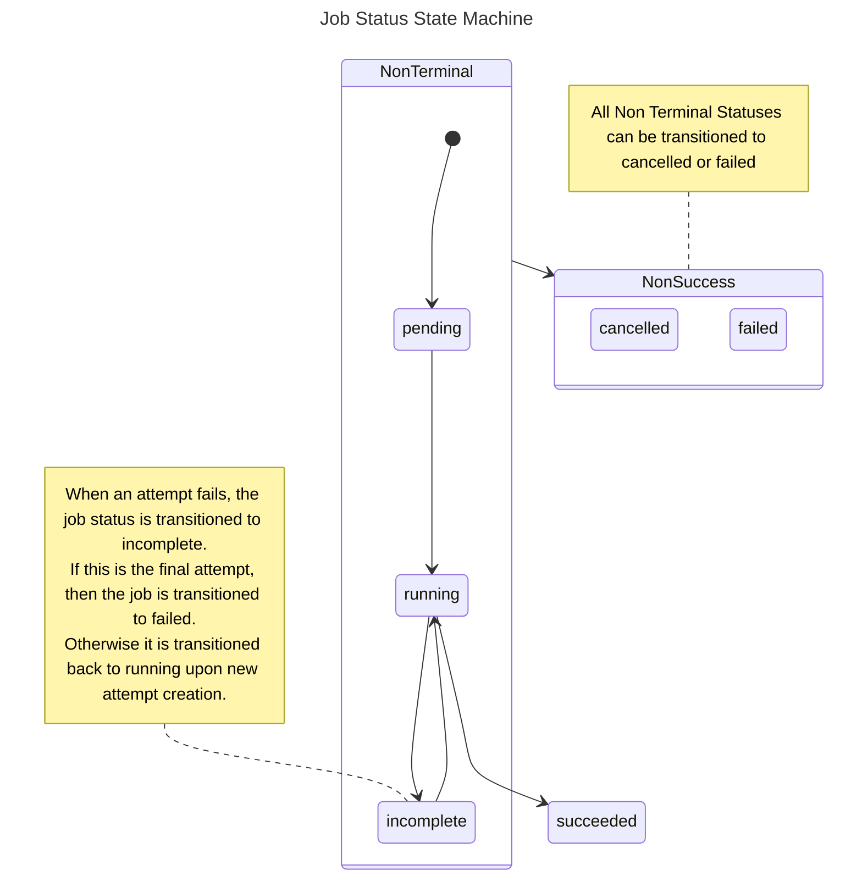
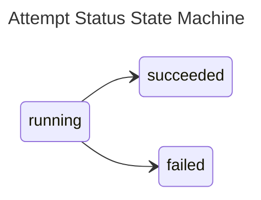
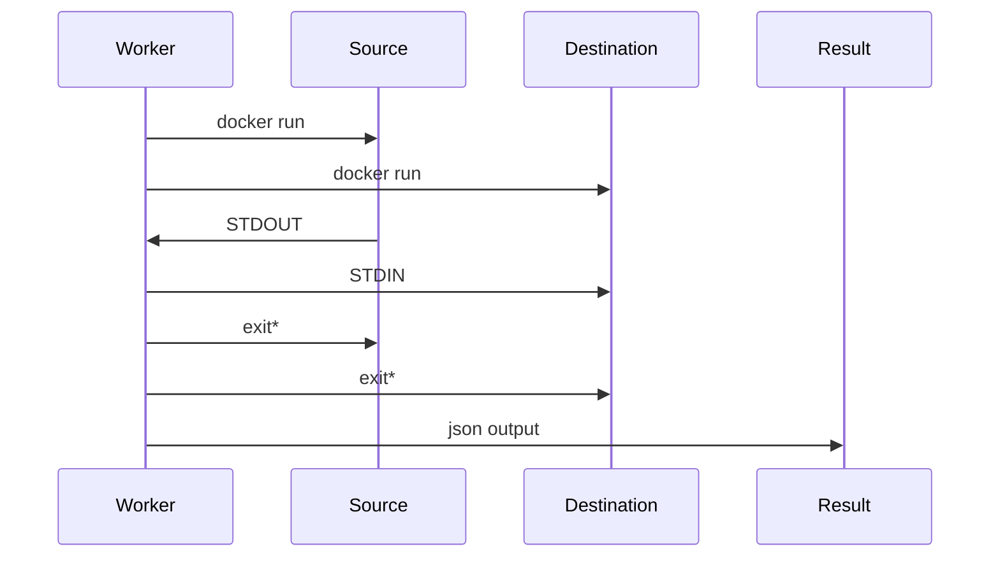

# Workers & Jobs

In Airbyte, all interactions with connectors are run as jobs performed by a Worker. Each job has a corresponding worker:

- Spec worker: retrieves the specification of a connector \(the inputs needed to run this connector\)
- Check connection worker: verifies that the inputs to a connector are valid and can be used to run a sync
- Discovery worker: retrieves the schema of the source underlying a connector
- Sync worker, used to sync data between a source and destination

Thus, there are generally 4 types of workers.

**Note: Workers here refers to Airbyte workers. Temporal, which Airbyte uses under the hood for scheduling, has its own worker concept. This distinction is important.**

## Sync Jobs

At a high level, a sync job is an individual invocation of the Airbyte pipeline to synchronize data from a source to a destination data store.

### Sync Job State Machine

Sync jobs have the following state machine.

### Attempts and Retries

In the event of a failure, the Airbyte platform will retry the pipeline. Each of these sub-invocations of a job is called an attempt.

### Retry Rules

Based on the outcome of previous attempts, the number of permitted attempts per job changes. By default, Airbyte is configured to allow the following:

- 5 subsequent attempts where no data was synchronized
- 10 total attempts where no data was synchronized
- 20 total attempts where some data was synchronized

For oss users, these values are configurable. See [Configuring Airbyte](../operator-guides/configuring-airbyte.md#jobs) for more details.

### Retry Backoff

After an attempt where no data was synchronized, we implement a short backoff period before starting a new attempt. This will increase with each successive complete failure—a partially successful attempt will reset this value.

By default, Airbyte is configured to backoff with the following values:

- 10 seconds after the first complete failure
- 30 seconds after the second
- 90 seconds after the third
- 4 minutes and 30 seconds after the fourth

For oss users, these values are configurable. See [Configuring Airbyte](../operator-guides/configuring-airbyte.md#jobs) for more details.

The duration of expected backoff between attempts can be viewed in the logs accessible from the job history UI.

### Retry examples

To help illustrate what is possible, below are a couple examples of how the retry rules may play out under more elaborate circumstances.

<table>
    <thead>
        <tr>
            <th colspan="2">Job #1</th>
        </tr>
        <tr>
            <th>Attempt Number</th>
            <th>Synced data?</th>
        </tr>
    </thead>
    <tbody>
        <tr>
            <td>1</td>
            <td>No</td>
        </tr>
        <tr>
            <td colspan="2">10 second backoff</td>
        </tr>
        <tr>
            <td>2</td>
            <td>No</td>
        </tr>
        <tr>
            <td colspan="2">30 second backoff</td>
        </tr>
        <tr>
            <td>3</td>
            <td>Yes</td>
        </tr>
        <tr>
            <td>4</td>
            <td>Yes</td>
        </tr>
        <tr>
            <td>5</td>
            <td>Yes</td>
        </tr>
        <tr>
            <td>6</td>
            <td>No</td>
        </tr>
        <tr>
            <td colspan="2">10 second backoff</td>
        </tr>
        <tr>
            <td>7</td>
            <td>Yes</td>
        </tr>
        <tr>
            <td colspan="2">Job succeeds — all data synced</td>
        </tr>
    </tbody>
</table>

<table>
    <thead>
        <tr>
            <th colspan="2">Job #2</th>
        </tr>
        <tr>
            <th>Attempt Number</th>
            <th>Synced data?</th>
        </tr>
    </thead>
    <tbody>
        <tr>
            <td>1</td>
            <td>Yes</td>
        </tr>
        <tr>
            <td>2</td>
            <td>Yes</td>
        </tr>
        <tr>
            <td>3</td>
            <td>Yes</td>
        </tr>
        <tr>
            <td>4</td>
            <td>Yes</td>
        </tr>
        <tr>
            <td>5</td>
            <td>Yes</td>
        </tr>
        <tr>
            <td>6</td>
            <td>Yes</td>
        </tr>
        <tr>
            <td>7</td>
            <td>No</td>
        </tr>
        <tr>
            <td colspan="2">10 second backoff</td>
        </tr>
        <tr>
            <td>8</td>
            <td>No</td>
        </tr>
        <tr>
            <td colspan="2">30 second backoff</td>
        </tr>
        <tr>
            <td>9</td>
            <td>No</td>
        </tr>
        <tr>
            <td colspan="2">90 second backoff</td>
        </tr>
        <tr>
            <td>10</td>
            <td>No</td>
        </tr>
        <tr>
            <td colspan="2">4 minute 30 second backoff</td>
        </tr>
        <tr>
            <td>11</td>
            <td>No</td>
        </tr>
        <tr>
            <td colspan="2">Job Fails — successive failure limit reached</td>
        </tr>
    </tbody>
</table>

## Worker Responsibilities

The worker has the following responsibilities.

1. Handle the process lifecycle for job-related processes. This includes starting, monitoring and shutting down processes.
2. Facilitate message passing to or from various processes, if required. \(more on this [below](jobs.md#worker-types)\).
3. Handle job-relation operational work such as:
   1. Basic schema validation.
   2. Returning job output, including any error messages. \(See [Airbyte Specification](airbyte-protocol.md) to understand the output of each worker type.\)
   3. Telemetry work e.g. tracking the number and size of records within a sync.

Conceptually, **workers contain the complexity of all non-connector-related job operations**. This lets each connector be as simple as possible.

### Worker Types

There are 2 flavors of workers:

1. **Synchronous Job Worker** - Workers that interact with a single connector \(e.g. spec, check, discover\).

   The worker extracts data from the connector and reports it to the scheduler. It does this by listening to the connector's STDOUT.
   These jobs are synchronous as they are part of the configuration process and need to be immediately run to provide a good user experience. These are also all lightweight operations.

2. **Asynchronous Job Worker** - Workers that interact with 2 connectors \(e.g. sync, clear\)

   The worker passes data \(via record messages\) from the source to the destination. It does this by listening on STDOUT of the source and writing to STDIN on the destination.
   These jobs are asynchronous as they are often long-running resource-intensive processes. They are decoupled from the rest of the platform to simplify development and operation.

For more information on the schema of the messages that are passed, refer to [Airbyte Specification](airbyte-protocol.md).

### Worker-Job Architecture

This section will depict the worker-job architecture as discussed above. Only the 2-connector version is shown. The single connector version is the same with one side removed.

The source process should automatically exit after passing all of its messages. Similarly, the destination process shutdowns after receiving all records. Each process is given a shutdown grace period. The worker forces shutdown if this is exceeded.

See the [architecture overview](high-level-view.md) for more information about workers.

## Deployment Types

Up to now, the term 'processes' has been used loosely. This section will describe this in more detail.

Airbyte offers two deployment types. The underlying process implementations differ accordingly.

1. The Docker deployment - Each process is a local process backed by a Docker container. As all processes are local, process communication is per standard unix pipes.
2. The Kubernetes deployment - Each process is a backed by a Kubernetes pod. As Kubernetes does not make process-locality guarantees, Airbyte has implemented mechanisms to hide the remote process execution.
   See [this blogpost](https://airbyte.com/blog/scaling-data-pipelines-kubernetes) for more details.

### Decoupling Worker and Job Processes

Workers being responsible for all non-connector-related job operations means multiple jobs are operationally dependent on a single worker process.

There are two downsides to this:

1. Any issues to the parent worker process affects all job processes launched by the worker.
2. Unnecessary complexity of vertically scaling the worker process to deal with IO and processing requirements from multiple jobs.

This gives us a potentially brittle system component that can be operationally tricky to manage. For example, since redeploying Airbyte terminates all worker processes, all running jobs are also terminated.

The Container Orchestrator was introduced to solve this.

#### Container Orchestrator

When enabled, workers launch the Container Orchestrator process.

The worker process delegates the [above listed responsibilities](#worker-responsibilities) to the orchestrator process.

This decoupling introduces a new need for workers to track the orchestrator's, and the job's, state. This is done via a shared Cloud Storage store.

Brief description of how this works,

1. Workers constantly poll the Cloud Storage location for job state.
2. As an Orchestrator process executes, it writes status marker files to the Cloud Storage location i.e. `NOT_STARTED`, `INITIALIZING`, `RUNNING`, `SUCCESS`, `FAILURE`.
3. If the Orchestrator process runs into issues at any point, it writes a `FAILURE`.
4. If the Orchestrator process succeeds, it writes a job summary as part of the `SUCCESS` marker file.

The Cloud Storage store is treated as the source-of-truth of execution state.

The Container Orchestrator is only available for Airbyte Kubernetes today and automatically enabled when running the Airbyte Helm Charts deploys.

Users running Airbyte Docker should be aware of the above pitfalls.

## Workloads

Workloads is Airbyte's next generation Worker architecture. It is designed to be more scalable, reliable and maintainable than the current Worker architecture. It performs particularly
well in low-resource environments.

One big flaw of pre-Workloads architecture was the coupling of scheduling a job with starting a job. This complicated configuration, and created thundering herd situations for
resource-constrained environments with spiky job scheduling.

Workloads is an Airbyte-internal job abstraction decoupling the number of running jobs (including those in queue), from the number of jobs that can be started. Jobs stay queued
until more resources are available or canceled. This allows for better back pressure and self-healing in resource constrained environments.

Workers now communicate with the Workload API Server to create a Workload instead of directly starting jobs.

The **Workload API Server** places the job in a queue. The **Launcher** picks up the job and launches the resources needed to run the job e.g. Kuberenetes pods. It throttles
job creation based on available resources, minimising deadlock situations.

With this set up, Airbyte now supports:
- configuring the maximum number of concurrent jobs via `MAX_CHECK_WORKERS` and `MAX_SYNC_WORKERS` environment variables.`
- configuring the maximum number of jobs that can be started at once via ``
- differentiating between job schedule time & job start time via the Workload API, though this is not exposed to the UI.

This also unlocks future work to turn Workers asynchronous, which allows for more efficient steady-state resource usage. See
[this blogpost](https://airbyte.com/blog/introducing-workloads-how-airbyte-1-0-orchestrates-data-movement-jobs) for more detailed information.

## Configuring Jobs & Workers

Details on configuring jobs & workers can be found [here](../operator-guides/configuring-airbyte.md).

### Worker Parallization

Airbyte exposes the following environment variable to change the maximum number of each type of worker allowed to run in parallel.
Tweaking these values might help you run more jobs in parallel and increase the workload of your Airbyte instance:

- `MAX_CHECK_WORKERS`: Maximum number of _Non-Sync_ workers allowed to run in parallel. Default to **5**.
- `MAX_SYNC_WORKERS`: Maximum number of _Sync_ workers allowed to run in parallel. Defaults to **10**.
