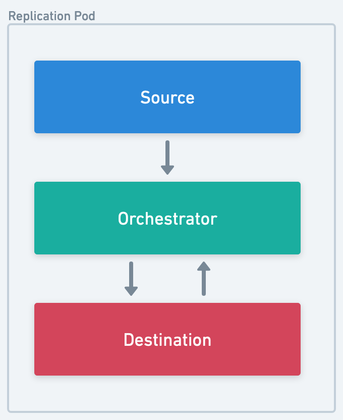
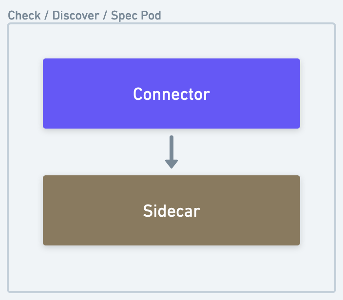
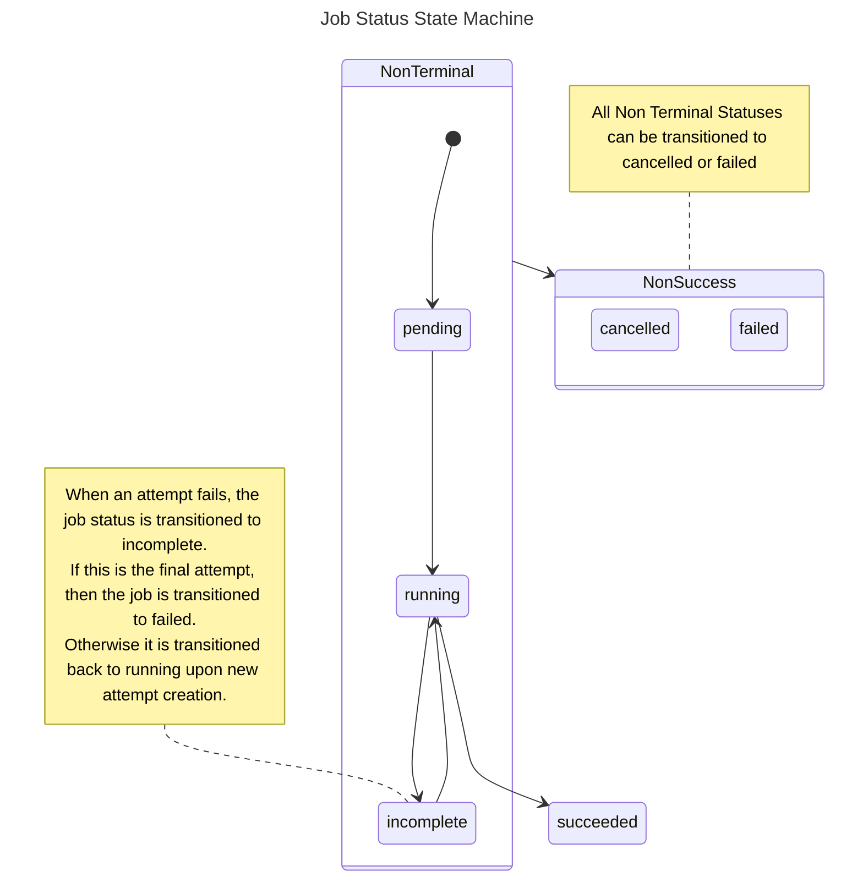
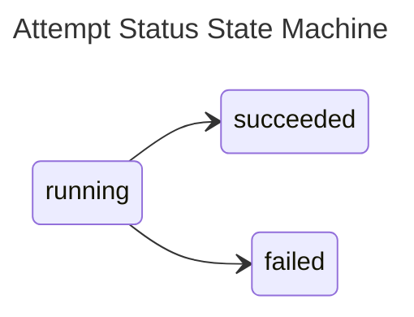

# Workloads & Jobs

In Airbyte, all connector operations are run as 'workloads' — a pod encapsulating the discrete invocation of one or more connectors' interface method(s) (READ, WRITE, CHECK, DISCOVER, SPEC). 

Generally, there are 2 types of workload pods:

- Replication (SYNC) pods
  - Calls READ on the source and WRITE on the destination docker images
- Connector Job (CHECK, DISCOVER, SPEC) pods
  - Calls the specified interface method on the connector image

|         |                                                             |
|:-------------------------------------------------------------------------:|:----------------------------------------------------------------------------------------------------:|
| <em>The source, destination and orchestrator all run in a single pod</em> | <em>The sidecar processes the output of the connector and forwards it back to the core platform</em> |

## Airbyte Middleware and Bookkeeping Containers

Inside any connector operation pod, a special airbyte controlled container will run alongside the connector container(s) to process and interpret the results as well as perform necessary side effects.

There are two types of middleware containers:
* The Container Orchestrator
* The Connector Sidecar

#### Container Orchestrator

An airbyte controlled container that sits between the source and destination connector containers inside a Replication Pod.

Responsibilities:
* Hosts middleware capabilities such as scrubbing PPI, aggregating stats, transforming data, and checkpointing progress.
* Interprets and records connector operation results
* Handles miscellaneous side effects (e.g. logging, auth token refresh flows, etc. )

#### Connector Sidecar

An airbyte controlled container that reads the output of a connector container inside a Connector Pod (CHECK, DISCOVER, SPEC).

Responsibilities:
* Interprets and records connector operation results
* Handles miscellaneous side effects (e.g. logging, auth token refresh flows, etc. )

## Workload launching architecture

Workloads is Airbyte's next generation architecture. It is designed to be more scalable, reliable and maintainable than the previous Worker architecture. It performs particularly
well in low-resource environments.

One big flaw of pre-Workloads architecture was the coupling of scheduling a job with starting a job. This complicated configuration, and created thundering herd situations for
resource-constrained environments with spiky job scheduling.

Workloads is an Airbyte-internal job abstraction decoupling the number of running jobs (including those in queue), from the number of jobs that can be started. Jobs stay queued
until more resources are available or canceled. This allows for better back pressure and self-healing in resource constrained environments.

Dumb workers now communicate with the Workload API Server to create a Workload instead of directly starting jobs.

The **Workload API Server** places the job in a queue. The **Launcher** picks up the job and launches the resources needed to run the job e.g. Kuberenetes pods. It throttles
job creation based on available resources, minimising deadlock situations.

With this set up, Airbyte now supports:
- configuring the maximum number of concurrent jobs via `MAX_CHECK_WORKERS` and `MAX_SYNC_WORKERS` environment variables.`
- configuring the maximum number of jobs that can be started at once via ``
- differentiating between job schedule time & job start time via the Workload API, though this is not exposed to the UI.

This also unlocks future work to turn Workers asynchronous, which allows for more efficient steady-state resource usage. See
[this blogpost](https://airbyte.com/blog/introducing-workloads-how-airbyte-1-0-orchestrates-data-movement-jobs) for more detailed information.

## Further configuring Jobs & Workloads

Details on configuring jobs & workloads can be found [here](../operator-guides/configuring-airbyte.md).

## Sync Jobs

At a high level, a sync job is an individual invocation of the Airbyte pipeline to synchronize data from a source to a destination data store.

### Sync Job State Machine

Sync jobs have the following state machine.

### Attempts and Retries

In the event of a failure, the Airbyte platform will retry the pipeline. Each of these sub-invocations of a job is called an attempt.

### Retry Rules

Based on the outcome of previous attempts, the number of permitted attempts per job changes. By default, Airbyte is configured to allow the following:

- 5 subsequent attempts where no data was synchronized
- 10 total attempts where no data was synchronized
- 20 total attempts where some data was synchronized

For oss users, these values are configurable. See [Configuring Airbyte](../operator-guides/configuring-airbyte.md#jobs) for more details.

### Retry Backoff

After an attempt where no data was synchronized, we implement a short backoff period before starting a new attempt. This will increase with each successive complete failure—a partially successful attempt will reset this value.

By default, Airbyte is configured to backoff with the following values:

- 10 seconds after the first complete failure
- 30 seconds after the second
- 90 seconds after the third
- 4 minutes and 30 seconds after the fourth

For oss users, these values are configurable. See [Configuring Airbyte](../operator-guides/configuring-airbyte.md#jobs) for more details.

The duration of expected backoff between attempts can be viewed in the logs accessible from the job history UI.

### Retry examples

To help illustrate what is possible, below are a couple examples of how the retry rules may play out under more elaborate circumstances.

<table>
    <thead>
        <tr>
            <th colspan="2">Job #1</th>
        </tr>
        <tr>
            <th>Attempt Number</th>
            <th>Synced data?</th>
        </tr>
    </thead>
    <tbody>
        <tr>
            <td>1</td>
            <td>No</td>
        </tr>
        <tr>
            <td colspan="2">10 second backoff</td>
        </tr>
        <tr>
            <td>2</td>
            <td>No</td>
        </tr>
        <tr>
            <td colspan="2">30 second backoff</td>
        </tr>
        <tr>
            <td>3</td>
            <td>Yes</td>
        </tr>
        <tr>
            <td>4</td>
            <td>Yes</td>
        </tr>
        <tr>
            <td>5</td>
            <td>Yes</td>
        </tr>
        <tr>
            <td>6</td>
            <td>No</td>
        </tr>
        <tr>
            <td colspan="2">10 second backoff</td>
        </tr>
        <tr>
            <td>7</td>
            <td>Yes</td>
        </tr>
        <tr>
            <td colspan="2">Job succeeds — all data synced</td>
        </tr>
    </tbody>
</table>

<table>
    <thead>
        <tr>
            <th colspan="2">Job #2</th>
        </tr>
        <tr>
            <th>Attempt Number</th>
            <th>Synced data?</th>
        </tr>
    </thead>
    <tbody>
        <tr>
            <td>1</td>
            <td>Yes</td>
        </tr>
        <tr>
            <td>2</td>
            <td>Yes</td>
        </tr>
        <tr>
            <td>3</td>
            <td>Yes</td>
        </tr>
        <tr>
            <td>4</td>
            <td>Yes</td>
        </tr>
        <tr>
            <td>5</td>
            <td>Yes</td>
        </tr>
        <tr>
            <td>6</td>
            <td>Yes</td>
        </tr>
        <tr>
            <td>7</td>
            <td>No</td>
        </tr>
        <tr>
            <td colspan="2">10 second backoff</td>
        </tr>
        <tr>
            <td>8</td>
            <td>No</td>
        </tr>
        <tr>
            <td colspan="2">30 second backoff</td>
        </tr>
        <tr>
            <td>9</td>
            <td>No</td>
        </tr>
        <tr>
            <td colspan="2">90 second backoff</td>
        </tr>
        <tr>
            <td>10</td>
            <td>No</td>
        </tr>
        <tr>
            <td colspan="2">4 minute 30 second backoff</td>
        </tr>
        <tr>
            <td>11</td>
            <td>No</td>
        </tr>
        <tr>
            <td colspan="2">Job Fails — successive failure limit reached</td>
        </tr>
    </tbody>
</table>
