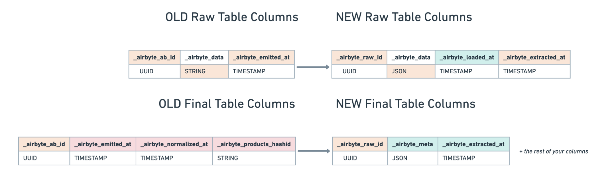

# Typing and Deduping

This page refers to new functionality currently available in **early access**. Typing and deduping will become the new default method of transforming datasets within data warehouse and database destinations after they've been replicated. This functionality is going live with [Destinations V2](https://github.com/airbytehq/airbyte/issues/26028), which is now in early access for BigQuery.

You will eventually be required to upgrade your connections to use the new destination versions.  We are building tools for you to copy your connector’s configuration to a new version to make testing new destinations easier. These will be available in the next few weeks.

## What is Destinations V2?

At launch, Airbyte Destinations V2 will provide:
* One-to-one table mapping: Data in one stream will always be mapped to one table in your data warehouse. No more sub-tables.
* Improved per-row error handling with `_airbyte_meta`: Airbyte will now populate typing errors in the `_airbyte_meta` column instead of failing your sync. You can query these results to audit misformatted or unexpected data.
* Internal Airbyte tables in the `airbyte_internal` schema: Airbyte will now generate all raw tables in the `airbyte_internal` schema. We no longer clutter your desired schema with raw data tables.
* Incremental delivery for large syncs: Data will be incrementally delivered to your final tables when possible. No more waiting hours to see the first rows in your destination table.

## Destinations V2 Example

Consider the following [source schema](https://docs.airbyte.com/integrations/sources/faker) for stream `users`:

```json
{
  "id": "number",
  "first_name": "string",
  "age": "number",
  "address": {
    "city": "string",
    "zip": "string"
  }
}
```

The data from one stream will now be mapped to one table in your schema as below:

#### Destination Table Name: *public.users*

| *(note, not in actual table)*                   	| _airbyte_raw_id 	| _airbyte_extracted_at    	| _airbyte_meta                                                            	| id 	| first_name 	| age  	| address                                     	|
|-----------------------------------------------	|-----------------	|---------------------	|--------------------------------------------------------------------------	|----	|------------	|------	|---------------------------------------------	|
| Successful typing and de-duping ⟶        	| xxx-xxx-xxx     	| 2022-01-01 12:00:00 	| {}                                                                       	| 1  	| sarah      	| 39   	| {   city: “San Francisco”,   zip: “94131” } 	|
| Failed typing that didn’t break other rows ⟶  	| yyy-yyy-yyy     	| 2022-01-01 12:00:00 	| { errors: {[“fish” is not a valid integer for column “age”]} 	| 2  	| evan       	| NULL 	| {   city: “Menlo Park”,   zip: “94002” }    	|
| Not-yet-typed ⟶            	|                 	|                     	|                                                                          	|    	|            	|      	|                                             	|

In legacy normalization, columns of [Airbyte type](https://docs.airbyte.com/understanding-airbyte/supported-data-types/#the-types) `Object` in the Destination were "unnested" into separate tables. In this example, with Destinations V2, the previously unnested `public.users_address` table with columns `city` and `zip` will no longer be generated.

#### Destination Table Name: *airbyte.raw_public_users* (`airbyte.{namespace}_{stream}`)

| *(note, not in actual table)*                   	| _airbyte_raw_id 	| _airbyte_data                                                                                               	| _airbyte_loaded_at    	| _airbyte_extracted_at    	|
|-----------------------------------------------	|-----------------	|-------------------------------------------------------------------------------------------------------------	|----------------------	|---------------------	|
| Successful typing and de-duping ⟶             	| xxx-xxx-xxx     	| {   id: 1,   first_name: “sarah”,   age: 39,   address: {     city: “San Francisco”,     zip: “94131”   } } 	| 2022-01-01 12:00:001 	| 2022-01-01 12:00:00 	|
| Failed typing that didn’t break other rows ⟶  	| yyy-yyy-yyy     	| {   id: 2,   first_name: “evan”,   age: “fish”,   address: {     city: “Menlo Park”,     zip: “94002”   } } 	| 2022-01-01 12:00:001 	| 2022-01-01 12:00:00 	|
| Not-yet-typed ⟶                               	| zzz-zzz-zzz     	| {   id: 3,   first_name: “edward”,   age: 35,   address: {     city: “Sunnyvale”,     zip: “94003”   } }    	| NULL                 	| 2022-01-01 13:00:00 	|

You also now see the following changes in Airbyte-provided columns:



## Participating in Early Access

You can start using Destinations V2 for BigQuery in early access by following the below instructions: 

1. **Upgrade your BigQuery Destination**: If you are using Airbyte Open Source, update your BigQuery destination version to the latest version. If you are a Cloud customer, this step will already be completed on your behalf.
2. **Enabling Destinations V2**: Create a new BigQuery destination, and enable the Destinations V2 option under `Advanced` settings. You will need your BigQuery credentials for this step. For this early release, we ask that you enable Destinations V2 on a new BigQuery destination using new connections. When Destinations V2 is fully available, there will be additional migration paths for upgrading your destination without resetting any of your existing connections. 
    1. If your previous BigQuery destination is using “GCS Staging”, you can reuse the same staging bucket. 
    2. Do not enable Destinations V2 on your previous / existing BigQuery destination during early release. It will cause your existing connections to fail.
3. **Create a New Connection**: Create connections using the new BigQuery destination. These will automatically use Destinations V2.
    1. If your new destination has the same default namespace, you may want to add a stream prefix to avoid collisions in the final tables. 
    2. Do not modify the ‘Transformation’ settings. These will be ignored.
4. **Monitor your Sync**: Wait at least 20 minutes, or until your sync is complete. Verify the data in your destination is correct. Congratulations, you have successfully upgraded your connection to Destinations V2!

Once you’ve completed the setup for Destinations V2, we ask that you pay special attention to the data delivered in your destination. Let us know immediately if you see any unexpected data: table and column name changes, missing columns, or columns with incorrect types.
