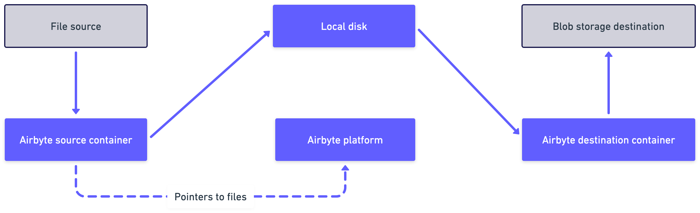

# Delivery methods

Airbyte supports two methods for delivering source data to the destination.

- Replicate records
- Copy raw files

This article explains the difference between these methods, when you should use each one, and how to configure this option in Airbyte.

## Replicate records

When you replicate records, you extract and load structured records into your destination of choice. This method allows for blocking and hashing individual fields or files from a structured schema. Data can be flattened, typed, and deduped depending on the destination.

For most connectors, this is the only option you have. It's ideal for working with structured data like databases, spreadsheets, JSON, and APIs.

## Copy raw files

When you copy raw files, you copy files without parsing their contents. Bits are copied into the destination exactly as they appeared in the source. In this case, Airbyte is strictly focused on data movement, and pays no attention to structure or processing.

This choice is ideal for unstructured text, non-text data like multimedia, and compressed files. However, it's only available on specific connectors that are designed to handle unstructured data, like those related to blob storage solutions.

To ensure your source and destination credentials remain isolated, Airbyte uses a temporary local staging location. The flow is illustrated below.

### Supported versions and limitations

#### Supported Airbyte versions

- Cloud: All Workspaces

- Self-Managed Community and Self-Managed Enterprise: `v1.2.0` or later

#### Supported sources {#supported-sources}

- [SFTP bulk](../integrations/sources/sftp-bulk): `v1.5.0` or later

- [S3](../integrations/sources/s3): `v4.10.1` or later

Additional sources may be added later.

#### Supported destinations

- [S3](../integrations/destinations/s3): `v1.4.0` or later

Additional destinations may be added later.

#### Limitations

- Maximum file size: `1GB` per file.

## How to configure the delivery method

You configure the delivery method on the source. See the docs for [supported connectors](#supported-sources), above.
