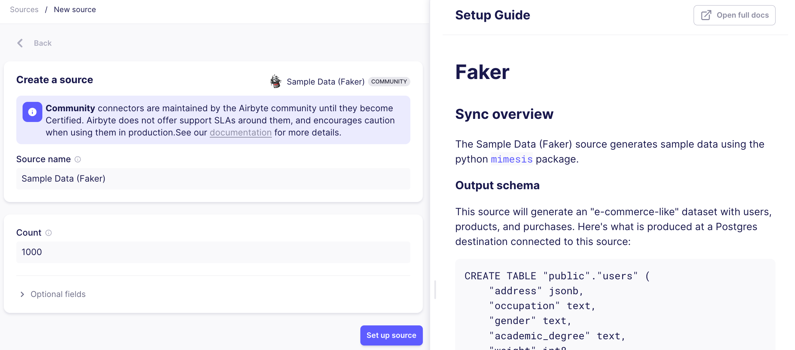

# Add a Source

Setting up a new source in Airbyte is a quick and simple process! When viewing the Airbyte UI, you'll see the main navigation bar on the left side of your screen. Click the **Sources** tab to bring up a list of all available sources.

<Arcade id="k63e0sDIzPWtM0wQjNSC" title="Getting Started (Source)" paddingBottom="calc(61.42578125% + 41px)" />

You can use the provided search bar, or simply scroll down the list to find the source you want to replicate data from. Let's use a demo source, Faker, as an example. Clicking on the **Sample Data (Faker)** card will bring us to its setup page.

The left half of the page contains a set of fields that you will have to fill out. In the **Source name** field, you can enter a name of your choosing to help you identify this instance of the connector. By default, this will be set to the name of the source (ie, `Sample Data (Faker)`).

Each connector in Airbyte will have its own set of authentication methods and configurable parameters. In the case of Sample Data (Faker), you can adjust the number of records you want returned in your `Users` data, and optionally adjust additional configuration settings. You can always refer to your source's provided setup guide for specific instructions on filling out each field.

:::info
Some sources will have an **Optional Fields** tab. You can open this tab to view and configure any additional optional parameters that exist for the souce, but you do not have to do so to successfully set up the connector.
:::

Once you've filled out all the required fields, click on the **Set up source** button and Airbyte will run a check to verify the connection. Happy replicating!

Can't find the connectors that you want? Try your hand at easily building one yourself using our [Connector Builder](../../connector-development/connector-builder-ui/overview.md)!
