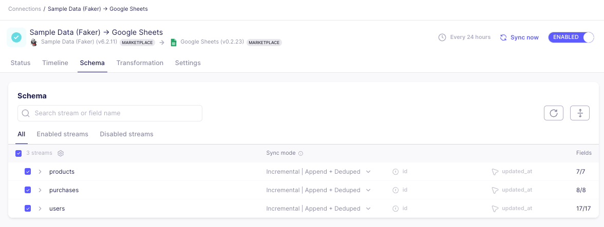
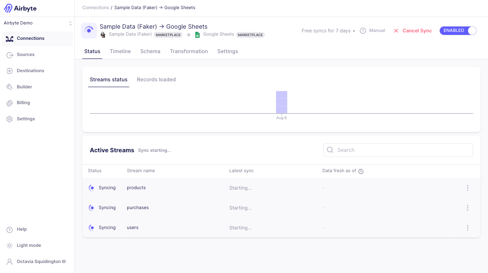

import Tabs from "@theme/Tabs";
import TabItem from "@theme/TabItem";

# Set up a Connection

Now that you've learned how to set up your first [source](./add-a-source) and [destination](./add-a-destination), it's time to finish the job by creating your very first connection!

On the left side of your main Airbyte dashboard, select **Connections**. You will be prompted to choose which source and destination to use for this connection. For this example, we'll use the **Google Sheets** source and the destination you previously set up, either **Local JSON**  or **Google Sheets**.

## Configure the connection

Once you've chosen your source and destination, you'll be able to configure the connection. You can refer to [this page](/cloud/managing-airbyte-cloud/configuring-connections.md) for more information on each available configuration. For this demo, we'll simply set the **Replication frequency** to a 24 hour interval and leave the other fields at their default values.


:::note
By default, data will sync to the default defined in the destination. To ensure your data is synced to the correct place, see our examples for [Destination Namespace](/using-airbyte/core-concepts/namespaces.md)
:::

Next, you can toggle which streams you want to replicate, as well as setting up the desired sync mode for each stream. For more information on the nature of each sync mode supported by Airbyte, see [this page](/using-airbyte/core-concepts/sync-modes).

Our test data consists of three streams, which we've enabled and set to `Incremental - Append + Deduped` sync mode.



Click **Set up connection** to complete your first connection. Your first sync is about to begin!

## Connection Overview

Once you've finished setting up the connection, you will be automatically redirected to a connection overview containing all the tools you need to keep track of your connection.



Here's a basic overview of the tabs and their use:

1. The **Status** tab shows you an overview of your connector's sync health.
2. The **Job History** tab allows you to check the logs for each sync. If you encounter any errors or unexpected behaviors during a sync, checking the logs is always a good first step to finding the cause and solution.
3. The **Replication** tab allows you to modify the configurations you chose during the connection setup.
4. The **Transformation** tab allows you to set up a custom post-sync transformations using dbt.
4. The **Settings** tab contains additional settings, and the option to delete the connection if you no longer wish to use it.

### Check the data from your first sync

Once the first sync has completed, you can verify the sync has completed by checking the data in your destination.

<Tabs groupId="cloud-hosted">
  <TabItem value="cloud" label="Cloud">
     If you followed along and created your own connection using a **Google Sheets** destination, you will now see three tabs created in your Google Sheet, `products`, `users`, and `purchases`.

  </TabItem>
  <TabItem value="self-managed" label="Self Hosted">
    If you followed along and created your own connection using a `Local JSON` destination, you can use this command to check the file's contents to make sure the replication worked as intended (be sure to replace YOUR_PATH with the path you chose in your destination setup, and YOUR_STREAM_NAME with the name of an actual stream you replicated):

    ```bash
    cat /tmp/airbyte_local/YOUR_PATH/_airbyte_raw_YOUR_STREAM_NAME.jsonl
    ```

    You should see a list of JSON objects, each containing a unique `airbyte_ab_id`, an `emitted_at` timestamp, and `airbyte_data` containing the extracted record.

:::tip 
If you are using Airbyte on Windows with WSL2 and Docker, refer to [this guide](/integrations/locating-files-local-destination.md) to locate the replicated folder and file.
:::

  </TabItem>
</Tabs>

## What's next?

Congratulations on successfully setting up your first connection using Airbyte! We hope that this will be just the first step on your journey with us. We support a large, ever-growing [catalog of sources and destinations](/integrations/), and you can even [contribute your own](/connector-development/).

If you have any questions at all, please reach out to us on [Slack](https://slack.airbyte.io/). If you would like to see a missing feature or connector added, please create an issue on our [Github](https://github.com/airbytehq/airbyte). Our community's participation is invaluable in helping us grow and improve every day, and we always welcome your feedback.

Thank you, and we hope you enjoy using Airbyte!
