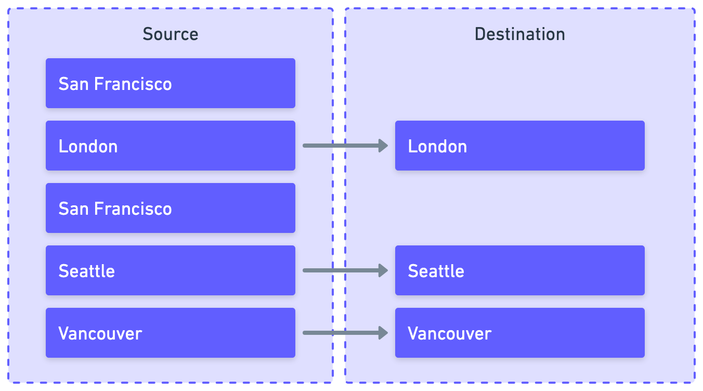

# Mappings

Use mappings to hash, encrypt, and rename fields, and filter rows. You set up mappings on each stream, ensuring your source data arrives in your destination exactly as you want it.


## More about mapping in Airbyte

It’s often the case that you want to move data from a source to a destination in a non-literal way, obscuring sensitive information and improving the consistency and usability of that data in its final destination. Mapping allows you to match a field from your source to your destination and sync data in a way that is still accurate, but also more meaningful and appropriate for your needs.

Several types of mapping are possible in Airbyte, and you can combine them together in meaningful ways.

### Hash

Hashing is an **irreversible** process that protects sensitive data by obscuring it. Airbyte supports MD5, SHA-256, and SHA-512 hashing methods. Support for MD2, SHA-1, and SHA-384 is only available [through the API](https://reference.airbyte.com).


There are many reasons you might want to hash data.

- **Data security**: Source datasets can contain data like passwords or credit card information. It's more secure to store a hashed or encrypted version of this data.
- **Data integrity**: You can compare hashed values to ensure nobody has tampered with the data.
- **Efficient retrieval**: Hashing can enable faster lookups in databases.
- **Anonymity and compliance**: Source datasets can contain personally identifiable information (PII). Anonymizing PII can help you meet data privacy regulations like GDPR and HIPAA.

### Encrypt

Encryption is a **reversible** process that protects sensitive data by obscuring it. Airbyte supports RSA and AES encryption using an encryption key you generate yourself.


There are many reasons you might want to encrypt data.

- **Data security**: Source datasets can contain data like passwords or credit card information. It's more secure to store a hashed or encrypted version of this data.
- **Data integrity**: You can compare hashed values to ensure nobody has tampered with the data.
- **Efficient retrieval**: Hashing can enable faster lookups in databases.
- **Anonymity and compliance**: Source datasets can contain personally identifiable information (PII). Anonymizing PII can help you meet data privacy regulations like GDPR and HIPAA.

#### RSA keys

Airbyte expects RSA keys in hex-encoded DER format. PEM isn't currently supported.

This example generates the required key format.

```bash
openssl genpkey -algorithm RSA -out private_key.pem -pkeyopt rsa_keygen_bits:2048
openssl rsa -pubout -outform DER -in private_key.pem -out public_key.der
xxd -p public_key.der | tr -d '\n'
```

This is an example of the public key format Airbyte expects, but make sure you generate your own.

```bash
30820122300d06092a864886f70d01010105000382010f003082010a0282010100ce01c1000b6712bd5f694402c82ffb7b60867130b6e3284eac39577ff0f9b12a69920af4e53f4d83843ce86ba4975bb0298e6cf0ffbb8696540426bbf2146075ac6779801cf3dac54aa21ec69b14ab78217b5be70d083d075f06443a6f84ed6a61c924a4467b76eb35b41cf0d9e88be8c98734aec87ba7e9a6e8b9bec45627edbba2ea285f4907811ff94a01b6b1a90d88d303fbb60f62c094a65f5739fc6e46e06924040cd54c2a990483aa25eb4a7a35c0b77ef42f0c06fe1b00a8ca038939d22cc136de862a3bb5ba4a14f211e31d1380cf26fa3d6b268f6a4be47e3926a5d83ca20ae0108379b0d940c0e8a5a9cf7d24a6222305520ce6b507e3f7515e2d0203010001
```

#### AES keys

You can only use AES keys if Airbyte is configured to use an [external secrets manager](../deploying-airbyte/integrations/secrets).

### Rename field

Renaming fields helps you ensure clarity, consistency, and compatibility in your destination data. 


There are many reasons you might want to rename fields.

- **Schema alignment**: Sources and destinations can use different naming conventions, or your destination can have more stringent naming requirements.
- **Readability and understanding**: Sources won't always have descriptive field names and the purpose of a field can be lost out of context. In an HRIS system, you might guess that `emp_num` is an employee number, but that might be less obvious years later in a data warehouse. Meaningful, descriptive names help teams understand and manage their data more efficiently.
- **Avoid conflicts**: Prevent multiple fields from having unnecessarily similar or identical names, and avoid the use of reserved keywords as field names.

### Filter rows

Filtering rows is how you ensure you only sync relevant, high-quality, and meaningful data to your destination. 



There are many reasons you might want to filter rows.

- **Remove irrelevant or corrupted data**: Data sources can contain test data, incomplete transactions, null values, and other things you don't want to preserve.
- **Optimization**: Smaller datasets require less processing and storage, and you can query them faster.
- **Compliance**: You don't want to keep data longer than is needed for a defined business purpose, and you want to ensure you don't accidentally archive data from individuals who opted out of data collection.

:::note
You can only filter fields whose type is string and number.
:::

## Considerations and limitations

Before you begin mapping fields, consider the following.

- Do not map a cursor or primary key field if the [sync mode](core-concepts/sync-modes) depends on it. Doing this disrupts Airbyte's ability to use them for incremental syncing and deduplication.

- If you set up mapping on an existing connection, Airbyte prompts you to refresh your stream. If a given destination does not support refreshes, Airbyte prompts you to clear it, instead. You almost certainly should do this as prompted. Not doing this could result in undesirable or unexpected behavior. For example, if you set up hashing on a field that contains PII, you want all data in that column to be hashed, not just new data. However, beware that if you're dealing with an extremely large database, a complete resync might take a significant amount of time.

## Create a new mapping

Follow these steps to create a new mapping. Once you add a mapping to a stream, you cannot disable that stream until you [delete that stream's mappings](#delete).

1. Click **Connections** in the sidebar.
2. Click the connection on which you want to set up mappings.
3. Click **Mappings**.
4. Click **Select stream** or **Add stream**.
5. Select the stream on which you want to set up mappings.
6. Define your mappings for that stream. 
7. When you're done, click **Submit**. Airbyte may prompt you to refresh or clear your destination to avoid unexpected behavior. The mapping is applied next time you sync data.

## Modify a mapping

Follow these steps to change an existing mapping.

1. Click **Connections** in the sidebar.
2. Click the connection on which you want to set up mappings.
3. Click **Mappings**.
4. Find the mappings you want to modify, and adjust them.
5. When you're done, click **Submit**. Airbyte may prompt you to refresh or clear your destination to avoid unexpected behavior. The mapping is applied next time you sync data.

## Delete a mapping {#delete}

Follow these steps to create a new mapping.

1. Click **Connections** in the sidebar.
2. Click the connection on which you want to set up mappings.
3. Click **Mappings**.
4. Click the trash can icon next to the mapping you want to remove.
