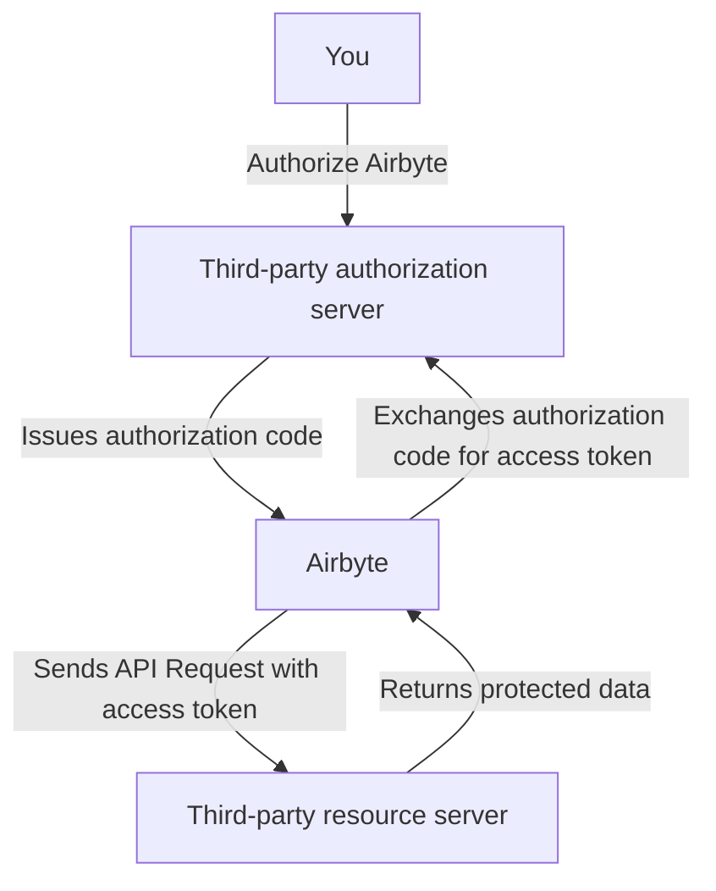

# Using OAuth to Connect

Many Airbyte connectors support OAuth 2.0, enabling secure and seamless integration between Airbyte and third-party APIs. This guide explains how OAuth works for connectors in Airbyte.

## What is OAuth?

[OAuth 2.0](https://oauth.net/2/) is an open standard for access delegation. It allows websites or applications to request limited access to your information on other platforms without exposing passwords. By using token-based authentication, OAuth enhances security and improves your user experience.

## OAuth Flow in Airbyte

The complexity of setting up OAuth flows is handled internally by Airbyte. When you set up a new connector, you only need to complete a few steps to use OAuth. Airbyte’s OAuth implementation involves three key components:

1. **You**: The individual authorizing access to your account on a third-party platform.

2. **Airbyte**: The application requesting authorization on your behalf.

3. **The third-party API**: The service to which the connector needs access.

This simplified diagram visualizes the connection process.

## OAuth in Airbyte Cloud

In Airbyte Cloud, the process depends on a [connector's support level](../integrations/connector-support-levels).

### Airbyte connectors

For Airbyte connectors, client credentials are securely managed by Airbyte. You only need to click the authentication button and use the third-party platform's UI to authorize Airbyte. 

### Marketplace and custom connectors

For Marketplace or custom connectors, you must configure your own client credentials.

1. Register an application on the third-party platform to obtain a **Client ID** and **Client Secret**. The exact process differs slightly for each third-party, but most explain this process in their documentation. The documentation for an Airbyte connector often provides these steps, too.

2. Enter your **Client ID** and **Client Secret** into the connector settings in Airbyte.

3. Click the authentication button.

## OAuth in Self-Managed Airbyte

In Self-Managed Airbyte, for security reasons, you must configure your own client credentials.

1. Register an application on the third-party platform to obtain a **Client ID** and **Client Secret**. The exact process differs slightly for each third-party, but most explain this process in their documentation. The documentation for an Airbyte connector often provides these steps, too.

2. Enter your **Client ID** and **Client Secret** into the connector settings in Airbyte.

3. Click the authentication button.

## Security Considerations

- You are responsible for managing client credentials except when Airbyte Cloud provides the OAuth app for you. Treat these keys like a username and password, and handle your sensitive data securely.

- OAuth is supported in airgapped instances of Airbyte. Redirects happen in your web browser, not the Airbyte server.

## Troubleshooting Common OAuth Issues

When OAuth connections fail, it's usually one of these problems.

### Your credentials are invalid

- Verify that the **Client ID** and **Client Secret** are correct (Self-Managed only).

- Check for typos or missing configuration steps.

### Your token is expired

- Airbyte handles access tokens and refresh tokens for you. If something goes wrong, reauthorize the connector.

### Redirect URI Mismatch

- Confirm that the redirect URI registered with the third-party platform matches the URI used by Airbyte. Airbyte's user interface provides this URI when you set up a new connector. Make sure you enter this value exactly.
