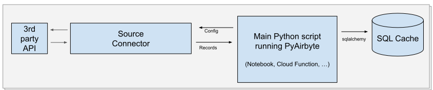

import PyAirbyteConnectors from '@site/src/components/PyAirbyteConnectors';

# Getting Started with PyAirbyte (Beta)

PyAirbyte is a library that provides a set of utilities to use Airbyte connectors in Python. It is meant to be used in situations where setting up an Airbyte server or cloud account is not possible or desirable, for example in a Jupyter notebook or when iterating on early prototypes on a developer's workstation.

You can also check out this [YouTube video](https://youtu.be/tUTE-csnwCI) on how to get started with PyAirbyte!

## Installation

```bash
pip install airbyte
```

Or during the beta, you may want to install the latest from from source with:

```bash
pip install 'git+https://github.com/airbytehq/PyAirbyte.git'
```

## Usage

Data can be extracted from sources and loaded into caches:

<a href="https://colab.research.google.com/github/airbytehq/quickstarts/blob/master/pyairbyte_notebooks/PyAirbyte_Basic_Features_Demo.ipynb" target="_parent"></a>

```python
import airbyte as ab

source = ab.get_source(
    "source-faker",
    config={"count": 5_000},
    install_if_missing=True,
)
source.check()
source.select_all_streams()
result = source.read()

for name, records in result.streams.items():
    print(f"Stream {name}: {len(list(records))} records")
```

## Quickstarts

* [Basic Demo](https://github.com/airbytehq/quickstarts/blob/main/pyairbyte_notebooks/PyAirbyte_Basic_Features_Demo.ipynb)
* [CoinAPI](https://github.com/airbytehq/quickstarts/blob/main/pyairbyte_notebooks/PyAirbyte_CoinAPI_Demo.ipynb)
* [GA4](https://github.com/airbytehq/quickstarts/blob/main/pyairbyte_notebooks/PyAirbyte_GA4_Demo.ipynb) 
* [Shopify](https://github.com/airbytehq/quickstarts/blob/main/pyairbyte_notebooks/PyAirbyte_Shopify_Demo.ipynb) 
* [GitHub](https://github.com/airbytehq/quickstarts/blob/main/pyairbyte_notebooks/PyAirbyte_Github_Incremental_Demo.ipynb) 
* [Postgres (cache)](https://github.com/airbytehq/quickstarts/blob/main/pyairbyte_notebooks/PyAirbyte_Postgres_Custom_Cache_Demo.ipynb)  
* [RAG With Langchain](https://github.com/airbytehq/quickstarts/blob/main/pyairbyte_notebooks/PyAirbyte_Document_Creation_RAG_with_Langchain_Demo.ipynb)


## API Reference

For details on specific classes and methods, please refer to our [PyAirbyte API Reference](https://airbytehq.github.io/PyAirbyte/index.html).

## Architecture

[comment]: <> (Edit under https://docs.google.com/drawings/d/1M7ti2D4ha6cEtPnk04RLp1SSh3au4dRJsLupnGPigHQ/edit?usp=sharing)



PyAirbyte is a python library that can be run in any context that supports Python >=3.9. It contains the following main components:
* **Source**: A source object is using a Python connector and includes a configuration object. The configuration object is a dictionary that contains the configuration of the connector, like authentication or connection modalities. The source object is used to read data from the connector.
* **Cache**: Data can be read directly from the source object. However, it is recommended to use a cache object to store the data. The cache object allows to temporarily store records from the source in a SQL database like a local DuckDB file or a Postgres or Snowflake instance.
* **Result**: An object holding the records from a read operation on a source. It allows quick access to the records of each synced stream via the used cache object. Data can be accessed as a list of records, a Pandas DataFrame or via SQLAlchemy queries.

## Available connectors

The following connectors are available:

<PyAirbyteConnectors />
