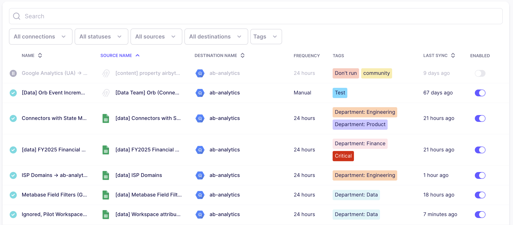

# Tagging Connections

As time goes on, the number of connections in your workspace tends to increase. Use tags to organize connections based on any set of criteria you like, then filter your connections based on the tags you want to see.

## Strategies for managing tags

Tags are flexible, so make sure you create a system that works for you. Here are a few classification schemes to get you started.

- **Data owner**: Which department or team owns the source data?

- **Engineering owner**: Who is responsible for keeping this connection running smoothly?

- **Criticality**: Is a connection powering critical business systems? Are there SLAs you need to meet?

- **Purpose**: What functions is the data powering, and who is using this data?

- **Readiness**: Is the connection in testing, or is it production-ready?

- **Origin**: Is this connection managed by the Airbyte UI, Python, Terraform, or something else?

Regardless of your tag choices, it's always good practice to observe these guidelines.

- Use a standardized set of tags that everyone understands

- Use clear, descriptive tags that accurately represent your connections

- Stick to a manageable number of tags

- Review and update tags to ensure they stay relevant

- Combine similar tags, like 'Prod' and 'Production'

- Customize colors to visually represent a tag's importance

## Create a new tag

Create a new tag and add it to one of your connections.

1. Open Airbyte and click **Connections**.

2. In the **Tags** column, find the connection you want to tag and hover on it.

3. If the connection has no tags, click **Add a tag** <svg fill="none" data-icon="plus" role="img" viewBox="0 0 24 24" class="inline-svg"><path fill="currentColor" d="M19 11h-6V5a1 1 0 0 0-2 0v6H5a1 1 0 0 0 0 2h6v6a1 1 0 0 0 2 0v-6h6a1 1 0 0 0 0-2"></path></svg>. If the connection already has tags, click **Edit tags** <svg fill="none" data-icon="pencil" role="img" viewBox="0 0 24 24" class="inline-svg"><path fill="currentColor" d="M22 7.24a1 1 0 0 0-.29-.71l-4.24-4.24a1 1 0 0 0-.71-.29 1 1 0 0 0-.71.29l-2.83 2.83L2.29 16.05a1 1 0 0 0-.29.71V21a1 1 0 0 0 1 1h4.24a1 1 0 0 0 .76-.29l10.87-10.93L21.71 8q.138-.146.22-.33.015-.12 0-.24a.7.7 0 0 0 0-.14zM6.83 20H4v-2.83l9.93-9.93 2.83 2.83zM18.17 8.66l-2.83-2.83 1.42-1.41 2.82 2.82z"></path></svg>.

3. Type a name for your tag and click **Create `tag name`**.

Airbyte creates the tag and applies it to that connection. Tag colors are defined automatically, but you can [change them](#change-tag-properties).

## Add or remove a tag on a connection

Modify a connection to add or remove a tag that already exists.

1. Open Airbyte and click **Connections**.

2. In the **Tags** column, find the connection you want to tag and hover on it.

3. Click **Edit tags** <svg fill="none" data-icon="pencil" role="img" viewBox="0 0 24 24" class="inline-svg"><path fill="currentColor" d="M22 7.24a1 1 0 0 0-.29-.71l-4.24-4.24a1 1 0 0 0-.71-.29 1 1 0 0 0-.71.29l-2.83 2.83L2.29 16.05a1 1 0 0 0-.29.71V21a1 1 0 0 0 1 1h4.24a1 1 0 0 0 .76-.29l10.87-10.93L21.71 8q.138-.146.22-.33.015-.12 0-.24a.7.7 0 0 0 0-.14zM6.83 20H4v-2.83l9.93-9.93 2.83 2.83zM18.17 8.66l-2.83-2.83 1.42-1.41 2.82 2.82z"></path></svg>.

4. Click on tags to add and remove them for that connection.

Airbyte applies and removes tags and you select and deselect them.

## Change a tag's name and color {#change-tag-properties}

Rename and recolor a tag.

1. Open Airbyte and click **Settings** > **General**.

2. Under **Workspace Tags**, click the pencil icon <svg fill="none" data-icon="pencil" role="img" viewBox="0 0 24 24" class="inline-svg"><path fill="currentColor" d="M22 7.24a1 1 0 0 0-.29-.71l-4.24-4.24a1 1 0 0 0-.71-.29 1 1 0 0 0-.71.29l-2.83 2.83L2.29 16.05a1 1 0 0 0-.29.71V21a1 1 0 0 0 1 1h4.24a1 1 0 0 0 .76-.29l10.87-10.93L21.71 8q.138-.146.22-.33.015-.12 0-.24a.7.7 0 0 0 0-.14zM6.83 20H4v-2.83l9.93-9.93 2.83 2.83zM18.17 8.66l-2.83-2.83 1.42-1.41 2.82 2.82z"></path></svg>.

3. Rename the tag and update the color as you prefer. The color must be a valid hexadecimal code. Click the color sample and use the color picker to generate this for you.

4. Click **Save changes**.

Airbyte updates your tag. Next time you view the Connections page, your tags will reflect these changes.

## Delete a tag

Delete a tag from Airbyte and remove it from any connections that use it.

1. Open Airbyte and click **Settings** > **General**.

2. Under **Workspace Tags**, click the trash icon <svg fill="none" data-icon="trash" role="img" viewBox="0 0 24 24" class="inline-svg"><path fill="currentColor" d="M20 6h-4V5a3 3 0 0 0-3-3h-2a3 3 0 0 0-3 3v1H4a1 1 0 0 0 0 2h1v11a3 3 0 0 0 3 3h8a3 3 0 0 0 3-3V8h1a1 1 0 1 0 0-2M10 5a1 1 0 0 1 1-1h2a1 1 0 0 1 1 1v1h-4zm7 14a1 1 0 0 1-1 1H8a1 1 0 0 1-1-1V8h10z"></path></svg>.

3. Click **Delete**.

Airbyte deletes the tag and removes it from any connections that use it.

## Limitations

Tags have the following maximums.

- 30 characters per tag name

- 10 tags per connection

- 100 tags per workspace
