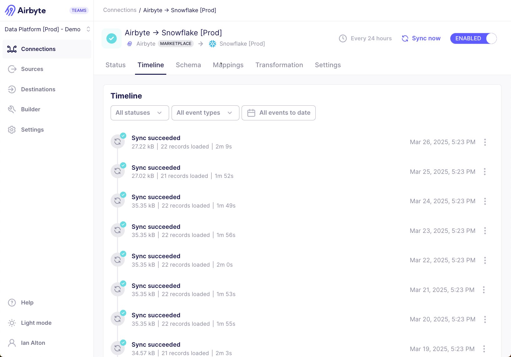

# Review the Connection Timeline

The Connection Timeline displays historical information about relevant connection events. You can also view and download logs, find any relevant errors, and find a link to a job to share with Support.

## How to review the Connection Timeline

Follow these steps to access the Connection Timeline.

1. Click **Connections**.

2. Click the connection in the list that you want to inspect.

3. Click **Timeline**.

Use the filters at the top of the timeline to filter the timeline for specific events types and period of time you are looking for.

## What appears on the Connection Timeline

The Connection Timeline includes the following event types:

- Syncs

- Refreshes

- Clears

- Connection settings changes

  - Changing connection settings like name or sync schedule

  - Manually enabling or disabling a connection

  - Airbyte disabling a connection due to a billing issue or consecutive failures

- Schema updates

- Schema configuration changes

  - Enabling or disabling streams and fields

  - Changing primary keys or cursors

  - Changing the sync mode

  - Adding or removing streams/fields after clicking "Refresh source schema"

The Connection Timeline also shows who took an action, if that's relevant to the event.

## Syncs, refreshes, and clears

Completed syncs, [refreshes](/platform/operator-guides/refreshes), and [clears](/platform/operator-guides/clear) have a status associated to the event.

| Status     | Description                                                                                                                            |
| ---------- | -------------------------------------------------------------------------------------------------------------------------------------- |
| Succeeded  | Airbyte extracted 100% of the data and loaded to the destination.                                                                      |
| Incomplete | The sync encountered an error, and should resolve itself. Airbyte loaded a subset or none of the data to the destination.              |
| Failed     | The sync encountered a fatal error, and needs intervention to resolve. Airbyte loaded a subset or none of the data to the destination. |
| Cancelled  | Someone cancelled the sync before it finished.                                                                                         |
| Running    | The sync is currently running.                                                                                                         |

### How the Connection Timeline reflects moved data

For sync and refresh events, Airbyte also shows the volume of synced data, such as the amount of data moved, the number of records read and committed, and the total sync time. Reviewing this timeline can help you monitor the connection and identify any potential issues.

| Data                             | Description                                                    |
| -------------------------------- | -------------------------------------------------------------- |
| `x` GB (also measured in KB, MB) | Amount of data moved during the sync.                          |
| `x` extracted records            | Number of records read from the source during the sync.        |
| `x` loaded records               | Number of records the destination confirmed it received.       |
| `xh xm xs`                       | Total time (hours, minutes, seconds) for the sync to complete. |

### How the Connection Timeline reflects failed syncs

Most syncs succeed after a single attempt. If an attempt fails, Airbyte attempts to sync your data again. [Learn more about Airbyte's retry approach](../../understanding-airbyte/jobs.md#retry-rules). If Airbyte needs multiple attempts to sync, you can open the logs to see the individual log from each attempt. Repeated failed attempts can cause syncs can fail.

Airbyte summarizes metrics in the sync summary across all the attempts in the sync. As a result, you may observe that the number of records extracted is higher than the number of records loaded if an attempt fails during the extraction process. A successful sync status means that all the records from the source have been successfully written to the destination even if Airbyte had to make multiple attempts.

### Data volume moved

If you're using Airbyte Cloud with [volume-based pricing](https://airbyte.com/pricing), Airbyte calculates volume the way it calculates the information presented in the sync summary in the user interface. Every database stores and compresses data differently, so Airbyte measures data volume observed by the Airbyte Platform during the sync. When the data is in transit, Airbyte serializes it in the [Airbyte Protocol format](/platform/understanding-airbyte/airbyte-protocol/#airbyterecordmessage). This is likely to be a larger representation of your data than you would see if you were to query your database directly.
