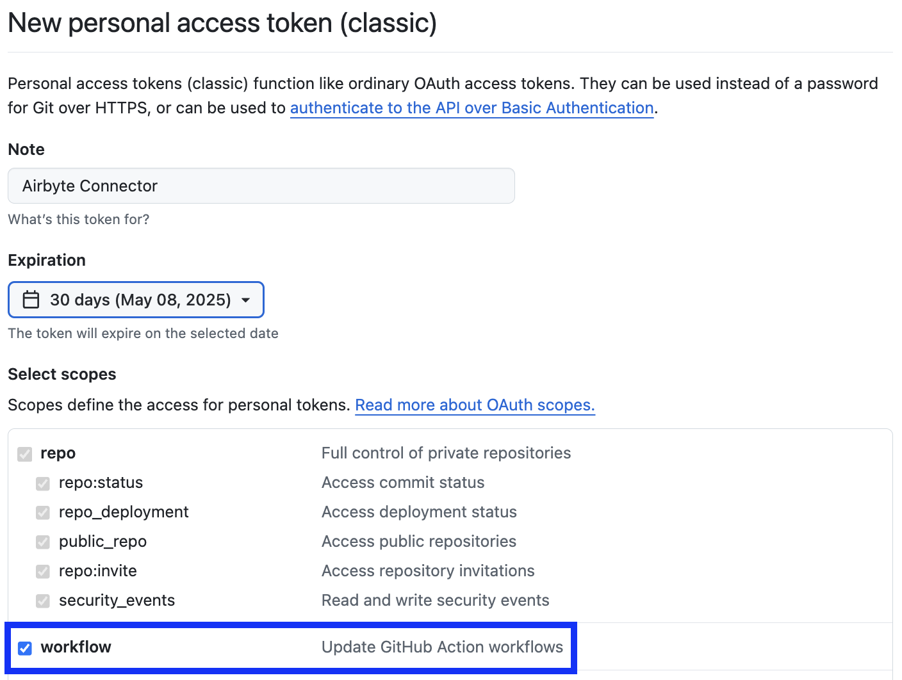

# Contribute a New Connector

## API Connectors in Connector Builder

You can contribute a new low-code API Connector in Connector Builder. They're the fastest to review, and easiest for you and others to maintain!

To contribute a new connector in Connector Builder:

1. Build the connector in Connector Builder. [Read this guide to get started](../connector-development/connector-builder-ui/overview.md).
2. When you're happy with the connector, press the **Publish -> Contribute to Marketplace** button.
3. You'll be prompted for a connector description and your Github Access Token.
4. Builder will make a new pull request on your behalf automatically!
5. Airbyte Marketplace team will review the PR.

### Obtaining your Github Access Token

In order to contribute a new connector from the Airbyte UI, you'll need to obtain your [GitHub Personal Access Token](https://docs.github.com/en/authentication/keeping-your-account-and-data-secure/managing-your-personal-access-tokens#creating-a-personal-access-token-classic). This will allow your GitHub user to author the contribution.

The token must be a (classic) token with repo scope enabled. Follow these directions to create a new token with the required scopes.

1. In the upper-right corner of any page on GitHub, click your profile photo, then click Settings.
2. In the left sidebar, click `Developer settings`.
3. In the left sidebar, under Personal access tokens, click `Tokens (classic)`.

4. Select Generate new token, then click `Generate new token (classic)`.

5. Add the `workflow` scope. Click `Generate Token`.

6. Make sure to copy your personal access token. You won’t be able to see it again! Paste the personal access token to the Airbyte UI, and click "Contribute" to contribute the connector.

## Custom Python CDK or Java CDK connectors

### Find or start a Github Discussion about the connector

While our Connector Builder is constantly growing and evolving in flexibility and supported use cases, some connector implementations won't work in the Builder just yet.
See the [Connector Development guide](../connector-development/README.md) for more details on how to build a connector. If you're building a custom Python CDK or Database (Java CDK) connector, please start with filing a discussion or an issue:

1. Check to see if there is an existing [Discussion](https://github.com/airbytehq/airbyte/discussions/categories/new-connector-request) for a connector you have in mind
2. If you don't find an existing issue, [Request a New Connector](https://github.com/airbytehq/airbyte/discussions/new?category=new-connector-request)

This will enable our team to make sure your contribution does not overlap with existing works and will comply with the design orientation we are currently heading the product toward. If you do not receive an update on the issue from our team, please ping us on [Slack](https://slack.airbyte.io)!

### Open a pull request

1. Make sure your connector passes `airbyte-ci connectors test` tests. [Here's a guide on how to run them](../connector-development/testing-connectors/README.md).
2. Make sure you include the README, documentation, and an icon for your connector. Without them, one of the CI checks will fail.
3. Follow the [pull request convention](./resources/pull-requests-handbook.md#pull-request-title-convention)
4. Wait for a review from a community maintainer or our team. We generally look for the following criteria:

- Does this PR cover authentication, pagination, and incremental syncs where applicable?
- ‌Does the PR add reasonable list of streams?
- If the connector uses custom Python components, did you write unit tests?

5. Provide a sandbox account. For some APIs, we'll need a sandbox account that we'll ask for. We'll then set it up in our CI and use it to test this connector in the future.
