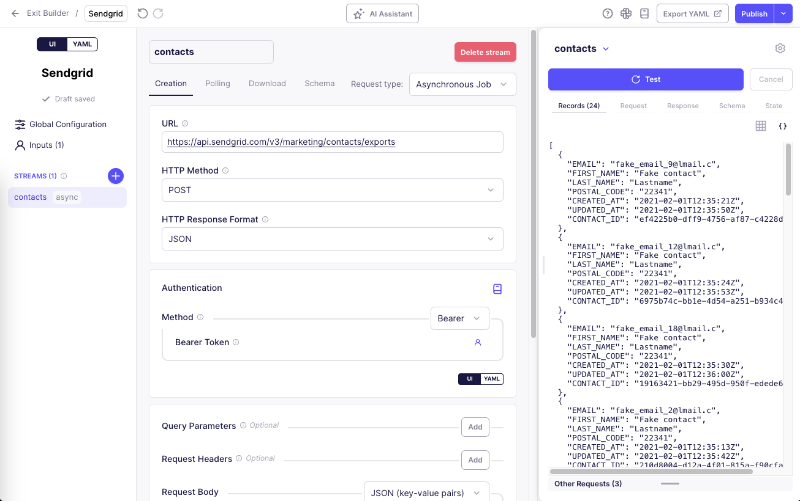
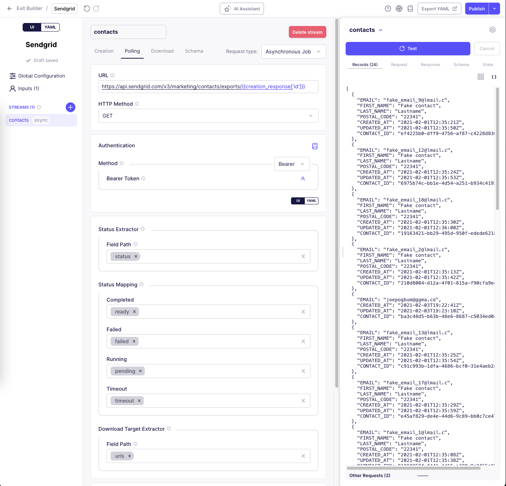
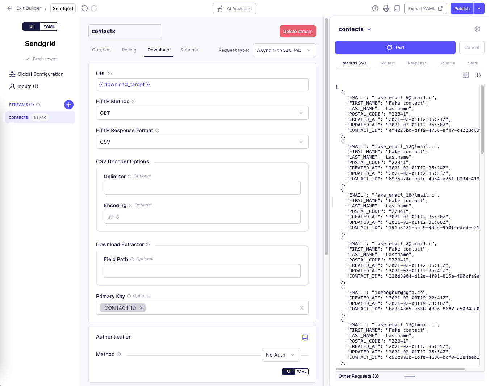
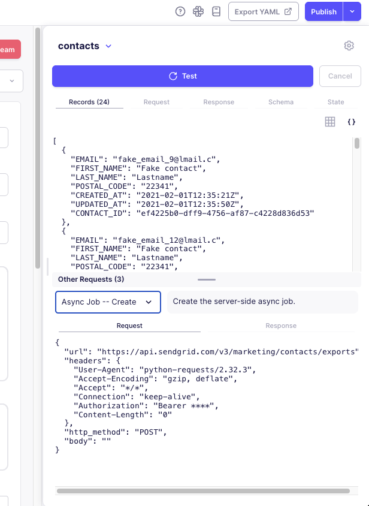
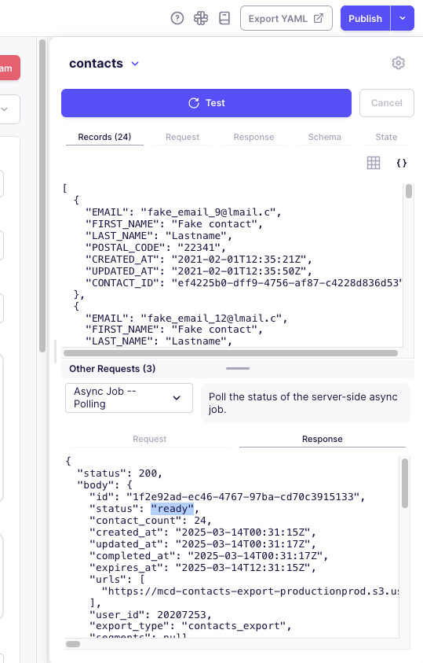

# Asynchronous Job streams

In the Connector Builder UI, you can create two types of streams: **Synchronous Request** and **Asynchronous Job**. Understanding the difference is important for efficiently extracting data from APIs that use asynchronous processing.

## Synchronous Streams

Synchronous streams operate in real-time, where:
- The connector makes a request to an API endpoint
- The API responds immediately with data
- The connector processes and returns that data in the same operation

This is the simpler, more common pattern used for most APIs that can return data immediately.

## Asynchronous Streams

Asynchronous streams handle scenarios where data extraction happens over multiple steps:
1. **Creation**: You request a job to be created (like a report generation)
2. **Polling**: You periodically check if the job is complete
3. **Download**: Once the job is complete, you download the results

This approach is necessary for APIs that handle large datasets or resource-intensive operations that cannot be completed in a single request-response cycle.

## When to Use Asynchronous Streams

Use asynchronous streams when:
- The API requires you to trigger a job and wait for it to complete
- You're working with large datasets that need server-side processing
- The API documentation mentions job creation, status checking, and result download
- Data generation takes too long to be handled in a single request

Common examples include analytics report generation, large data exports (like SendGrid contacts), complex data processing operations, and batch-processed operations.

## Configuring an Asynchronous Stream

To make an existing stream asynchronous, at the top-right of the stream configuration, select `Request type` > `Asynchronous Job`.

To create a new stream as an asynchronous stream, click the `+` add stream button, and select `Request type`> `Asynchronous Job`.

An asynchronous stream in the Connector Builder UI is divided into three main tabs:

### 1. Creation Tab

The Creation tab configures how to request that a job be created on the server.

#### Key Components:

- **URL**: The full URL that the request should be sent to to create the job
- **HTTP Method**: Typically POST for job creation, but this can vary by API
- **HTTP Response Format**: Format of the response from the job creation request. This will also be used for the polling response.
- **Authentication**: Authentication method for the creation request
- **Request Options**: Headers, query parameters, and request body for the creation request

#### Example Configuration (SendGrid):

In the UI, for the [SendGrid contacts export](https://www.twilio.com/docs/sendgrid/api-reference/contacts/export-contacts), you would configure:

- **URL** field: `https://api.sendgrid.com/v3/marketing/contacts/exports`
- **HTTP Method** dropdown: `POST`
- In the **Authentication** section: 
  - Select **Bearer Token** authentication type
  - Fill out the **API Key** user input with your SendGrid API key

### 2. Polling Tab

The Polling tab defines how to check the status of a running job.

#### Key Components:

- **URL**: The full URL that the request should be sent to to check the status of the job. Use the `{{ creation_response }}` variable to reference the response from the creation request when constructing this URL.
- **HTTP Method**: Typically GET for status checking, but this can vary by API
- **Status Extractor**: Extracts the job status from the response
- **Status Mapping**: Maps API-specific status values to standard statuses
- **Download Target Extractor**: Extracts the URL or ID for downloading results

#### Status Extractor and Status Mapping Explained

The **Status Extractor** and **Status Mapping** work together:

1. **Status Extractor** defines a path to extract the status value from the API response. It uses a field path to point into the JSON response to find the status value.

2. **Status Mapping** maps the extracted status values to standard connector statuses:
   - **Completed**: Job finished successfully and data is ready for download
   - **Failed**: Job encountered an error and cannot be completed
   - **Running**: Job is still processing, need to keep polling
   - **Timeout**: Job took too long to complete, should be aborted

For each of these, you should put all of the possible status values that the API might return which indicate that the job is in that state.

The connector first uses the Status Extractor to get the raw status value, then uses the Status Mapping to determine what action to take next.

#### Download Target Extractor Explained

The **Download Target Extractor** works similarly to the Status Extractor but extracts a download URL or identifier from the successful API response. This extracted value will be used in the Download stage to retrieve the data.

#### Example Configuration (SendGrid):

In the UI, for the [SendGrid contacts export](https://www.twilio.com/docs/sendgrid/api-reference/contacts/export-contacts), you would configure:

- **URL** field: `https://api.sendgrid.com/v3/marketing/contacts/exports/{{creation_response['id']}}`
- **HTTP Method** dropdown: `GET`
- In the **Status Extractor** section:
  - Set the **Field Path** to: `status`
- In the **Status Mapping** section:
  - Set **Completed** to: `ready`
  - Set **Failed** to: `failed`
  - Set **Running** to: `pending`
  - Set **Timeout** to: `timeout`
- In the **Download Target Extractor** section:
  - Set the **Field Path** to: `urls`

### 3. Download Tab

The Download tab configures how to retrieve the results once the job is complete.

#### Key Components:

- **URL**: The full URL that the request should be sent to to download the results. Use the `{{ download_target }}` variable to reference the value extracted by the Download Target Extractor in the Polling tab.
- **HTTP Method**: Typically GET for downloading, but this can vary by API
- **HTTP Response Format**: Format of the downloaded data
- **Download Extractor**: Optional path to extract a specific path from the download response for constructing records.
- **Primary Key**: Unique identifier for records
- **Record Selector**: Identifies individual records in the response

#### Example Configuration (SendGrid):

In the UI, for the [SendGrid contacts export](https://www.twilio.com/docs/sendgrid/api-reference/contacts/export-contacts), you would configure:

- **URL** field: `{{ download_target }}`
- **HTTP Method** dropdown: `GET`
- **HTTP Response Format** dropdown: `CSV`
- In the **Download Extractor** section:
  - Leave the **Field Path** empty since we want to use the entire CSV content
- Set **Primary Key** to: `CONTACT_ID`

## Testing Asynchronous Streams in the UI

Click the "Test" button in the top right corner of the Connector Builder UI to test your connector.

Asynchronous streams can take longer to test than synchronous streams, so be patient. However, you can use the `Cancel` button to stop the test at any time.

After the test completes, you'll see several important panels that help you understand what's happening during the asynchronous process:

### Main Records / Request / Response Tabs

The main Records / Request / Response tabs in the testing panel show the **final download phase** of your asynchronous stream:

1. **Records Tab**: Shows the records that were created from the final download response.

2. **Request Tab**: Shows the HTTP request sent to download the final data, including the download URL, headers, and any request parameters.

3. **Response Tab**: Shows the actual data returned from the API, which is used to produce the records you're trying to sync.

For the SendGrid example, the main Request tab would show a GET request to the URL extracted from the polling response, and the Response tab would show the CSV data containing the contacts.

### Other Requests Panel

The **Other Requests** panel can be helpful for debugging asynchronous streams. This panel shows the intermediate requests and responses that occurred during the asynchronous process:

1. **Creation Requests**: Shows the request sent to create the job and the API's response, including any job ID or token returned.

   

2. **Polling Requests**: Shows each polling request sent to check the job status and the API's response, including the status values returned.

   

To view the details of the creation and polling stages:

1. After running a test, look for the "Other Requests" panel at the bottom of the screen
2. Select a request from the dropdown menu (they are typically labeled like "Async Job -- Create" or "Async Job -- Polling")
3. Use the tabs to switch between the request and response details
    - Request tab: The request URL, method, headers, and body
    - Response tab: The response status, headers, and body

## How Asynchronous Data Extraction Works

Let's walk through the complete flow using the [SendGrid contacts export](https://www.twilio.com/docs/sendgrid/api-reference/contacts/export-contacts) example:

1. **Job Creation**:
   - The connector sends a POST request to the exports endpoint with the user's API key
   - SendGrid begins generating the export and returns a response with a job ID
   - In the Other Requests panel, you'll see this creation request and its response

2. **Status Checking**:
   - The connector uses the job ID to construct the polling URL
   - It periodically sends GET requests to this URL to check the status
   - SendGrid returns updates about the job status
   - In the Other Requests panel, you'll see these polling requests and responses

3. **Status Evaluation**:
   - The connector extracts the status value (e.g., "pending") using the Status Extractor
   - It maps this to a standard status (e.g., "running") using the Status Mapping
   - It continues polling until the status changes to "ready" (mapped to "completed")

4. **Download URL Extraction**:
   - When the job is complete, the connector extracts the download URL using the Download Target Extractor
   - In the Other Requests panel, you'll see the final polling response that contains this URL

5. **Result Download**:
   - The connector sends a GET request to the extracted URL
   - SendGrid returns a CSV file with the contacts data
   - In the main Request/Response tabs, you'll see this download request and the resulting data

## Best Practices for Asynchronous Streams

1. **Verify Each Stage**: Use the Other Requests panel to verify that each stage is working correctly:
   - Confirm the job creation request is successful
   - Verify that status is at the expected place with the expected values in the polling response 
   - Ensure the download target is correctly extracted by checking the main Request tab URL

2. **Configure Status Mapping Properly**: Include all possible API status values in your status mapping.

3. **Use the Right Http Response Format**: Make sure you select the correct HTTP Response Format (JSON, CSV, XML, etc.) for both creation and download

4. **Check for Rate Limits**: Many APIs limit how frequently you can poll for job status. Configure appropriate error handling if you hit these limits.

Remember that asynchronous streams often take longer to test than synchronous streams, especially if the API takes time to process jobs. 