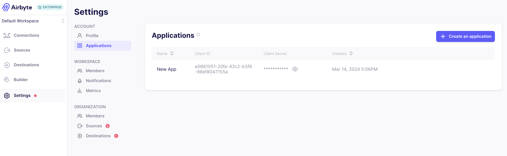

# Configuring API Access

The Airbyte API enables you to programmatically interact with Airbyte: create sources, destinations, run syncs, list workspaces, and much more.

Access to the API in Self-Managed Enterprise deployments is controlled via application keys. Applications keys are tied to individual users and their respective permissions. Prior to configuring API access, ensure you have an up and running deployment of Airbyte Self-Managed Enterprise that exposes the `airbyte-server` service. To do this, follow the steps in the [implementation guide](./implementation-guide.md).

## Step 1: Create an Application

While logged into the Airbyte UI, go to the `settings/applications` page, then create an application to get a pair of `client_id` and `client_secret` credentials. This can be exchanged anytime to get an access token to make requests to the API. These credentials do not expire, but may be deleted at any time.



## Step 2: Obtain an Access Token

With your `client_id` and `client_secret` in hand, make the following API request, replacing `<YOUR_WEBAPP_URL>` with the URL you use to access the Airbyte UI:

```yml
POST <YOUR_WEBAPP_URL>/api/v1/applications/token
```

Ensure the following JSON Body is attached to the request, populated with your `client_id` and `client_secret`:

```yaml
{ "client_id": "", "client_secret": "" }
```

The API response should provide an `access_token` which is a Bearer Token valid for 60 minutes that can be used to make requests to the API. Once your `access_token` expires, you may make a new request to the `applications/token` endpoint to get a new token.

## Step 3: Operate Airbyte via API

You may now make requests to any endpoint documented in our [Airbyte API Reference](https://reference.airbyte.com). For example, you may use the [List workspaces endpoint](https://reference.airbyte.com/reference/listworkspaces) to verify the list of workspaces in your organization. Ensure to include your `access_token` as a `Bearer Token` in your request.:

```yaml
GET <YOUR_WEBAPP_URL>/api/public/v1/workspaces
```

Expect a response like the following:

```json
{
  "data": [
    {
      "workspaceId": "b5367aab-9d68-4fea-800f-0000000000",
      "name": "Finance Team",
      "dataResidency": "auto"
    },
    {
      "workspaceId": "b5367aab-9d68-4fea-800f-0000000001",
      "name": "Analytics Team",
      "dataResidency": "auto"
    }
  ]
}
```

To go further, you may use our [Python](https://github.com/airbytehq/airbyte-api-python-sdk) and [Java](https://github.com/airbytehq/airbyte-api-java-sdk) SDKs to make API requests directly in code, or our [Terraform Provider](https://registry.terraform.io/providers/airbytehq/airbyte/latest) (which uses the Airbyte API) to declare your Airbyte configuration as infrastructure.
