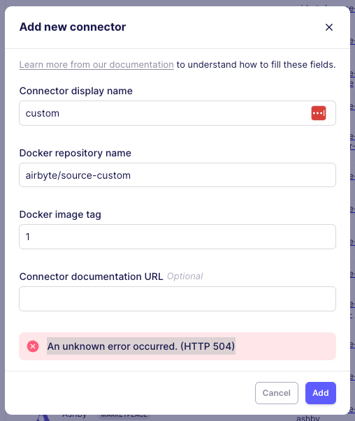

import ContainerProviders from '@site/static/_docker_image_registries.md';

# Uploading Docker-based custom connectors

:::info
This guide walks through the setup of a Docker-based custom connector. To understand how to use our low-code connector builder, read our guide [here](/platform/connector-development/connector-builder-ui/overview).
:::

If our connector catalog does not fulfill your needs, you can build your own Airbyte connectors! You can either use our [low-code connector builder](/platform/connector-development/connector-builder-ui/overview) or upload a Docker-based custom connector.

This page walks through the process to upload a **Docker-based custom connector**. This is an ideal route for connectors that have an **internal** use case like a private API with a specific fit for your organization. This guide for using Docker-based custom connectors assumes the following:

- You followed our other guides and tutorials about [connector development](/platform/connector-development/connector-builder-ui/overview)
- You finished your connector development and have it running locally on an Airbyte development instance.
- You want to deploy this connector to a production Airbyte instance running on a Kubernetes cluster.

If you prefer video tutorials, we recorded a demo on how to upload [connectors images to a GCP Artifact Registry](https://www.youtube.com/watch?v=4YF20PODv30&ab_channel=Airbyte).

## 1. Create a private Docker registry

Airbyte needs to pull its Docker images from a remote Docker registry to consume a connector.
You should host your custom connectors image on a private Docker registry.
Here are some resources to create a private Docker registry, in case your organization does not already have one:

<ContainerProviders/>

## 2. Authenticate to your private Docker registry

To push and pull images to your private Docker registry, you need to authenticate to it:

- Your local or CI environment (where you build your connector image) must be able to **push** images to your registry.
- Your Airbyte instance must be able to **pull** images from your registry.

## 3. Adhere to Airbyte's Docker Image Requirements

See the [Airbyte Protocol Docker Interface](../understanding-airbyte/airbyte-protocol-docker.md) page for specific Docker image requirements, such as required environment variables.

## Cloud Provider Managed Registries

### AWS EKS + Amazon ECR

**Option 1: IAM Roles for Service Accounts (IRSA) - Recommended**

1. Create an IAM role with ECR permissions:


```bash
aws iam create-role --role-name AirbyteECRRole --assume-role-policy-document '{
  "Version": "2012-10-17",
  "Statement": [{
    "Effect": "Allow",
    "Principal": {"Federated": "arn:aws:iam::ACCOUNT:oidc-provider/oidc.eks.REGION.amazonaws.com/id/CLUSTER_ID"},
    "Action": "sts:AssumeRoleWithWebIdentity",
    "Condition": {
      "StringEquals": {
        "oidc.eks.REGION.amazonaws.com/id/CLUSTER_ID:sub": "system:serviceaccount:airbyte:airbyte-worker",
        "oidc.eks.REGION.amazonaws.com/id/CLUSTER_ID:aud": "sts.amazonaws.com"
      }
    }
  }]
}'

aws iam attach-role-policy --role-name AirbyteECRRole --policy-arn arn:aws:iam::aws:policy/AmazonEC2ContainerRegistryReadOnly
```

2. Annotate the Airbyte worker service account:


```bash
kubectl annotate serviceaccount airbyte-worker -n airbyte eks.amazonaws.com/role-arn=arn:aws:iam::ACCOUNT:role/AirbyteECRRole
```

**Option 2: Node Instance Profile**

Attach the `AmazonEC2ContainerRegistryReadOnly` policy to your EKS node group's instance profile. This provides cluster-wide access but is less secure than IRSA.

### GCP GKE + Artifact Registry

**Option 1: Workload Identity - Recommended**

1. Create a Google Service Account:


```bash
gcloud iam service-accounts create airbyte-registry-reader \
    --description="Airbyte custom connector registry access" \
    --display-name="Airbyte Registry Reader"
```

2. Grant Artifact Registry Reader permissions:


```bash
gcloud projects add-iam-policy-binding PROJECT_ID \
    --member="serviceAccount:airbyte-registry-reader@PROJECT_ID.iam.gserviceaccount.com" \
    --role="roles/artifactregistry.reader"
```

3. Enable Workload Identity binding:


```bash
gcloud iam service-accounts add-iam-policy-binding \
    --role roles/iam.workloadIdentityUser \
    --member "serviceAccount:PROJECT_ID.svc.id.goog[airbyte/airbyte-worker]" \
    airbyte-registry-reader@PROJECT_ID.iam.gserviceaccount.com
```

4. Annotate the Kubernetes service account:


```bash
kubectl annotate serviceaccount airbyte-worker -n airbyte \
    iam.gke.io/gcp-service-account=airbyte-registry-reader@PROJECT_ID.iam.gserviceaccount.com
```

### Azure AKS + Container Registry

**Option 1: Managed Identity - Recommended**

1. Create a managed identity:


```bash
az identity create --name airbyte-acr-identity --resource-group myResourceGroup
```

2. Get the identity's client ID and assign ACR pull permissions:


```bash
IDENTITY_CLIENT_ID=$(az identity show --name airbyte-acr-identity --resource-group myResourceGroup --query clientId -o tsv)
ACR_RESOURCE_ID=$(az acr show --name myregistry --query id -o tsv)

az role assignment create --assignee $IDENTITY_CLIENT_ID --role acrpull --scope $ACR_RESOURCE_ID
```

3. Configure the AKS cluster to use the managed identity:


```bash
az aks update --name myAKSCluster --resource-group myResourceGroup --assign-identity $IDENTITY_RESOURCE_ID
```

## Third-Party and Self-Hosted Registries

### Using ImagePullSecrets

**Create Docker Registry Secret:**

```bash
kubectl create secret docker-registry custom-registry-secret \
  --docker-server=your-registry.com \
  --docker-username=your-username \
  --docker-password=your-password \
  --docker-email=your-email@example.com \
  --namespace=airbyte
```

**Configure Airbyte to Use the Secret:**

Set the environment variable on the airbyte-worker deployment:


```bash
kubectl set env deployment/airbyte-worker -n airbyte JOB_KUBE_MAIN_CONTAINER_IMAGE_PULL_SECRET=custom-registry-secret
```

**Helm Configuration:**

If using Helm to deploy Airbyte, configure the image pull secret in your values.yaml:


```yaml
worker:
  env:
    JOB_KUBE_MAIN_CONTAINER_IMAGE_PULL_SECRET: custom-registry-secret
```

## RBAC and Security Configuration

**Service Account Permissions:**

Ensure the airbyte-worker service account has the necessary permissions:


```yaml
apiVersion: rbac.authorization.k8s.io/v1
kind: Role
metadata:
  namespace: airbyte
  name: airbyte-worker-role
rules:
- apiGroups: [""]
  resources: ["pods", "secrets"]
  verbs: ["get", "list", "create", "delete"]
- apiGroups: ["batch"]
  resources: ["jobs"]
  verbs: ["get", "list", "create", "delete", "watch"]
```

## Validation and Testing

**Test Registry Access:**

1. Verify the secret is created correctly:


```bash
kubectl get secret custom-registry-secret -n airbyte -o yaml
```

2. Test image pull with a temporary pod:


```bash
kubectl run test-pull --image=your-registry.com/your-custom-connector:latest --restart=Never --rm -i --tty --image-pull-policy=Always
```

3. Check airbyte-worker logs for authentication issues:


```bash
kubectl logs deployment/airbyte-worker -n airbyte | grep -i "pull\|auth\|secret"
```

**Troubleshooting Common Issues:**

- **ImagePullBackOff**: Check secret name matches `JOB_KUBE_MAIN_CONTAINER_IMAGE_PULL_SECRET` value
- **Authentication failures**: Verify registry credentials and secret format
- **Network issues**: Ensure cluster can reach registry endpoints (check network policies)
- **Permission errors**: Verify service account has necessary RBAC permissions

## 3. Push your connector image to your private Docker registry

1. Build and tag your connector image locally, e.g.: `docker build . -t my-custom-connectors/source-custom:0.1.0`
2. Create your image tag with `docker tag` command. The structure of the remote tag depends on your cloud provider's container registry service. Please check their online documentation linked at the top.
3. Use `docker push <image-name>:<tag>` to push the image to your private Docker registry.

You should run all the above commands from your local/CI environment, where your connector source code is available.

## 4. Use your custom Docker connector in Airbyte

At this step, you should have:

- A private Docker registry hosting your custom connector image.
- Authenticated your Airbyte instance to your private Docker registry.

You can pull your connector image from your private registry to validate the previous steps. Test the image pull by creating a temporary pod that uses your connector image.

1. Click on `Settings` in the left-hand sidebar. Navigate to `Sources` or `Destinations` depending on your connector. Click on `Add a new Docker connector`.

2. Name your custom connector in `Connector display name`. This is just the display name used for your workspace.

3. Fill in the Docker `Docker full image name` and `Docker image tag`.

4. (Optional) Add a link to connector's documentation in `Connector documentation URL`
   You can optionally fill this with any value if you do not have online documentation for your connector.
   This documentation will be linked in your connector setting's page.

5. `Add` the connector to save the configuration. You can now select your new connector when setting up a new connection!

## Troubleshooting

### Loading connector docker containers into kind

If you are running Airbyte in kind (kubernetes in docker -- this is the default method for abctl), you must load the docker image of that connector into the cluster. If you are seeing the following error, it likely means that the docker image has not been properly loaded into the cluster.




A connector container can be loaded using the following command:

```bash
kind load docker-image <image-name>:<image-tag> -n airbyte-abctl
```

For the example above, the command would be:

```bash
kind load docker-image airbyte/source-custom:1 -n airbyte-abctl
```
