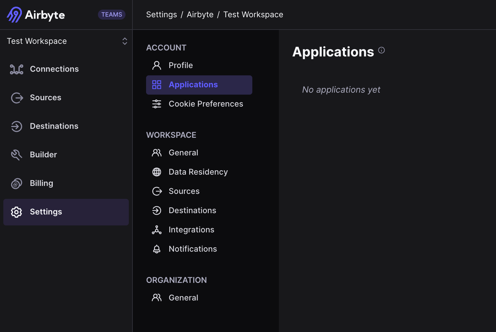
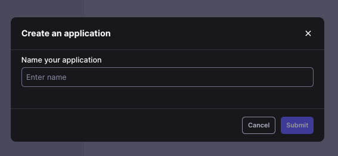
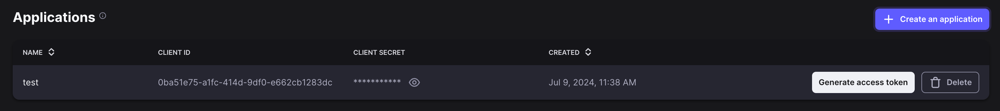

import Tabs from "@theme/Tabs";
import TabItem from "@theme/TabItem";

# Configuring API Access

The Airbyte API enables you to programmatically interact with Airbyte: create sources, destinations, run syncs, list workspaces, and much more.

Access to the API is controlled through application keys. Applications keys are tied to individual users and their respective permissions. 

# Prerequisites
<Tabs groupId="cloud-hosted">
  <TabItem value="cloud" label="Cloud">
   Access to a Cloud workspace.

  </TabItem>
  <TabItem value="self-managed" label="Self-Managed">
    A deployment of Airbyte Self-Managed that exposes the `airbyte-server` service. 
  </TabItem>
</Tabs>

## Step 1: Create an Application

While logged into the Airbyte UI, go to Settings -> Account -> Applications. Click the button "Create an application". 



Name your application for easy identification.


 

A `client_id` and `client_secret` will be automatically generated. The `client_secret` can be exposed by clicking on the icon next to the secret.



## Step 2: Obtain an Access Token

Once the `client_secret` is exposed, you can use the button in the UI to get an access token to do a quick test. 

You can also use the `client_id` and `client_secret` to retrive an access token using the [Get an Access Token endpoint](https://reference.airbyte.com/reference/createaccesstoken).


<Tabs groupId="cloud-hosted">
  <TabItem value="cloud" label="Cloud">
    
    ```yml
    POST https://api.airbyte.com/api/v1/applications/token
    ```

    Ensure the following JSON Body is attached to the request, populated with your `client_id` and `client_secret`:

    ```yaml
    { 
      "client_id": "", 
      "client_secret": "" 
      }
    ```

  </TabItem>
  <TabItem value="self-managed" label="Self-Managed">
    Self-Managed users should replace `<YOUR_WEBAPP_URL>` below with the URL used to access the Airbyte UI

    ```yml
    POST <YOUR_WEBAPP_URL>/api/v1/applications/token
    ```

    Ensure the following JSON Body is attached to the request, populated with your `client_id` and `client_secret`:

    ```yaml
    { 
      "client_id": "", 
      "client_secret": "" 
      }
    ```
  </TabItem>
</Tabs>

The API response should provide an `access_token`, which is a Bearer Token valid for 3 minutes. It can be used to make requests to the API. Once your `access_token` expires, you must make a new request to the `applications/token` endpoint to get a new token.

:::tip
Access tokens are short-lived (3 minutes) so we recommend fetching a new token before each request. The Terraform Provider/SDKs properly handle this for you if you initialize the Provider/SDK with the Client Credentials grant type using your Application's `client_id` and `client_secret`.
:::

## Step 3: Operate Airbyte via API

You may now make requests to any endpoint documented in our [Airbyte API Reference](https://reference.airbyte.com). For example, you may use the [List workspaces endpoint](https://reference.airbyte.com/reference/listworkspaces) to verify the list of workspaces in your organization. Ensure to include your `access_token` as a `Bearer Token` in your request.:

```yaml
GET <YOUR_WEBAPP_URL>/api/public/v1/workspaces
```

Expect a response like the following:

```json
{
  "data": [
    {
      "workspaceId": "b5367aab-9d68-4fea-800f-0000000000",
      "name": "Finance Team",
      "dataResidency": "auto"
    },
    {
      "workspaceId": "b5367aab-9d68-4fea-800f-0000000001",
      "name": "Analytics Team",
      "dataResidency": "auto"
    }
  ]
}
```

To go further, you may use our [Python](https://github.com/airbytehq/airbyte-api-python-sdk) and [Java](https://github.com/airbytehq/airbyte-api-java-sdk) SDKs to make API requests directly in code, or our [Terraform Provider](https://registry.terraform.io/providers/airbytehq/airbyte/latest) (which uses the Airbyte API) to declare your Airbyte configuration as infrastructure.
