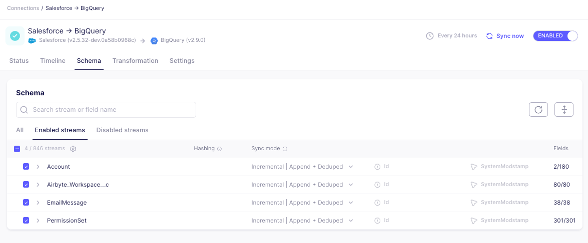
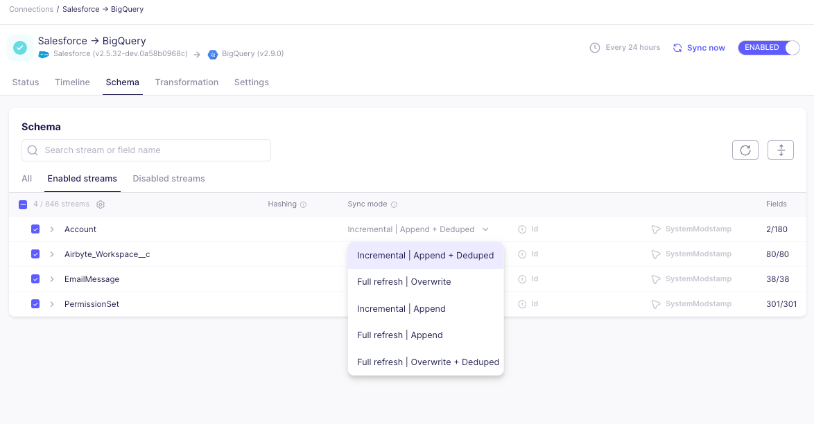
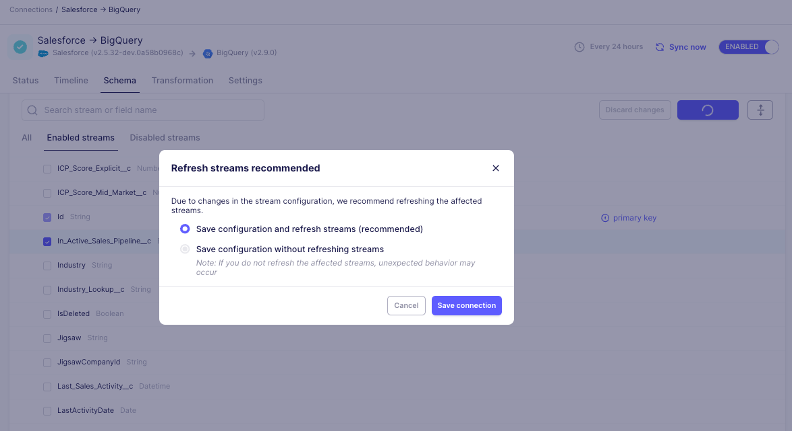

# Configuring Schemas

A connection's schema typically consists of one or many streams. Each stream is most commonly associated with a database table or an API endpoint. Within a stream, there are typically several fields or columns. You can sync specific data from your sources by selecting which stream or fields.

To learn more about streams and fields, see our [Core Concepts](/platform/using-airbyte/core-concepts/).

## Select Streams

On the "Schema" tab of a connection, you choose which streams to sync and how they are loaded to the destination.

To modify which streams are enabled:

1. In the Airbyte UI, click **Connections** and then click the connection you want to change.

2. Click the **Schema** tab. All the streams Airbyte has discovered from your source will appear.

3. Toggle the checkbox on or off for your selected stream. To select or deselect all streams at once, use the summary toggle for all the streams in the namespace. Most sources only have one namespace, so the summary toggle will be located in the header. To select or deselect an individual stream, use the toggle in its row.

:::tip
Use the tabs to show only enabled streams or all disabled streams.
:::

## Modify Stream Names

To modify the stream name in the destination, use the connection-wide setting **Stream prefix**. Entering text here prepends the same text to each stream name in the destination, allowing for you to easily differentiate between streams of the same name in your destination.

By default, Airbyte does not add any text to the **Stream prefix**. Streams without a **Stream Prefix** are synced to the destination with the same table name found in the source. As an example:

| Source stream name | Stream Prefix | Destination stream name |
| ------------------ | ------------- | ----------------------- |
| accounts           |               | accounts                |
| accounts           | salesforce\_  | salesforce_accounts     |

Airbyte does not allow for the renaming of individual streams at this time.

### Stream uniqueness

Stream identifiers must be unique across Airbyte connections that share the same destination. Don't configure more than one Airbyte connection to sync to the same destination stream. Doing so can cause job failures and isn't permitted in Airbyte. To prevent Airbyte from syncing to the same destination stream when setting up multiple connections to a single destination, each connection must have either a unique stream name or namespace.

A common scenario looks like this: you have multiple source accounts and want to sync all this data to a single table in your destination. Although convenient, doing this carried a risk of data loss as multiple connections clashed with each other while writing to the same table.

To resolve this, you can:

- Provide streams in each connection with a unique stream prefix
- Provide namespaces in each connection with a unique namespace format
- Disable conflicting streams

If you want to sync your data into a single table, combine it downstream, in your destination, after Airbyte has synced it.

## Select Sync Mode

Each stream syncs using a specific sync mode. The sync mode tells Airbyte how the data should be synced, and what shape it will take.

To learn more about sync modes, see our [Sync Mode documentation](/platform/using-airbyte/core-concepts/sync-modes/).

During connection creation, Airbyte will ask how you would like data to be synced to the destination, and automatically select a sync mode for each stream depending on your input.

Most users select "Replicate Source", which will simply copy the data from the source to the destination where you'll see one row in the destination for each row in the source. If you prefer to Append Historical Changes or take a Full Snapshot with each sync, you can optionally select those options, but keep in mind those will create duplicate records in your destination.

You can also modify a single stream's sync mode by navigating to the relevant stream and opening the sync mode dropdown. Depending on the sync mode you select, you may need to choose a cursor or primary key.

:::info
Cursors and Primary Keys that are defined by the source are automatically selected and cannot be changed in the table.
:::

To modify a cursor or primary key for a stream:

1. Click on the toggle for a stream that is enabled to show all it's fields.

2. Select the cursor or primary key from the fields displayed.

3. Save your changes. You may need to `Refresh` or `Clear` your data to ensure data continues syncing successfully.

## Select Fields

Column or field selection is available to protect PII or sensitive data from being synced to the destination. By default, Airbyte will sync all detected fields from the source.

When you deselect a partial set of fields, Airbyte may read all data from the source (depending on the source), but it will only write data to the destination from fields you selected. Deselecting fields will not prevent Airbyte from reading them. It is not possible to deselect a primary key or cursor if your selected sync mode requires it to sync.

Field selection is currently only available for top-level fields. You cannot deselect nested fields.

:::info
When you refresh the schema, newly added fields will be selected by default, even if you have previously deselected fields in that stream.
:::

To select a partial set of fields:

1. Toggle a stream to display the fields in that stream. The fields will appear nested under the stream name. You'll see each field we detect from the source.

2. Toggle individual fields to include or exclude them in the sync.

3. Click **Save changes**, or click **Cancel** to discard the changes.

4. The **Stream configuration changed** dialog may display. This gives you the option to `Refresh` the edited streams when you save your changes. If your destination does not support `Refreshes`, you will need to `Clear` your data instead.

:::tip
When editing the stream configuration, Airbyte recommends that you refresh streams. A [refresh](/platform/operator-guides/refreshes) will delete data in the destination of the affected streams and then re-sync all historical data. Skipping a refresh is discouraged and might lead to unexpected behavior.
:::

8. Click **Save connection** to apply your preference.
