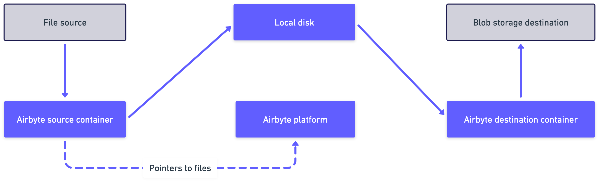

import ConfigureMetadata from './_configure_file_metadata.mdx';

# Delivery methods

Airbyte supports two methods for delivering source data to the destination.

- Replicate records
- Copy raw files

This article explains the difference between these methods, when you should use each one, and how to configure this option in Airbyte.

## Replicate records

When you replicate records, you extract and load structured records into your destination of choice. This method allows for blocking and hashing individual fields or files from a structured schema. Data can be flattened, typed, and deduped depending on the destination.

For most connectors, this is the only option you have and it's chosen by default. It's ideal for working with structured data like databases, spreadsheets, JSON, and APIs. In some connectors, this method also [moves unstructured files](sync-files-and-records) included in the structured data.

## Copy raw files

When you copy raw files, you copy files without parsing their contents. Airbyte copies bits into the destination exactly as they appear in the source. In this case, Airbyte is focused on data movement over structure. To support AI use cases, this option also delivers structured metadata that describes those files.

This choice is ideal for unstructured text, non-text data like multimedia, and compressed files. However, it's only available on specific connectors designed to handle unstructured data, like those related to blob storage solutions.

To ensure your source and destination credentials remain isolated, Airbyte uses a temporary local staging location. See the illustration below.

### Supported versions and limitations

#### Supported Airbyte versions

- Cloud: All Workspaces

- Self-Managed Community and Self-Managed Enterprise: 

    - Version 1.2.0 or later to copy files.

    - Version 1.7.0 or later to copy files with metadata.

#### Limitations

- Maximum file size: 1-GB per file.

## Configure copy raw files as your delivery method

You can only configure the delivery method to copy raw files for specific, file-based connectors. In most cases, the option isn't present and you don't need to set it.

1. Add your [file-based source](getting-started/add-a-source), if you haven't already. When you configure your source, under **Delivery Method**, choose **Copy Raw Files**.

2. Add your [file-based destination](getting-started/add-a-destination), if you haven't already. While setting up the destination connector, choose the file format of your metadata by setting the **Output Format** option. For help, see [Change the metadata format](#metadata-format) below.

3. Add your [connection](getting-started/set-up-a-connection), if you haven't already. In the schema, enable the stream(s) containing the files you want to sync, and select which fields you want in your metadata. For help, see [Change what's in the metadata](#metadata-content), below.

<!-- You configure the delivery method on the source.

You set the metadata format on the destination.

You set the metadata content on the connection. -->

<ConfigureMetadata />
