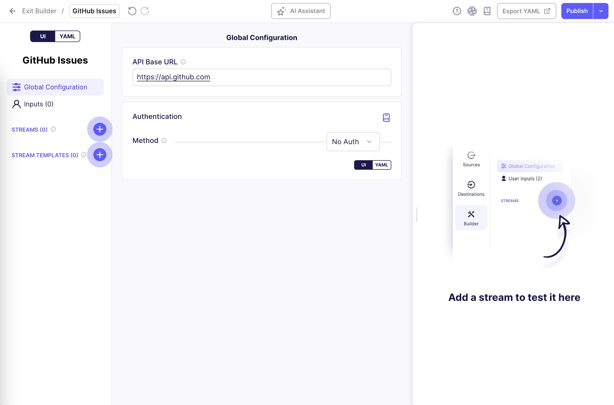
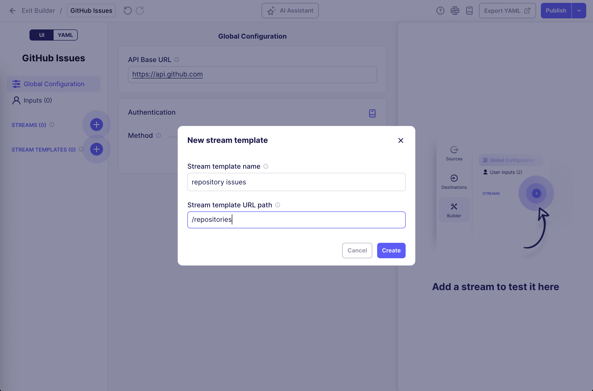
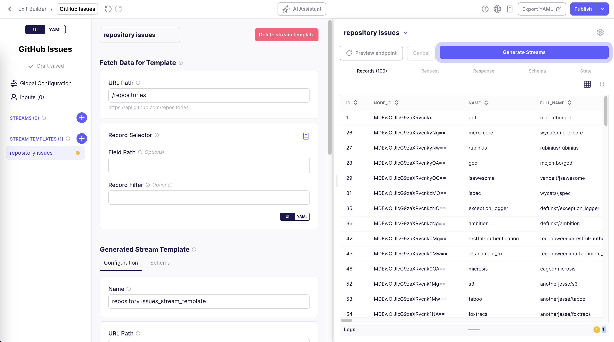

# Stream Templates

## Overview

Stream Templates allow you to generate multiple similar streams from a single template configuration.

## When to use Stream Templates

Stream templates are ideal for scenarios like:

- APIs that have similar endpoint structures for multiple resources.
- APIs where you need to fetch data from multiple regions or geographical areas using the same endpoint pattern.
- APIs that provide the same data structure for different resources (e.g. metrics for different entities).
- APIs that require a request to determine which endpoints or resources can be fetched dynamically.

Not everyone needs to use stream templates, but people who are comfortable with the Connector Builder can use them to save a lot of time building and maintaining connectors.

## How Stream Templates work

A stream template consists of two main sections:

1. **Fetch Data for Template** - Fetches a list of items from an API endpoint.
2. **Generated Stream Template** - Defines how each generated stream will behave, using values from the items fetched in the first section.

## Step-by-Step Setup Guide - GitHub Issues API

To demonstrate how stream templates work, we'll build a connector that fetches issues from multiple GitHub repositories.

To make this work, we need to fetch a list of repositories from the GitHub API, then use their IDs to fetch the issues for each repository.

### 0. Create a new connector in the Connector Builder

1. Start a new connector from scratch in the Connector Builder UI.
2. Set a name for your connector (e.g. `GitHub Issues`).
3. Set the **API Base URL** to `https://api.github.com`.

### 1. Create a new Stream Template

1. In the Connector Builder UI, click the `+` button next to **STREAM TEMPLATES**.
2. Enter a name for your template (e.g. `repository issues`).
3. Enter the URL path for fetching the repositories, which will be used to generate individual streams: `/repositories`.
4. Click **Create**.

### 2. Configure Fetch Data for Template

In the **Fetch Data for Template** section, define the endpoint that fetches the list of items that will be used to generate individual streams.

The URL path was already set to `/repositories` in the previous step, so we can click **Preview endpoint** in the right-hand testing panel to see what data is returned:

As shown in the **Records** tab, we get a list of repositories back, which we can use to generate individual streams in the next step.

### 3. Configure Generated Stream Template

In the **Generated Stream Template** section, define how each generated stream will be configured.

One stream will be generated for each record returned in the previous step. The record's values can be referenced using `{{ components_values.field_name }}`, where `field_name` is the name of any field in the record.

1. In the **Name** input, enter `{{ components_values.full_name }} issues`, to name each generated stream after the repository it is fetching issues for.
2. In the **URL Path** input, enter `/repositories/{{ components_values.id }}/issues` to construct the correct URL path for fetching issues for the given repository.

### 4. Generate Streams

1. Now that both sections are configured, click **Generate Streams** to generate the streams from the template.
2. After generating the streams, you can expand the stream template in the left-hand sidebar to see the list of generated streams.
3. Click on one of the generated streams to see its configuration and test it to verify that it works as expected.

:::info

The generated stream configurations are read-only; to make changes to them, you must modify the parent Stream Template configuration, and re-generate the streams.

:::

<iframe width="800" height="464" src="https://www.loom.com/embed/38420a6e4c7c44a799abc3574e72ed28" frameborder="0" webkitallowfullscreen mozallowfullscreen allowfullscreen></iframe>

## Important Notes

- **Testing**: Always test both Preview endpoint and at least one of the generated streams before publishing.
- **Changes**: If you modify the stream template, you'll need to regenerate the streams to see the changes and test them again.
- **Generated streams limit**: You can limit the number of streams that the Builder generates in the settings at the top-right of the right-hand testing panel.
- **Troubleshooting**: If generated streams show warnings, fix issues in the template, regenerate, and test again.
- **References**: Use `{{ components_values.field_name }}` to access fields from the **Fetch Data for Template** records.
- **Editing Generated Streams**: Generated streams are read-only; changes must be made to the template

## Limitations

In the current UI, you can only configure the URL Path and record selector for the **Fetch Data for Template** section.

If you need a more complex configuration for the **Fetch Data for Template** section, you'll need to switch to YAML mode and modify the `components_resolver` field.
