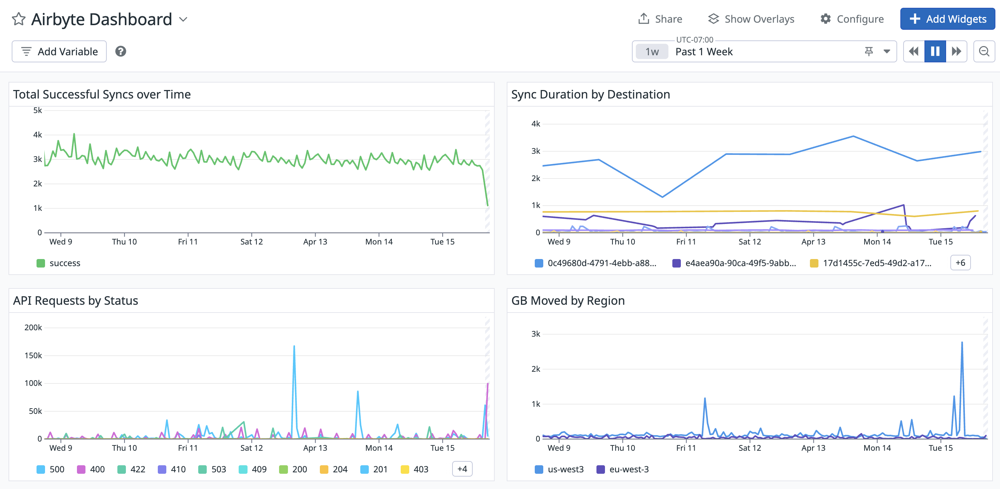

# OpenTelemetry metrics monitoring

Airbyte Self-Managed Enterprise generates a number of crucial metrics about syncs and volumes of data moved. You can configure Airbyte to send telemetry data to an OpenTelemetry collector endpoint so you can consume these metrics in your downstream monitoring tool of choice. Airbyte doesn't send traces and logs.

Airbyte sends specific metrics to provide you with health insight in the following areas.

- Resource provisioning: Monitor API requests and sync attempts to ensure your deployment has adequate resources

- Sync performance: Track sync duration and data volume moved to understand performance

- System health: Monitor sync status and completion rates to ensure system stability

## Example dashboard

Here's an example of a dashboard in Datadog using Airbyte's OpenTelemetry metrics.



## Configure OpenTelemetry metrics

1. Deploy an OpenTelemetry Collector if you don't already have one. See the [OpenTelemetry documentation](https://opentelemetry.io/docs/collector/getting-started/#kubernetes) for help doing this. If you use Datadog as your monitoring tool, they have an in-depth guide to [set up a Datadog Collector and Exporter](https://docs.datadoghq.com/opentelemetry/collector_exporter/).

    1. For Airbyte to send metrics to your server, your OpenTelemetry service (collector or otherwise) must accept OpenTelemetry Protocol (OTLP) over HTTP. If you use an OpenTelemetry Collector, your configuration would need to include some variation of the below to accept OTLP over HTTP:

    ```yml
    receivers:
      otlp:
        protocols:
          http:
            endpoint: 0.0.0.0:4318
    ```

2. Update Airbyte's `values.yaml` file to enable OpenTelemetry.

    ```yaml title="values.yaml"
    global:
        edition: enterprise # This is an enterprise-only feature
        metrics:
            enabled: true
            otlp:
                enabled: true
                # The OpenTelemetry Collector endpoint Airbyte sends metrics to. You configure this endpoint outside of Airbyte as part of your OpenTelemetry deployment
                # This endpoint also needs to end in the metrics ingestion endpoint. For OpenTelemetry Collector users, this is /v1/metrics.
                # e.g. http://localhost:4318/v1/metrics
                collectorEndpoint: "YOUR_ENDPOINT" 
    ```

3. Redeploy Airbyte with the updated values.

Airbyte sends metrics to the collector you specified in your configuration.

## Available metrics

The following metrics are available. They're published every minute.

<table>
  <thead>
    <tr>
      <th>Metric</th>
      <th>Tag</th>
      <th>Example Value</th>
    </tr>
  </thead>
  <tbody>
    <tr>
      <td rowspan="9"><code>airbyte.syncs</code></td>
      <td><code>connection_id</code></td>
      <td>653a067e-cd0b-4cab-96b5-5e5cb03f159b</td>
    </tr>
    <tr>
      <td><code>workspace_id</code></td>
      <td>bed3b473-1518-4461-a37f-730ea3d3a848</td>
    </tr>
    <tr>
      <td><code>job_id</code></td>
      <td>23642492</td>
    </tr>
    <tr>
      <td><code>status</code></td>
      <td>success, failed</td>
    </tr>
    <tr>
      <td><code>attempt_count</code></td>
      <td>3</td>
    </tr>
    <tr>
      <td><code>source_connector_id</code></td>
      <td>82c7fb2d-7de1-4d4e-b12e-510b0d61e374</td>
    </tr>
    <tr>
      <td><code>destination_connector_id</code></td>
      <td>3cb42982-755b-4644-9ed4-19651b53ebdd</td>
    </tr>
    <tr>
      <td><code>version</code></td>
      <td>1.5.0</td>
    </tr>
    <tr>
      <td><code>service</code></td>
      <td>airbyte-worker</td>
    </tr>
    <tr>
      <td rowspan="7"><code>airbyte.gb_moved</code></td>
      <td><code>connection_id</code></td>
      <td>653a067e-cd0b-4cab-96b5-5e5cb03f159b</td>
    </tr>
    <tr>
      <td><code>workspace_id</code></td>
      <td>bed3b473-1518-4461-a37f-730ea3d3a848</td>
    </tr>
    <tr>
      <td><code>job_id</code></td>
      <td>23642492</td>
    </tr>
    <tr>
      <td><code>source_connector_id</code></td>
      <td>82c7fb2d-7de1-4d4e-b12e-510b0d61e374</td>
    </tr>
    <tr>
      <td><code>destination_connector_id</code></td>
      <td>3cb42982-755b-4644-9ed4-19651b53ebdd</td>
    </tr>
    <tr>
      <td><code>version</code></td>
      <td>1.5.0</td>
    </tr>
    <tr>
      <td><code>service</code></td>
      <td>airbyte-worker</td>
    </tr>
    <tr>
      <td rowspan="7"><code>airbyte.sync_duration</code></td>
      <td><code>connection_id</code></td>
      <td>653a067e-cd0b-4cab-96b5-5e5cb03f159b</td>
    </tr>
    <tr>
      <td><code>workspace_id</code></td>
      <td>bed3b473-1518-4461-a37f-730ea3d3a848</td>
    </tr>
    <tr>
      <td><code>job_id</code></td>
      <td>23642492</td>
    </tr>
    <tr>
      <td><code>source_connector_id</code></td>
      <td>82c7fb2d-7de1-4d4e-b12e-510b0d61e374</td>
    </tr>
    <tr>
      <td><code>destination_connector_id</code></td>
      <td>3cb42982-755b-4644-9ed4-19651b53ebdd</td>
    </tr>
    <tr>
      <td><code>version</code></td>
      <td>1.5.0</td>
    </tr>
    <tr>
      <td><code>service</code></td>
      <td>airbyte-worker</td>
    </tr>
    <tr>
      <td rowspan="7"><code>airbyte.api_requests</code></td>
      <td><code>uri</code></td>
      <td>/v1/applications/create</td>
    </tr>
    <tr>
      <td><code>status</code></td>
      <td>200</td>
    </tr>
    <tr>
      <td><code>exception</code></td>
      <td>NullPointerException</td>
    </tr>
    <tr>
      <td><code>method</code></td>
      <td>GET, POST</td>
    </tr>
    <tr>
      <td><code>version</code></td>
      <td>1.5.0</td>
    </tr>
    <tr>
      <td><code>service</code></td>
      <td>airbyte-server</td>
    </tr>
  </tbody>
</table>
