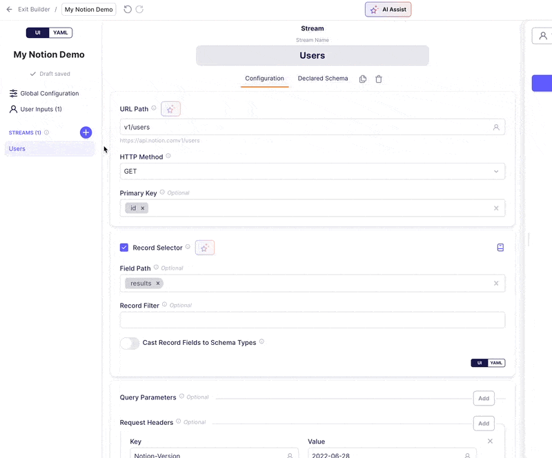
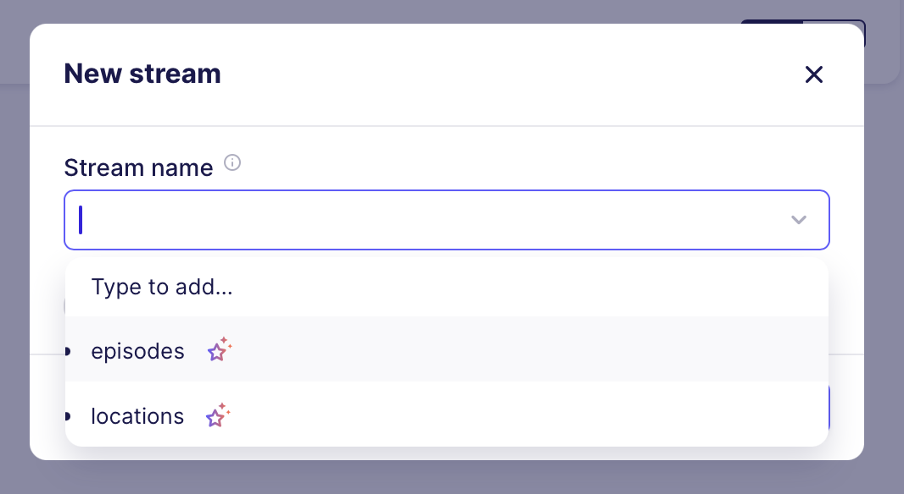

# AI Assistant for the Connector Builder (Beta)

Welcome to the **AI Assistant**, your personal helper for creating Airbyte connectors through our Connector Builder. While still in beta, this AI tool promises to significantly speed up your development time by automating and simplifying the process of building connectors.

Check out our [Hands-on Tutorial](https://airbyte.com/blog/hands-on-with-the-new-ai-assistant) to get started.

## Key Features

1. **Pre-fill and Configure Connectors**: When starting a new connector, AI Assistant can automatically prefill and configure a number of fields and sections in the Airbyte Connector Builder, drastically reducing setup time. This currently includes:
    - API Endpoint URL
    - Authentication methods (API keys, OAuth, basic auth)
    - Pagination schemes (offset-limit, cursor-based, page-based)
    - Primary key identification
    - Record selection and data extraction patterns
    - Request options and headers
    - Incremental sync configuration
    - Available streams discovery and setup
2. **Ongoing Field and Section Suggestions**: As you continue working on a connector, AI Assistant will provide intelligent suggestions, helping you fine-tune your connector’s configuration.

## Why You’ll Love It

- **Faster Development**: The AI Assistant automates much of the setup and configuration, cutting down the time it takes to build connectors.
- **Less Time Spent Understanding the API Documentation**: The AI Assistant can read and understand the API documentation for you, so you don't have to.

## What Should You Expect?

- **Human Oversight Required**: Since it's an AI-based tool, you should still review the output to ensure everything is set up correctly. As it's in beta, it won't always be perfect, but it will save you significant time by handling most of the tedious setup tasks.
- **Optimized for Common API Types**: While the AI Assistant supports a wide range of APIs, like any AI feature it works best with common use cases. It performs best with **REST APIs** that return JSON responses. However, you can also use it with less common APIs like **GraphQL**.
- **Session-Based Assistance**: The AI Assistant maintains context throughout your connector building session, allowing it to provide increasingly relevant suggestions as you work.
- **Error Handling**: The Assistant will provide specific error messages if it encounters issues with URL formats, unreachable documentation links, or parsing problems with API specifications.

## How It Works

### Provide API Documentation

Start by providing either:
- A link to the API documentation (the Assistant will crawl and analyze the documentation)
- An OpenAPI specification URL (for structured API definitions)

The Assistant supports various documentation formats and will attempt to extract key configuration details automatically. If the provided URL is unreachable or in an unsupported format, you'll receive specific error messages to help troubleshoot the issue.

### Automatic Configuration

The AI Assistant will analyze the provided documentation and automatically configure:
- **API Endpoint URL**: Extracts the URL of the API endpoint for the stream
- **Authentication**: Identifies and configures supported authentication methods (API keys, OAuth flows, basic authentication)
- **Pagination**: Detects pagination patterns and configures appropriate pagination strategies
- **Request Options**: Sets up common headers, query parameters, and request formatting
- **Stream Metadata**: Discovers available data streams and their expected schemas

### Suggestions for Fields and Sections

As you progress, the Assistant will offer suggestions for other fields and sections within the Connector Builder, making it easier to complete your setup.

### Stream Configuration

The Assistant will help you set up your streams by:
- **Stream Discovery**: Automatically identifying available data streams from the API documentation
- **Configuration Suggestions**: Providing likely configurations for each stream including endpoints, parameters, and data extraction patterns
- **Incremental Sync Setup**: Configuring cursor-based incremental synchronization where supported by the API

### Test & Review

After configuration, you can run tests to ensure the setup is correct. If the Assistant misses anything (like headers or pagination), you can adjust these manually and re-test.

## Where Can I Use It?

You can access the AI Assistant in the following scenarios:
- **When creating a new connector** from scratch in the Airbyte Connector Builder
- **Within your existing connectors** by clicking the "AI Assist" button at the top of the builder interface
- **For iterative improvements** as you refine your connector configuration - the Assistant maintains session context to provide increasingly relevant suggestions

## Getting Started

To begin using the AI Assistant:
1. Navigate to the Connector Builder in your Airbyte workspace
2. Start creating a new connector or open an existing one
3. Look for the "AI Assist" button in the builder interface
4. Provide your API documentation URL or OpenAPI specification
5. Review and refine the generated configuration as needed

We're excited to see how much time AI Assistant can save you during the beta phase. While it's not perfect yet, it already simplifies the process of building and managing connectors.
