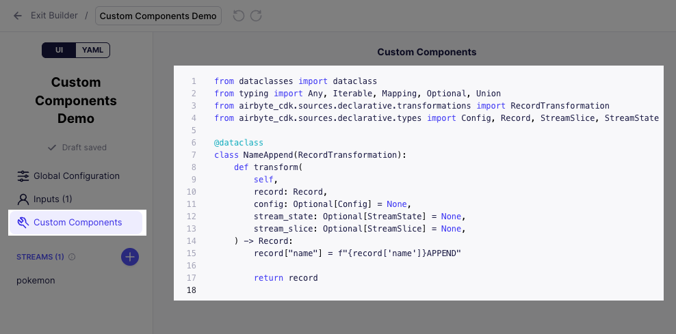

import Tabs from '@theme/Tabs';
import TabItem from '@theme/TabItem';

# Custom components for the Connector Builder

Use Custom Components to extend the Connector Builder with your own Python implementations when Airbyte's built-in components don't meet your specific needs.

This feature enables you to:

- Override any built-in component with a custom Python class

- Implement specialized logic for handling complex API behaviors

- Maintain full control over the connection process while still leveraging the Connector Builder framework

The following example shows a simple RecordTransformation component that appends text to a record's name field.



## What are Custom Components?

Custom Components are Python classes that implement specific interfaces from the Airbyte CDK. They follow a consistent pattern:

- A dataclass that implements the interface of the component it's replacing

- Fields representing configurable arguments from the YAML configuration

- Implementation of required methods to handle the component's specific capability

## Why Custom Components are powerful

When enabled, Custom Components bring the full flexibility of the Low-Code CDK into the simpler Connector Builder UI. Custom Components provide significant advantages when building complex connectors, and they equip you to integrate with virtually any API, regardless of complexity or your unique requirements.

1. **Handle Edge Cases**: Address unique API behaviors that aren't covered by built-in components, such as unusual pagination patterns, complex authentication schemes, or specialized data transformation needs.

2. **Extend Functionality**: When standard components don't offer the precise capabilities you need, Custom Components let you implement exactly what's required without compromising.

3. **Maintain Framework Benefits**: While providing customization, you still benefit from the structure, testing capabilities, and deployment options of the Connector Builder framework.

4. **Iterative Development**: You can start with built-in components and gradually replace only the specific parts that need customization, rather than building an entire connector from scratch.

5. **Specialized Transformations**: Implement complex data manipulation, normalization, or enrichment that goes beyond what declarative configuration can provide.

## How to enable Custom Components

:::danger Security Warning
Custom Components are currently considered **UNSAFE** and **EXPERIMENTAL**. Airbyte doesn't provide any sandboxing guarantees. This feature could execute arbitrary code in your Airbyte environment. Enable it at your own risk.
:::

Airbyte disables Custom Components by default due to their experimental nature and security implications. Administrators can enable this feature in Core and Self-Managed Enterprise deployments using one of the following methods:

### Using abctl

If you deploy Airbyte with abctl, follow the steps below to update your values and redeploy Airbyte.

1. Edit your existing `values.yaml` file or create a new override file with this configuration:

    <Tabs groupId="helm-chart-version">
    <TabItem value='helm-1' label='Helm chart V1' default>

      ```yaml title="values.yaml"
      workload-launcher:
        extraEnv:
          - name: AIRBYTE_ENABLE_UNSAFE_CODE
            value: "true"
      connector-builder-server:
        extraEnv:
          - name: AIRBYTE_ENABLE_UNSAFE_CODE
            value: "true"
      ```
    </TabItem>
    <TabItem value='helm-2' label='Helm chart V2' default>

    ```yaml title="values.yaml"
    workloadLauncher:
      extraEnv:
        - name: AIRBYTE_ENABLE_UNSAFE_CODE
          value: "true"
    connectorBuilderServer:
      extraEnv:
        - name: AIRBYTE_ENABLE_UNSAFE_CODE
          value: "true"
    ```

    </TabItem>
    </Tabs>


2. Use this file during deployment with the abctl command:

   ```bash
   abctl local install --values values.yaml
   ```

### Using Helm charts

If you're deploying Airbyte using public Helm charts without abctl, follow the steps below to update your values and redeploy Airbyte.

1. Edit your existing `values.yaml` file or create a new override file with this configuration:

    <Tabs groupId="helm-chart-version">
    <TabItem value='helm-1' label='Helm chart V1' default>

      ```yaml title="values.yaml"
      workload-launcher:
        extraEnv:
          - name: AIRBYTE_ENABLE_UNSAFE_CODE
            value: "true"
      connector-builder-server:
        extraEnv:
          - name: AIRBYTE_ENABLE_UNSAFE_CODE
            value: "true"
      ```
    </TabItem>
    <TabItem value='helm-2' label='Helm chart V2' default>

    ```yaml title="values.yaml"
    workloadLauncher:
      extraEnv:
        - name: AIRBYTE_ENABLE_UNSAFE_CODE
          value: "true"
    connectorBuilderServer:
      extraEnv:
        - name: AIRBYTE_ENABLE_UNSAFE_CODE
          value: "true"
    ```

    </TabItem>
    </Tabs>

2. Apply the configuration during Helm installation or upgrade:

    <Tabs groupId="helm-chart-version">
    <TabItem value='helm-1' label='Helm chart V1' default>

    ```bash
    helm upgrade airbyte airbyte-v2/airbyte \
      --namespace airbyte \       # Target Kubernetes namespace
      --values ./values.yaml \    # Custom configuration values
    ```

    </TabItem>
    <TabItem value='helm-2' label='Helm chart V2' default>

    ```bash
    helm upgrade airbyte airbyte-v2/airbyte \
      --namespace airbyte-v2 \       # Target Kubernetes namespace
      --values ./values.yaml \       # Custom configuration values
      --version 2.0.3 \              # Helm chart version to use
      --set global.image.tag=1.7.0   # Airbyte version to use
    ```

    </TabItem>
    </Tabs>


:::caution
Monitor your deployment for any security or performance issues. Remember that this feature allows execution of arbitrary code in your Airbyte environment.
:::

## How to use Custom Components

Custom Components in the Connector Builder UI extend the capabilities available in the Low-Code CDK. For detailed implementation information, please refer to the [Custom Components documentation](../config-based/advanced-topics/custom-components.md).

Key implementation steps include:

1. Create a Python class that implements the interface of the component you want to customize

2. Define the necessary fields and methods required by that interface

3. Reference your custom component in the connector configuration using its fully qualified class name

The existing documentation provides examples of:

- How to create custom component classes

- Required implementation interfaces

- Properly referencing custom components in your configuration

- Handling parameter propagation between parent and child components

While using the Connector Builder UI, you need to switch to the YAML editor view to implement custom components. You can't configure them through the visual interface.
