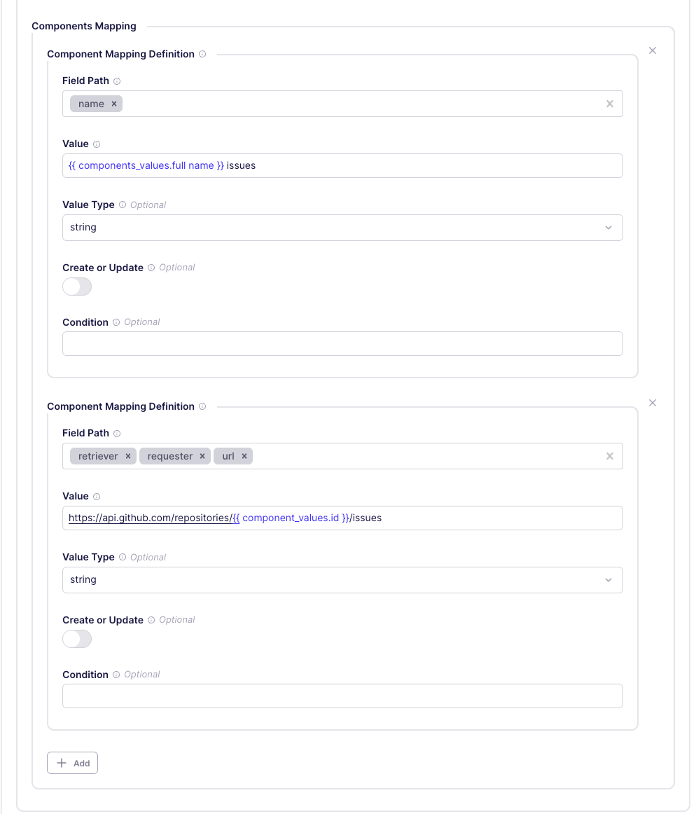

# Stream Templates

Use Stream Templates to generate multiple similar streams from a single template configuration.

## When to use Stream Templates

Stream templates are ideal for scenarios like:

- APIs that have similar endpoint structures for multiple resources.
- APIs where you need to fetch data from multiple regions or geographical areas using the same endpoint pattern.
- APIs that provide the same data structure for different resources (for example, metrics for different entities).
- APIs that require a request to determine which endpoints or resources can be fetched dynamically.

Not everyone needs to use stream templates, but people who are comfortable with the Connector Builder can use them to save a lot of time building and maintaining connectors.

## How Stream Templates work

A stream template consists of two main sections:

1. **Produce Data for Template** - Fetches a list of items from an API endpoint or other data source.
2. **Generated Stream Template** - Defines how each generated stream behaves, using values from the items fetched in the first section.

Stream templates use different approaches to produce data for generating multiple streams:

### HTTP-based data fetching

The most common approach fetches data via HTTP requests to determine what streams to generate. This uses the same request configuration interface as regular streams.

**Example use case**: fetching a list of repositories from GitHub API to generate individual issue streams for each repository.

### Configuration-based stream generation

Generate streams based on values specified in the connector's configuration. This is useful when users can specify what data they want to sync through the connector setup.

**Example use case**: a connector where users specify a list of database tables in the configuration, and each table becomes a separate stream.

### Predefined stream variations

Generate a fixed set of streams based on predefined parameters in the connector. This approach creates consistent streams across all connector instances.

**Example use case**: a connector that always creates streams for a fixed set of data types or regions.

## Components mapping

The Components Mapping configuration defines how data from the resolver is mapped to variables that can be used in the Generated Stream Template. This is configured through the UI form and includes:

### Field Path

A list of potentially nested fields indicating the full path where the value will be added or updated in the template. Supports:

- Simple field names: `["primary_key"]`
- Nested fields: `["retriever", "requester", "url"]`
- Dynamic field names using interpolation: `["retriever", "{{ components_values.name }}"]`
- Wildcard patterns: `["*", "**", "name"]`

### Value Type

Optional specification of the expected data type (string, integer, boolean, etc.). If omitted, the type is inferred from the provided value.

### Create or Update
Boolean flag determining whether to create new paths if they don't exist (true) or only update existing paths (false). Defaults to false.

## Step-by-Step Setup Guide - GitHub Issues API

To demonstrate how stream templates work, build a connector that fetches issues from multiple GitHub repositories. To make this work, you need to fetch a list of repositories from the GitHub API, then use their IDs to fetch the issues for each repository.

### Step 1: Create a new connector in the Connector Builder

1. Click **Builder**.

2. Click **New custom connector**.

3. Click **Start from scratch**.

4. If prompted to use AI, click **Skip and start manually**.

5. Name your connector (for example, `GitHub Issues`).

### Step 2: Create a new Stream Template

1. Click the `+` button next to **STREAM TEMPLATES**.

2. Enter a name for your template (for example, `Repository Issues`).

3. Under **Produce Data for Template**, set **API Endpoint URL** to `https://api.github.com/repositories`.

4. Click **Preview endpoint**. The panel on the right displays a sample of the data that endpoint returns.

### Step 3: Configure Generated Stream Template

Because each repository has a unique name and URL, you need to set up component mappings to allow generated streams to reflect these values.

Under **Produce Data for Template**, in the Components Mapping section, create two component mappings.

1. In the first component map, set **Field Path** to `name`.

2. Set **Value** to `{{ components_values.full_name }} issues`.

3. Click **Add** to add a second component mapping.

4. In the second component map, set **Field Path** to `retriever, requester, url`.

5. Set **Value** to `https://api.github.com/repositories/{{ components_values.id }}/issues`.

    

6. In the **Generated Stream Template** section, provide a **Name**. It doesn't matter what you call it. Any static value works.

### Step 4: Generate streams

1. Click **Generate Streams** to generate the streams from the template.

2. After generating the streams, you can expand the stream template in the left-hand sidebar to see the list of generated streams.

3. Click on one of the generated streams to see its configuration and test it to verify that it works as expected.

:::info
You can't modify generated streams. To make changes, modify the parent Stream Template configuration and re-generate the streams.
:::

## Advanced configuration options

### Available UI fields

The Connector Builder UI provides access to commonly used configuration fields for the **Produce Data for Template** section.

- **API Endpoint URL** - The API endpoint ph for fetching template data
- **HTTP Method** - Request method (GET, POST, etc.)
- **Authentication** - Authentication configuration for the request
- **Record Selector** - How to extract records from the API response
- **Components Mapping** - Define how resolver data maps to template variables (available in advanced configurations)

Additional fields are available through the form interface, organized into logical sections like request configuration, response handling, and data mapping.

### Interpolation contexts

When using interpolation in your stream templates, you have access to these contexts.

- `{{ components_values.field_name }}` - Access fields from the **Produce Data for Template** records
- `{{ config.field_name }}` - Access connector configuration values
- `{{ stream_slice.field_name }}` - Access stream slice information
- `{{ stream_template_config.field_name }}` - Access stream template configuration

## Important notes

- **Testing**: Always test both Preview endpoint and at least one of the generated streams before publishing.
- **Changes**: If you modify the stream template, you'll need to regenerate the streams to see the changes and test them again.
- **Generated streams limit**: You can limit the number of streams that the Builder generates in the settings at the top-right of the right-hand testing panel.
- **Troubleshooting**: If generated streams show warnings, fix issues in the template, regenerate, and test again.
- **References**: Use `{{ components_values.field_name }}` to access fields from the **Produce Data for Template** records.

## Limitations

- Some complex authentication flows may require switching to YAML mode. However, you can configure almost everything in the UI.
- You can't modify generated streams. To make changes, modify the parent Stream Template configuration and re-generate the streams.
