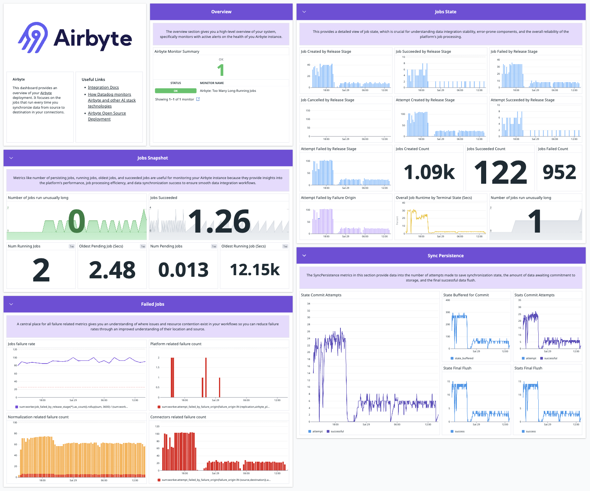

# Monitoring Airbyte

Airbyte offers extensive logging capabilities.

## Connection logging

All Airbyte instances include extensive logging for each connector. These logs give you detailed reports on each data sync. [Learn more about browsing logs](browsing-output-logs).

## OpenTelemetry metrics monitoring {#otel}

Self-Managed Enterprise customers can configure Airbyte to send telemetry data to an OpenTelemetry collector endpoint so you can consume these metrics in your downstream monitoring tool of choice. See [OpenTelemetry metrics monitoring](open-telemetry).

## Datadog Integration

Airbyte uses Datadog to monitor Airbyte Cloud performance on a [number of metrics](https://docs.datadoghq.com/integrations/airbyte/#data-collected) important to your experience. This integration only works on legacy Docker deployments of Airbyte. Airbyte is working on an improved version for abctl and Kubernetes. This could become available later as an enterprise feature to help you monitor your own deployment. If you're an enterprise customer and Datadog integration is important to you, let us know.

Currently, you can send metrics to Datadog using [OpenTelemetry](open-telemetry).

