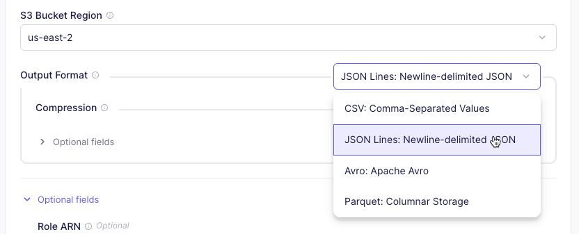
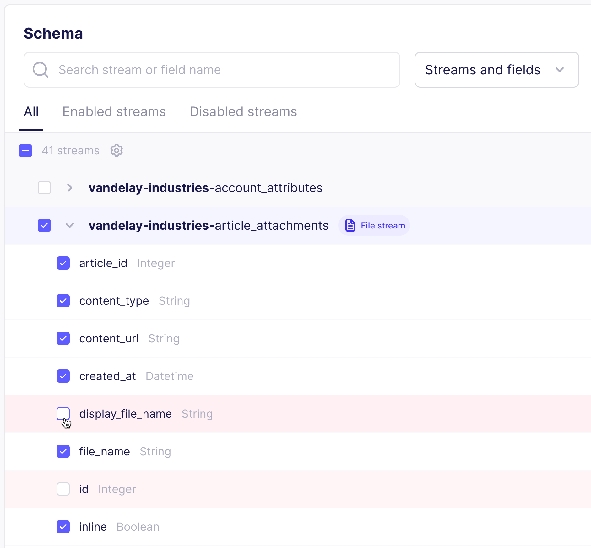

<!-- This is reusable content inserted into other topics. It is not a standalone topic. -->

## Configure file metadata

Two elements of the metadata are configurable: file format and what's in the file. You configure each of these in difference places in Airbyte.

### Change the metadata format {#metadata-format}

To change the format of the metadata, change the output format on the Destination connector.

1. In the left navigation, click **Destinations**.

2. Choose your destination connector from the list, or [create a new one](getting-started/add-a-destination).

3. Under **Output Format**, choose the file format you want. You can also choose whether you want to compress the file, or if you want to flatten it.

    

4. Click **Test and save**. Next time you sync, your metadata has the chosen format.

### Change what's in the metadata {#metadata-content}

You choose what appears in your metadata when setting up your connection.

1. In the left navigation, click **Connections**.

2. Choose your connection from the list, or [create a new one](getting-started/set-up-a-connection).

3. Click the **Schema** tab.

4. Open the stream that contains your files.

5. Select and deselect fields as needed.

    

6. Click **Save changes**. Next time you sync data, your metadata in your destination updates.

### Metadata sample

Here is a sample of metadata in `.jsonl` format, describing a single Word document.

```json
{
    "_airbyte_raw_id": "9e089a10-b347-4acf-abc8-f093b93b84bb",
    "_airbyte_extracted_at": 1748991118573,
    "_airbyte_meta": {
        "sync_id": 38401084,
        "changes": []
    },
    "_airbyte_generation_id": 2,
    "_airbyte_data": {
        "folder": "",
        "file_name": "Test Plan.docx",
        "bytes": 7838,
        "source_uri": "https://example.com",
        "id": "1i3cTG1UPQx-ZHft-78neonQ9tDNjkZ-E4bK46eGShFk",
        "created_at": "2025-03-04T14:30:28.000000Z",
        "updated_at": "2025-03-04T14:31:11.253000Z",
        "mime_type": "application/vnd.openxmlformats-officedocument.wordprocessingml.document",
        "_airbyte_file_path": "/Files/2025_06_03_1748991116728_/Test Plan.docx"
    }
}
```
