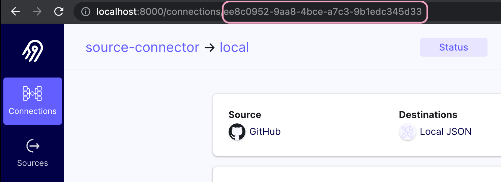
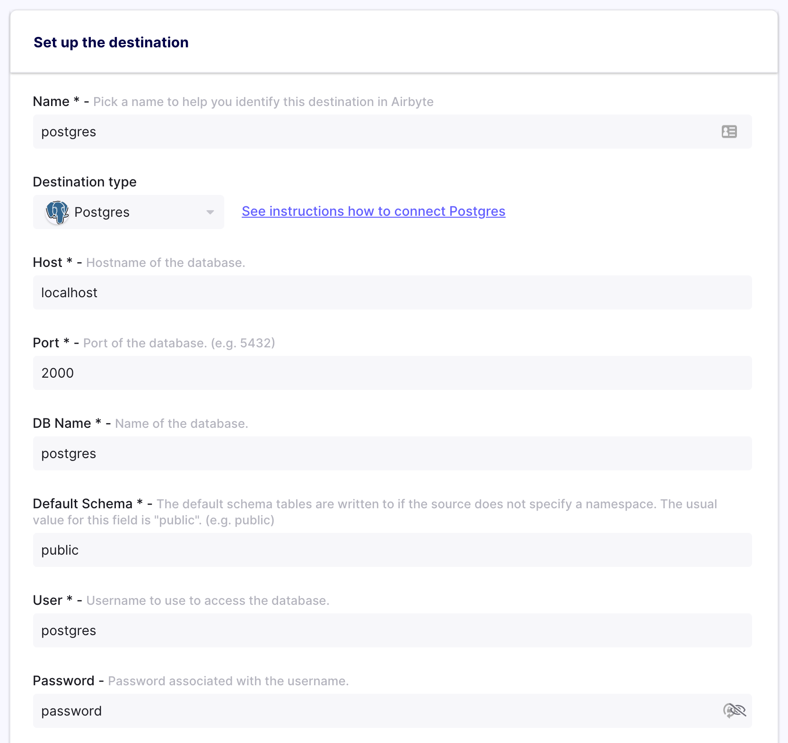
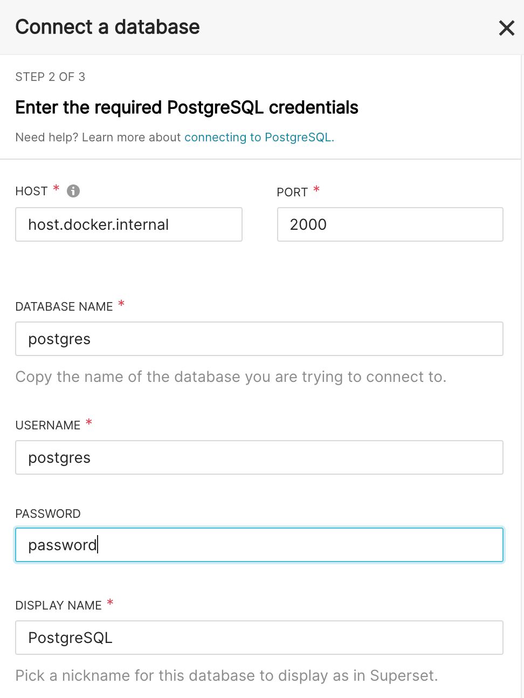

# Airflow Airbyte Plugin Demo Example

## Running the Script
Simply run `up.sh` to bring up the Airbyte and Airflow containers. You don't need to worry about cleaning up the containers, as we run a `docker-compose down -v` before attempting to recreate them.

After Airbyte starts running, head over to http://localhost:8000 and set up a connection. The script will then prompt you for an Airbyte connection id. You can find this in the URL after clicking on your connection.



Simple enter that ID into your terminal and a connection will be set up in Airflow for you. Head over to http://localhost:8085 to access the Airflow UI. Enter `airflow` as your username and `airflow` as your password. You should see your DAG show up in the UI with no errors if your connection was configured correctly.


Trigger the DAG with the switch in the top right and you should be in business! If it doesn't automatically run, just hit the play button in the top right to kick off the sync.

## Setting up Superset

As the script has automatically set up a Postgres container for you, just enter these connection details to set up your destination:



Head over to http://localhost:8088 to get to the Superset UI. Enter `admin` as your username and `admin` as your password. Then head to the `Data` section in the top bar and navigate to `Databases`. Click `+DATABASE` and enter the following config:



```
docker exec airbyte-destination psql -U postgres -c "ALTER TABLE stargazers ADD COLUMN starred_ts timestamp;"
docker exec airbyte-destination psql -U postgres -c "UPDATE stargazers SET starred_ts = starred_at::timestamptz;"
```

## Cleaning Up
Run `down.sh` to clean up the containers. Or run `docker-compose down -v` here and in the root directory, your call.