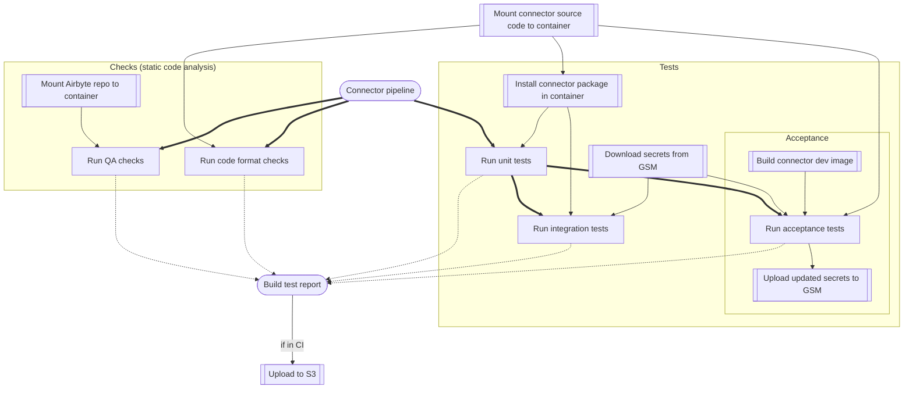

# POC of Dagger pipelines

This Python subpackage of `ci-connector-ops` gathers the POC code we're working on to:

- Rewrite [airbyte-python.gradle](https://github.com/airbytehq/airbyte/blob/7d7e48b2a342a328fa74c6fd11a9268e1dcdcd64/buildSrc/src/main/groovy/airbyte-python.gradle) and [airbyte-connector-acceptance-test.gradle](https://github.com/airbytehq/airbyte/blob/master/buildSrc/src/main/groovy/airbyte-connector-acceptance-test.gradle) in Python.
- Centralize the CI logic for connector testing
- Try out Dagger.io as a promising tool that can provide parallelism and caching out of the box for CI

# Install and use

From `airbyte` repo root:

## Install All pipelines

```bash
cd tools/ci_connector_ops
python -m venv .venv (please use at least Python 3.10)
source .venv/bin/activate
pip install --upgrade pip
pip install -e .\[pipelines\]
cd ../..
```

## Running the Connector Test pipeline

### Use remote secrets

If you want the pipeline to pull connector secrets from Google Secrets manager you have to set the `GCP_GSM_CREDENTIALS` env variable.
If you don't set this variable the local secrets files, under the `secrets` directory of a connector, will be used for acceptance test run.
More details [here](https://github.com/airbytehq/airbyte/blob/master/tools/ci_credentials/README.md#L20).

```bash
export GCP_GSM_CREDENTIALS=`cat <path to service account json file>`
```

If you don't want to use the remote secrets please call airbyte-ci connectors-ci with the following flag:

```bash
airbyte-ci connectors-ci --use-remote-secrets=False
```

### Environment variables required for CI run:

- `GCP_GSM_CREDENTIALS`: the credentials to connect to GSM
- `TEST_REPORTS_BUCKET_NAME`: the name of the bucket where the test report will be uploaded.
- `AWS_ACCESS_KEY_ID`: the access key id of a service account allowed to write to `TEST_REPORTS_BUCKET_NAME`
- `AWS_SECRET_ACCESS_KEY`: the secret access key of a service account allowed to write to`TEST_REPORTS_BUCKET_NAME`
- `AWS_REGION`: The AWS region of the `TEST_REPORTS_BUCKET_NAME`

### **Run the pipelines for a specific connectors**

(source-pokeapi does not require GSM access)

```bash
airbyte-ci connectors test --name=source-pokeapi
```

### **Run the pipeline for multiple connectors**

```bash
airbyte-ci connectors test --name=source-pokeapi --name=source-openweather
```

### **Run the pipeline for generally available connectors**

```bash
airbyte-ci connectors test --release-stage=generally_available
```

### **Run the pipeline for the connectors you changed on the branch**

```bash
touch airbyte-integrations/connectors/source-pokeapi/random_file_addition.txt
airbyte-ci connectors test --modified #the source-pokeapi pipeline should run
```

### Local VS. CI

The default behavior of the CLI is to run in a local context.
You can tell the CLI that it is running in a CI context with the following flag:

```bash
airbyte-ci --is-ci connectors-ci
```

The main differences are that:

- The pipeline will pull the branch under test from Airbyte's GitHub repo
- The pipeline will upload per connector test reports to S3

## What does a connector pipeline run



This is the DAG we expect for every connector for which the pipeline is triggered.
The Airbyte git repo will be the local one if you use `--is-local=True` command line option.
The connector secrets won't be downloaded nor uploaded if you use the `--use-remote-secrets=False` command line option.


### Performance benchmarks

| Connector      | Run integration test GHA duration                                      | Dagger POC duration (CI no cache)                                      |
| -------------- | ---------------------------------------------------------------------- | ---------------------------------------------------------------------- |
| source-pokeapi | [7mn22s](https://github.com/airbytehq/airbyte/actions/runs/4395453220) | [5mn26s](https://github.com/airbytehq/airbyte/actions/runs/4403595746) |

## Running the Metadata pipelines
The new metadata service also uses dagger for its reproducible CI pipeline.

To see all available commands run
```bash
airbyte-ci metadata-service --help
```

For example to run the unit tests for the metadata service library you can run
```bash
airbyte-ci metadata test lib
```

## Questions for the Dagger team

### Remaining questions:
TLDR; how can I benefit from caching in [this function](https://github.com/airbytehq/airbyte/blob/master/tools/ci_connector_ops/ci_connector_ops/pipelines/tests.py#L79). I've the impression no cache is used on each execution.
After using the "proxy docker host" to build and tag images + run acceptance tests ([here](https://github.com/airbytehq/airbyte/blob/master/tools/ci_connector_ops/ci_connector_ops/pipelines/tests.py#L79)) I have the impression the docker build I'm running is never cached. Is it possible to have this step cached? The acceptance tests are also never cached, possibly because the secret directory is filled with fresh files on a each execution. Does the Python SDK has a feature to set file timestamps on a Directory or should I use a `touch` command `with_exec` after writing these file to the directory (happening [here](https://github.com/airbytehq/airbyte/blob/master/tools/ci_connector_ops/ci_connector_ops/pipelines/actions/secrets.py#L38))?

### Dagger feature requests
This is a list of nice to have features that are not blocking because we found workarounds or are not an immediate need:
1. Handle `with_exec` error gracefully: when a `with_exec` status code is not 0 an error is raised. It's preventing interaction with the container after this `with_exec`. E.G It's not possible to list the entries of a directory if a `with_exec` failed before. We worked around this by assessing pytest success failure from its log and not from the `exit_code` and by installing a pytest plugin to always return 0 exit code.
2. Build and tag a container without publishing it to a registry.
[Current workaround](https://github.com/airbytehq/airbyte/blob/master/tools/ci_connector_ops/ci_connector_ops/pipelines/tests.py#L109): build and tag the image from a docker-cli container using a proxy docker host which is also containerized with Dagger. Dagger team also suggested to run a local docker registry and publish images to this directory during the pipeline execution.
3. Reorder log lines by pipeline number after execution?
[A log grouping tool is under construction](https://www.youtube.com/watch&ab_channel=Dagger) but I'm not sure its meant to be used in a CI logging context.
4. How to get access to visualizations: We'd love to have dynamic status checks on our GitHub PRs, with links to pipeline visualization [like](https://propeller.fly.dev/runs/da68273e-48d8-4354-8d8b-efaccf2792b9).