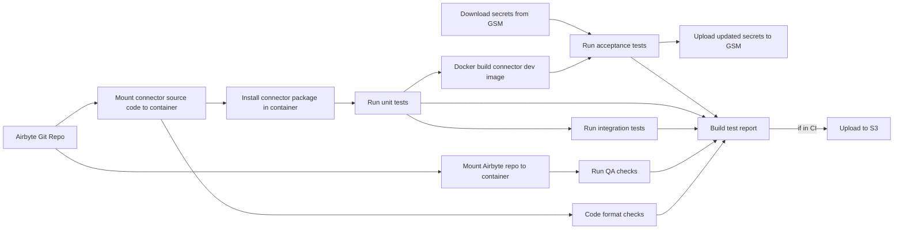

# POC of CI connector pipelines in python

This Python subpackage of `ci-connector-ops` gathers the POC code we're working on to:
- Rewrite [airbyte-python.gradle](https://github.com/airbytehq/airbyte/blob/7d7e48b2a342a328fa74c6fd11a9268e1dcdcd64/buildSrc/src/main/groovy/airbyte-python.gradle) and [airbyte-connector-acceptance-test.gradle](https://github.com/airbytehq/airbyte/blob/master/buildSrc/src/main/groovy/airbyte-connector-acceptance-test.gradle) in Python.
- Centralize the CI logic for connector testing 
- Try out Dagger.io as a promising tool that can provide parallelism and caching out of the box for CI 

## Install and use
From `airbyte` repo root:

### Install
```bash
cd tools/ci_connector_ops
python -m venv .venv (please use at least Python 3.10)
source .venv/bin/activate
pip install --upgrade pip
pip install -e .
cd ../..
```

### Use

### Use remote secrets
If you want the pipeline to pull connector secrets from Google Secrets manager you have to set the `GCP_GSM_CREDENTIALS` env variable.
If you don't set this variable the local secrets files, under the `secrets` directory of a connector, will be used for acceptance test run.
More details [here](https://github.com/airbytehq/airbyte/blob/master/tools/ci_credentials/README.md#L20).

```bash
export GCP_GSM_CREDENTIALS=`cat <path to service account json file>`
```

If you don't want to use the remote secrets please call connectors-ci with the following flag:
```bash
connectors-ci --use-remote-secrets=False
```

### Environment variables required for CI run:
* `GCP_GSM_CREDENTIALS`: the credentials to connect to GSM
* `TEST_REPORTS_BUCKET_NAME`: the name of the bucket where the test report will be uploaded.
* `AWS_ACCESS_KEY_ID`: the access key id of a service account allowed to write to `TEST_REPORTS_BUCKET_NAME`
* `AWS_SECRET_ACCESS_KEY`: the secret access key of a service account allowed to write to`TEST_REPORTS_BUCKET_NAME`
* `AWS_REGION`: The AWS region of the `TEST_REPORTS_BUCKET_NAME`


### **Run the pipelines for a specific connectors**
(source-pokeapi does not require GSM access)
```bash
connectors-ci test-connectors --name=source-pokeapi
```

### **Run the pipeline for multiple connectors**

```bash
connectors-ci test-connectors --name=source-pokeapi --name=source-openweather
```
### **Run the pipeline for generally available connectors**

```bash
connectors-ci test-connectors --release-stage=generally_available
```


### **Run the pipeline for the connectors you changed on the branch**

```bash
touch airbyte-integrations/connectors/source-pokeapi/random_file_addition.txt
connectors-ci test-connectors --modified #the source-pokeapi pipeline should run
```

### Local VS. CI
The default behavior of the CLI is to run in a local context.
You can tell the CLI that it is running in a CI context with the following flag:
```bash
connectors-ci --is-ci
```

The main differences are that:
- The pipeline will pull the branch under test from Airbyte's GitHub repo
- The pipeline will upload per connector test reports to S3 


## What does a connector pipeline run



This is the DAG we expect for every connector for which the pipeline is triggered.
The Airbyte git repo will be the local one if you use `--is-local=True` command line option.
The connector secrets won't be downloaded nor uploaded if you use the `--use-remote-secrets=False` command line option.

## Questions for the Dagger team (in priority order)

Dear Dagger team. You should be able to execute the code we pushed with the instructions above.
Please ignore the `Set your environment variables` step and focus on running `connectors-ci test-connectors source-pokeapi` to reproduce the problems I mention below.

**First batch of questions**:

1. ~~How to handle exit codes: if exit_code != 0 an exception is thrown and stops the other pipeline execution. Code context [here](https://github.com/airbytehq/airbyte/blob/7d7e48b2a342a328fa74c6fd11a9268e1dcdcd64/tools/ci_connector_ops/ci_connector_ops/pipelines/actions/tests.py#L25)~~ A stop-gap solution was implemented waiting for this [issue](https://github.com/dagger/dagger/issues/3192) to be fixed.
2. Can we make with_mounted_directory writable so that the container can write to the host FS? Code context [here](https://github.com/airbytehq/airbyte/blob/7d7e48b2a342a328fa74c6fd11a9268e1dcdcd64/tools/ci_connector_ops/ci_connector_ops/pipelines/actions/tests.py#L119)
Dagger team answer: We'll implement a flag to run privileged `with_exec` that will allow containers to write on the host FS.
3. How to get access to visualizations: We'd love to have dynamic status checks on our GitHub PRs, with links to pipeline visualization [like](https://propeller.fly.dev/runs/da68273e-48d8-4354-8d8b-efaccf2792b9).
Dagger team answer: coming soon. 
4. Can we build and tag an image in Dagger?
Dagger team answer: Run a local docker registry and publish images to this directory during the pipeline execution.
5. What are the best practices to report success failure details?
I built a custom models (`ConnectorTestReport`) to store test results. I archive tests results to S3. Do you have other suggestions? 
6. What are the best practices to write tests for pipelines?
Dagger team answer: Get inspirations from their own repo [here](https://github.com/dagger/dagger/tree/main/sdk/python/tests). 
I'll write test once the code architecture is ratified.

7. What would be your suggestion to run `docker scan` from dagger to spot vulnerabilities on our connectors?
Dagger team answer: A scanning tool should be wrapped in a container to scan images from Dagger.
8. Do you have a tool to re-order logs line by order of pipeline after execution?
A log grouping tool is under construction: https://www.youtube.com/watch&ab_channel=Dagger

**Second batch of questions**:

1. I used the stopgap to handle exit-code != 0 but I think as dagger considers the execution as failed this step is always re-run. (cf `run_integration_tests`). Am I understanding this problem correctly, is there a workaround?
2. `run_acceptance_tests` runs at every execution even if the artifacts passed to it did not change: the connector image id is not changing on rebuild of the same code and the secrets I download from GSM are not changing (but re-downloaded everytime because they might change). Is it because the directory instance I mount to it is different on each run? cf (`run_acceptance-tests`)
3. I tried to leverage concurrency as much as possible with `asyncio.create_task` and `asyncio.gather`. Is it something you expect developer to implement or is it not something I should bother with and consider Dagger will take care of concurrency at a lower level. (I noted performance improvement while using `asyncio.create_task` etc.)  

### Airbyte specific context that could help you understand our workflow.
- We always use a :dev tag to tag images of connector we build locally. We try to never publish these images to a public repository.
- We run a container called connector-acceptance-test which is a global test suite for all our connectors. This test suite is ran against a connector under test container, (usually using its :dev image).
- Connector-acceptance-test is a customizable test suite (built with pytest) configured with per-connector `acceptance-test-config.yml` files ([e.g.](https://github.com/airbytehq/airbyte/blob/b0c5f14db6a905899d0f9c043954abcc5ec296f0/airbyte-integrations/connectors/source-pokeapi/acceptance-test-config.yml#L1))
- As connector-acceptance-test is running connector containers, it triggers actual HTTP requests the public API of our source/destination connector. This is why we need to load secrets configuration with our test account credentials to these connector containers. connector-acceptance-test is also generating dynamic connector configurations to check the behavior of a connector under test when it is  it different structure of configuration files. 


### Performance benchmarks

| Connector      | Run integration test GHA duration | Dagger POC duration (local) | Dagger POC duration (CI) |
|----------------|-----------------------------------|-----------------------------|--------------------------|
| source-pokeapi | 3mn45s                            | 1mn48                       | TBD                      |