# Airbyte CI CLI 

## What is it?
`airbyte-ci` is a command line interface to run CI/CD pipelines.
The goal of this CLI is to offer developers a tool to run these pipelines locally and in a CI context with the same guarantee.
It can prevent unnecessary commit -> push cycles developers typically go through when they when to test their changes against a remote CI.
This is made possible thanks to the use of [Dagger](https://dagger.io), a CI/CD engine relying on Docker Buildkit to provide reproducible builds.
Our pipeline are declared with Python code, the main entrypoint is [here](https://github.com/airbytehq/airbyte/blob/master/tools/ci_connector_ops/ci_connector_ops/pipelines/commands/airbyte_ci.py).
This documentation should be helpful for both local and CI use of the CLI. We indeed [power connector testing in the CI with this CLI](https://github.com/airbytehq/airbyte/blob/master/.github/workflows/connector_integration_test_single_dagger.yml#L78). 

## How to install
### Requirements
* A running Docker engine
* Python >= 3.10

### Install
```bash
# Make sure that the current Python version is >= 3.10
pyenv shell 3.10
pip install "ci-connector-ops[pipelines] @ git+https://github.com/airbytehq/airbyte.git@master#subdirectory=tools/ci_connector_ops"
cd airbyte
airbyte-ci
```

If you face any installation problem feel free to reach out the Airbyte Connectors Operations team.
N.B: This project will eventually be moved to `airbyte-ci` root directory.


## Commands reference
- [`airbyte-ci` command group](#airbyte-ci)
  * [Options](#options)
- [`connectors` command subgroup](#connectors-command-subgroup)
  * [Options](#options-1)
- [`connectors list` command](#connectors-list-command)
- [`connectors format` command](#connectors-format-command)
- [`connectors test` command](#connectors-test-command)
  * [Examples](#examples-)
  * [What it runs](#what-it-runs-)
- [`connectors build` command](#connectors-build-command)
  * [What it runs](#what-it-runs)
- [`connectors publish` command](#connectors-publish-command)
- [Examples](#examples)
- [Options](#options-2)
  * [What it runs](#what-it-runs-1)
- [`metadata` command subgroup](#metadata-command-subgroup)
- [`metadata validate` command](#metadata-validate-command)
  * [Example](#example)
  * [Options](#options-3)
- [`metadata upload` command](#metadata-upload-command)
  * [Example](#example-1)
  * [Options](#options-4)
- [`metadata deploy orchestrator` command](#metadata-deploy-orchestrator-command)
  * [Example](#example-2)
  * [What it runs](#what-it-runs--1)
- [`metadata test lib` command](#metadata-test-lib-command)
  * [Example](#example-3)
- [`metadata test orchestrator` command](#metadata-test-orchestrator-command)
  * [Example](#example-4)

### <a id="airbyte-ci-command-group"></a>`airbyte-ci` command group
**The main command group option has sensible defaults. In local use cases you're not likely to pass options to the `airbyte-ci` command group.**

#### Options

| Option                       | Default value                   | Mapped environment variable   | Description                                                                                 |
| ---------------------------- | ------------------------------- | ----------------------------- | ------------------------------------------------------------------------------------------- |
| `--is-local/--is-ci`         | `--is-local`                    |                               | Determines the environment in which the CLI runs: local environment or CI environment.      |
| `--git-branch`               | The checked out git branch name | `CI_GIT_BRANCH`               | The git branch on which the pipelines will run.                                             |
| `--git-revision`             | The current branch head         | `CI_GIT_REVISION`             | The commit hash on which the pipelines will run.                                            |
| `--diffed-branch`            | `origin/master`                 |                               | Branch to which the git diff will happen to detect new or modified files.                   |
| `--gha-workflow-run-id`      |                                 |                               | GHA CI only - The run id of the GitHub action workflow                                      |
| `--ci-context`               | `manual`                        |                               | The current CI context: `manual` for manual run, `pull_request`, `nightly_builds`, `master` |
| `--pipeline-start-timestamp` | Current epoch time              | `CI_PIPELINE_START_TIMESTAMP` | Start time of the pipeline as epoch time. Used for pipeline run duration computation.       |


### <a id="connectors-command-subgroup"></a>`connectors` command subgroup

Available commands:
* `airbyte-ci connectors test`: Run tests for one or multiple connectors.
* `airbyte-ci connectors build`: Build docker images for one or multiple connectors. 
* `airbyte-ci connectors publish`: Publish a connector to Airbyte's DockerHub.

#### Options
| Option                 | Multiple | Default value | Description                                                                                                                                                                                                                                                                                           |
| ---------------------- | -------- | ------------- | ----------------------------------------------------------------------------------------------------------------------------------------------------------------------------------------------------------------------------------------------------------------------------------------------------- |
| `--use-remote-secrets` | False    | True          | If True, connectors configuration will be pulled from Google Secret Manager. Requires the GCP_GSM_CREDENTIALS environment variable to be set with a service account with permission to read GSM secrets. If False the connector configuration will be read from the local connector `secrets` folder. |
| `--name`               | True     |               | Select a specific connector for which the pipeline will run. Can be used multiple time to select multiple connectors. The expected name is the connector technical name. e.g. `source-pokeapi`                                                                                                        |
| `--release-stage`      | True     |               | Select connectors with a specific release stage: `alpha`, `beta`, `generally_available`.  Can be used multiple times to select multiple release stages.                                                                                                                                               |
| `--language`           | True     |               | Select connectors with a specific language: `python`, `low-code`, `java`. Can be used multiple times to select multiple languages.                                                                                                                                                                    |
| `--modified`           | False    | False         | Run the pipeline on only the modified connectors on the branch or previous commit (depends on the pipeline implementation).                                                                                                                                                                           |
| `--concurrency`        | False    | 5             | Control the number of connector pipelines that can run in parallel. Useful to speed up pipelines or control their resource usage.                                                                                                                                                                     |

### <a id="connectors-list-command"></a>`connectors list` command
Retrieve the list of connectors satisfying the provided filters.

#### Examples
List all connectors:

`airbyte-ci connectors list`

List generally available connectors:

`airbyte-ci connectors --release-stage=generally_available list`

List connectors changed on the current branch:

`airbyte-ci connectors --modified list`

List connectors with a specific language:

`airbyte-ci connectors --language=python list`

List connectors with multiple filters:

`airbyte-ci connectors --language=low-code --release-stage=generally_available list`

### <a id="connectors-list-command"></a>`connectors format` command
Run a code formatter on one or multiple connectors.

For Python connectors we run the following tools, using the configuration defined in `pyproject.toml`:
* `black` for code formatting
* `isort` for import sorting
* `licenseheaders` for adding license headers

For Java connectors we run `./gradlew format`.

In local CLI execution the formatted code is exported back the local repository. No commit or push is performed.
In CI execution the formatted code is pushed to the remote branch. One format commit per connector.

#### Examples
Format a specific connector:

`airbyte-ci connectors --name=source-pokeapi format`

Format all Python connectors:

`airbyte-ci connectors --language=python format`

Format all connectors modified on the current branch:

`airbyte-ci connectors --modified format`


### <a id="connectors-test-command"></a>`connectors test` command
Run a test pipeline for one or multiple connectors.

#### Examples

Test a single connector:
`airbyte-ci connectors --name=source-pokeapi test`

Test multiple connectors:
`airbyte-ci connectors --name=source-pokeapi --name=source-bigquery test`

Test generally available connectors:
`airbyte-ci connectors --release-stage=generally_available test`

Test connectors changed on the current branch:
`airbyte-ci connectors --modified test`

#### What it runs


### <a id="connectors-build-command"></a>`connectors build` command
Run a build pipeline for one or multiple connectors and export the built docker image to the local docker host.
It's mainly purposed for local use.

Build a single connector:
`airbyte-ci connectors --name=source-pokeapi build`

Build multiple connectors:
`airbyte-ci connectors --name=source-pokeapi --name=source-bigquery build`

Build generally available connectors:
`airbyte-ci connectors --release-stage=generally_available build`

Build connectors changed on the current branch:
`airbyte-ci connectors --modified build`

#### What it runs

For Python and Low Code connectors:


For Java connectors:

```mermaid
flowchart TD
    arch(For each platform amd64/arm64)
    distTar[Gradle distTar task run]
    base[Build integration base]
    java_base[Build integration base Java]
    normalization[Build Normalization]
    connector[Build connector image]
    
    arch-->base-->java_base-->connector
    distTar-->connector
    normalization--"if supports normalization"-->connector

    load[Load to docker host with :dev tag, current platform]
    spec[Get spec]
    connector-->spec--"if success"-->load
```


### <a id="connectors-publish-command"></a>`connectors publish` command
Run a publish pipeline for one or multiple connectors.
It's mainly purposed for CI use to release a connector update.

### Examples
Publish all connectors modified in the head commit: `airbyte-ci connectors --modified publish`

### Options

| Option                               | Required | Default         | Mapped environment variable        | Description                                                                                                                                                                      |
| ------------------------------------ | -------- | --------------- | ---------------------------------- | -------------------------------------------------------------------------------------------------------------------------------------------------------------------------------- |
| `--pre-release/--main-release`       | False    | `--pre-release` |                                    | Whether to publish the pre-release or the main release version of a connector. Defaults to pre-release. For main release you have to set the credentials to interact with the GCS bucket. |
| `--docker-hub-username`              | True     |                 | `DOCKER_HUB_USERNAME`              | Your username to connect to DockerHub.                                                                                                                                           |
| `--docker-hub-password`              | True     |                 | `DOCKER_HUB_PASSWORD`              | Your password to connect to DockerHub.                                                                                                                                           |
| `--spec-cache-gcs-credentials`       | False    |                 | `SPEC_CACHE_GCS_CREDENTIALS`       | The service account key to upload files to the GCS bucket hosting spec cache.                                                                                                    |
| `--spec-cache-bucket-name`           | False    |                 | `SPEC_CACHE_BUCKET_NAME`           | The name of the GCS bucket where specs will be cached.                                                                                                                           |
| `--metadata-service-gcs-credentials` | False    |                 | `METADATA_SERVICE_GCS_CREDENTIALS` | The service account key to upload files to the GCS bucket hosting the metadata files.                                                                                            |
| `--metadata-service-bucket-name`     | False    |                 | `METADATA_SERVICE_BUCKET_NAME`     | The name of the GCS bucket where metadata files will be uploaded.                                                                                                                |
| `--slack-webhook`                    | False    |                 | `SLACK_WEBHOOK`                    | The Slack webhook URL to send notifications to.                                                                                                                                  |
| `--slack-channel`                    | False    |                 | `SLACK_CHANNEL`                    | The Slack channel name to send notifications to.                                                                                                                                 |

I've added an empty "Default" column, and you can fill in the default values as needed.
#### What it runs


### <a id="metadata-validate-command-subgroup"></a>`metadata` command subgroup

Available commands:
* `airbyte-ci metadata validate`
* `airbyte-ci metadata upload`
* `airbyte-ci metadata test lib`
* `airbyte-ci metadata test orchestrator`
* `airbyte-ci metadata deploy orchestrator`

### <a id="metadata-validate-command"></a>`metadata validate` command
This commands validates the modified `metadata.yaml` files in the head commit, or all the `metadata.yaml` files.

#### Example
Validate all `metadata.yaml` files in the repo:
`airbyte-ci metadata validate --all`

#### Options
| Option             | Default      | Description                                                                                                                |
| ------------------ | ------------ | -------------------------------------------------------------------------------------------------------------------------- |
| `--modified/--all` | `--modified` | Flag to run validation of `metadata.yaml` files on the modified files in the head commit or all the `metadata.yaml` files. |

### <a id="metadata-upload-command"></a>`metadata upload` command
This command upload the modified `metadata.yaml` files in the head commit, or all the `metadata.yaml` files, to a GCS bucket.

#### Example
Upload all the `metadata.yaml` files to a GCS bucket:
`airbyte-ci metadata upload --all <gcs-bucket-name>`

#### Options
| Option              | Required | Default      | Mapped environment variable | Description                                                                                                              |
| ------------------- | -------- | ------------ | --------------------------- | ------------------------------------------------------------------------------------------------------------------------ |
| `--gcs-credentials` | True     |              | `GCS_CREDENTIALS`           | Service account credentials in JSON format with permission to get and upload on the GCS bucket                           |
| `--modified/--all`  | True     | `--modified` |                             | Flag to upload the modified `metadata.yaml` files in the head commit or all the  `metadata.yaml`  files to a GCS bucket. |

### <a id="metadata-upload-orchestrator"></a>`metadata deploy orchestrator` command
This command deploys the metadata service orchestrator to production.
The `DAGSTER_CLOUD_METADATA_API_TOKEN` environment variable must be set.

#### Example
`airbyte-ci metadata deploy orchestrator`

#### What it runs


### <a id="metadata-test-lib-command"></a>`metadata test lib` command
This command runs tests for the metadata service library.

#### Example
`airbyte-ci metadata test lib`

### <a id="metadata-test-orchestrator-command"></a>`metadata test orchestrator` command
This command runs tests for the metadata service orchestrator.

#### Example
`airbyte-ci metadata test orchestrator`

## Changelog 
| Version | PR  | Description                                                                                |
| ------- | --- | ------------------------------------------------------------------------------------------ |
| 0.1.0   |     | Alpha version not in production yet. All the commands described in this doc are available. |

## More info
This project is owned by the Connectors Operations team.
We share project updates and remaining stories before its release to production in this [EPIC](https://github.com/airbytehq/airbyte/issues/24403).